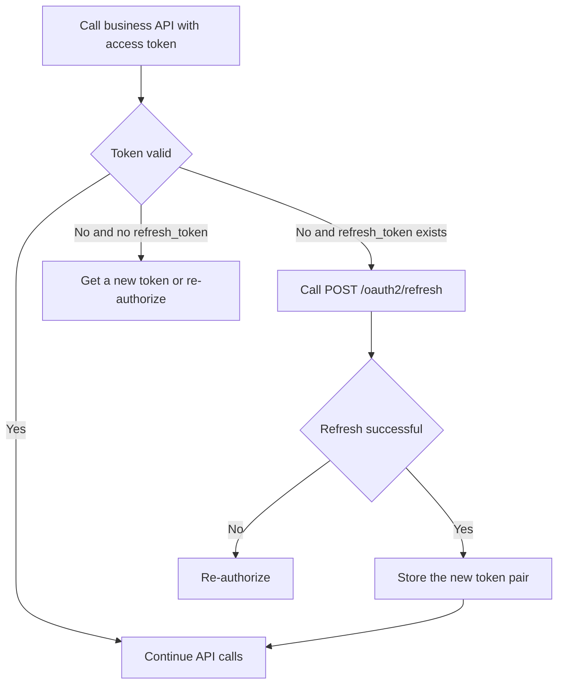

# OAuth2-refresh API

**Brief Description**

- Refreshes an expired `access_token` by using `refresh_token`.
- This API applies to flows where the token response actually includes `refresh_token`.
- If a `client_credentials` deployment does not return `refresh_token`, do not call this endpoint; obtain a new token instead.

**Request URL**

- `/oauth2/refresh`

**Request Method**

- `POST`
- `Content-Type: application/x-www-form-urlencoded`

## Refresh Lifecycle



---

## Request Parameters

| Parameter | Required | Description |
| :--- | :--- | :--- |
| `grant_type` | Yes | Fixed value `refresh_token` |
| `refresh_token` | Yes | Existing refresh token |
| `client_id` | Yes | Client ID issued to the third-party platform |
| `client_secret` | Yes | Client secret issued to the third-party platform |

---

## Request Example

```json
{
    "grant_type": "refresh_token",
    "refresh_token": "bkabsDaCYRWVPHMPqYij1O2rEWPNc34dH97FmQsDzuaopf1RxdDofp63HL4x",
    "client_id": "client123",
    "client_secret": "secret123"
}
```

---

## Response Parameters

| Parameter | Description |
| :--- | :--- |
| `access_token` | Newly issued access token |
| `refresh_token` | Newly issued refresh token |
| `refresh_expires_in` | Refresh-token lifetime in seconds |
| `token_type` | Fixed value `Bearer` |
| `expires_in` | Access-token lifetime in seconds |

---

## Response Example

```json
{
    "access_token": "avYDaEcmPfaphbE8oDmraKM6FOzq7nYI42iz4KTLClpvWegyREQnyiYUG2VA",
    "refresh_token": "BG6DGTZYpZPq0PHei3N4Rvb2yjM4YMZEFrvrf1A8LxI1xKbH2aEOHG3zfNy9",
    "refresh_expires_in": 2592000,
    "token_type": "Bearer",
    "expires_in": 7200
}
```

---

## Related Documentation

- [Get access_token API](./02_api_access_token.md)
- [Device Authorization API](./04_api_device_auth.md)
