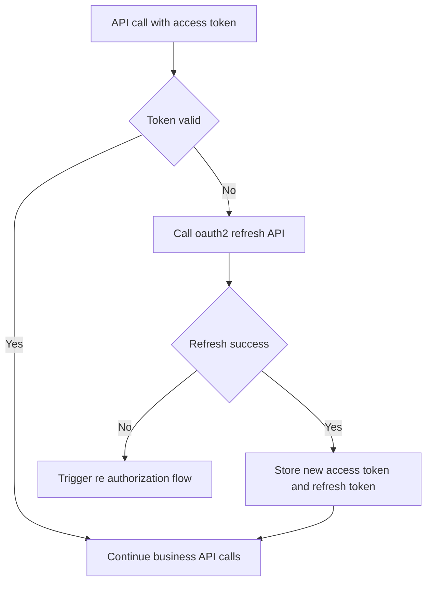
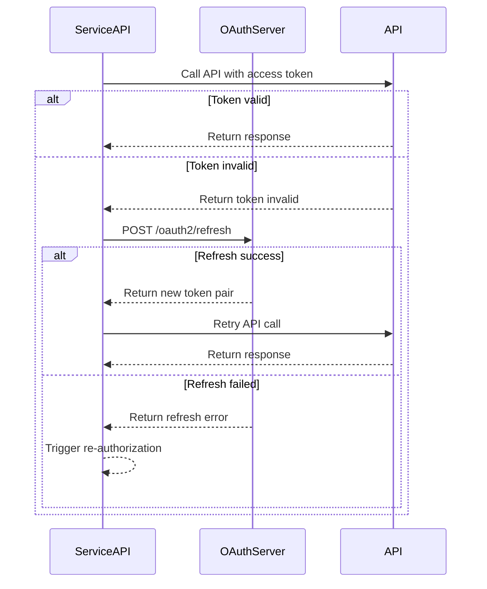

# OAuth2-refresh API

**Brief Description**
- OAuth2, refresh
- The Client backend uses `refresh_token` to refresh the `access_token`.

**Request URL**
- `/oauth2/refresh`

**Request Method**
- `POST`
- In the request header, `ContentType` must be `application/x-www-form-urlencoded;`

## Refresh Lifecycle (Concept)



## Refresh Lifecycle (Sequence)



---

## Request Parameter Description

| Parameter Name | Parameter Description | Required | Parameter Value Description |
| :--- | :--- | :--- | :--- |
| `grant_type` | Authorization Type | Yes | Must be `refresh_token` |
| `refresh_token` | Refresh Token | Yes | The old `refresh_token`, used to exchange for a new access token |
| `client_id` | Client ID | Yes | `client_id` applied for by the third-party platform |
| `client_secret` | Client Secret | Yes | `client_secret` applied for by the third-party platform |

---

## Request Example

```json
{
    "grant_type": "refresh_token",
    "refresh_token": "bkabsDaCYRWVPHMPqYij1O2rEWPNc34dH97FmQsDzuaopf1RxdDofp63HL4x",
    "client_id": "client123",
    "client_secret": "secret123"
}
```

---

## Return Parameter Description

| Parameter Name | Parameter Description | Parameter Value Description |
| :--- | :--- | :--- |
| `access_token` | Access Token | The newly issued access token |
| `refresh_token` | Refresh Token | The newly issued refresh token (the old token will become invalid) |
| `refresh_expires_in` | New Refresh Token Validity Period | Unit: seconds |
| `token_type` | Token Type | Fixed as `Bearer` |
| `expires_in` | New Access Token Validity Period | Unit: seconds |

---

## Return Example

```json
// Authorization successful, HTTP status code 200
{
    "access_token": "avYDaEcmPfaphbE8oDmraKM6FOzq7nYI42iz4KTLClpvWegyREQnyiYUG2VA",
    "refresh_token": "BG6DGTZYpZPq0PHei3N4Rvb2yjM4YMZEFrvrf1A8LxI1xKbH2aEOHG3zfNy9",
    "refresh_expires_in": 2592000,
    "token_type": "Bearer",
    "expires_in": 7200
}
```

---

## Related Documentation

- [Get access_token API](../02_api_access_token.md)
- [Device Authorization API](../04_api_device_auth.md)
