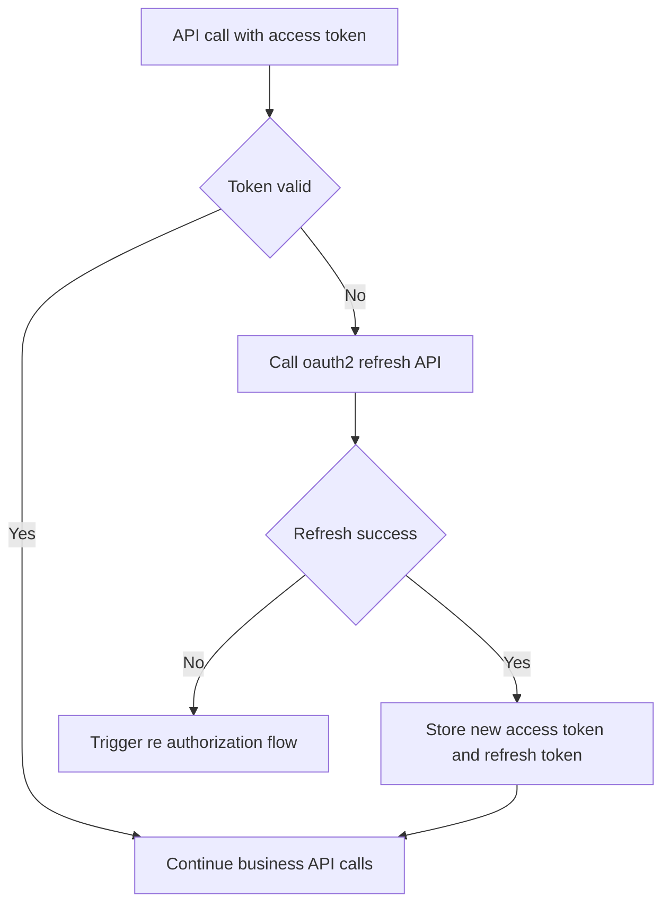
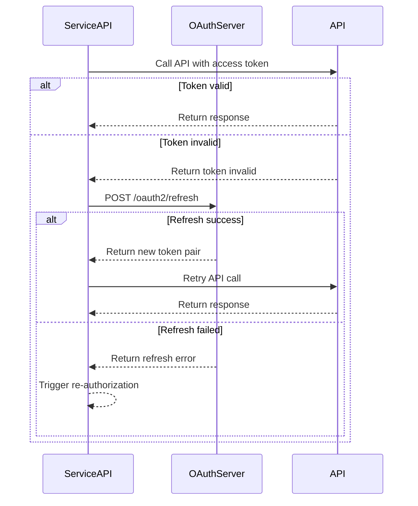

# OAuth2-refresh API

## Brief Description

- Use `refresh_token` to refresh `access_token`.
- This documentation treats it as a generic refresh interface and does not add further grant-type-specific carve-outs.

## Request URL

- `/oauth2/refresh`

## Request Method

- `POST`
- `Content-Type: application/x-www-form-urlencoded`

## Refresh Lifecycle (Concept)



## Refresh Lifecycle (Sequence)



## Request Parameters

| Parameter | Required | Description |
| :--- | :--- | :--- |
| `grant_type` | Yes | Must be `refresh_token` |
| `refresh_token` | Yes | Previous refresh token used to obtain a new access token |
| `client_id` | Yes | The `client_id` issued to the third-party platform |
| `client_secret` | Yes | The `client_secret` issued to the third-party platform |

## Request Example

```json
{
    "grant_type": "refresh_token",
    "refresh_token": "<masked_refresh_token>",
    "client_id": "<example_client_id>",
    "client_secret": "<masked_client_secret>"
}
```

## Response Parameters

| Parameter | Description |
| :--- | :--- |
| `access_token` | Newly issued access token |
| `refresh_token` | Newly issued refresh token; the old one becomes invalid |
| `refresh_expires_in` | New refresh-token TTL in seconds |
| `token_type` | Fixed as `Bearer` |
| `expires_in` | New access-token TTL in seconds |

## Response Example

```json
{
    "access_token": "<masked_access_token>",
    "refresh_token": "<masked_refresh_token>",
    "refresh_expires_in": 2592000,
    "token_type": "Bearer",
    "expires_in": 7200
}
```

## Implementation Note

- The original source sample mixes JSON and inline comments in a malformed way; this page rewrites it into equivalent readable JSON without changing the field contract.

## Related Documentation

- [Get access_token API](./02_api_access_token.md)
- [Device Authorization API](./04_api_device_auth.md)
