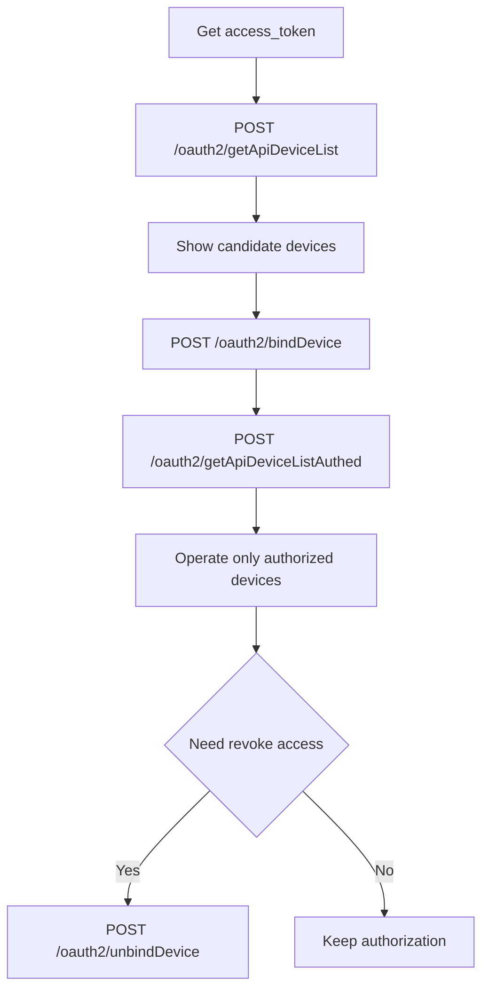

# Device Authorization API

This section covers APIs for managing device authorization.

## Table of Contents

- [Authorization Lifecycle](#authorization-lifecycle)
- [Get Authorizable Device List](#331-get-authorizable-device-list)
- [Authorize Device](#332-authorize-device)
- [Get Authorized Device List](#333-get-authorized-device-list)
- [Unauthorize Device](#334-unauthorize-device)

## Authorization Lifecycle



---

## 3.3.1 Get Authorizable Device List

**Brief Description**
- Get the list of authorizable devices under the Growatt end-user's personal account.
- Prerequisite: The end-user has registered a Growatt account and has configured/added devices under this account.

**Request URL**
- `/oauth2/getApiDeviceList`

**Request Method**
- `POST`
- The request header must carry a valid `access_token` placed in the `Authorization` parameter, and it must include the prefix `Bearer `.

### Request Example

```json
// No parameters
```

### Return Parameter Description

| Parameter Name | Type | Description |
| :--- | :--- | :--- |
| `code` | int | Interface return status code. 0 - Success, Others - Failure |
| `data` | string | Returned data |
| `message` | string | Return description |

### Return Example

```json
// Success, code=0
{
    "code": 0,
    "data": [
        {
            "deviceSn": "LPL1234567",
            "deviceTypeName": "min",
            "model": "MIN 7600TL-XH-US",
            "nominalPower": 7600,
            "datalogSn": "VC51030122122538",
            "datalogDeviceTypeName": "Shine4G-WiFi-FD",
            "dtc": 5300,
            "communicationVersion": "ZACA-0013",
            "existBattery": false,
            "batterySn": null,
            "batteryModel": null,
            "batteryCapacity": null,
            "batteryNominalPower": null,
            "authFlag": false,
            "batteryList": []
        }
    ],
    "message": "SUCCESSFUL_OPERATION"
}

// Failure, code non-zero
{
    "code": 2,
    "message": "TOKEN_IS_INVALID"
}
```

### Data Parameter Description

| Parameter Name | Parameter Description | Parameter Value Description |
| :--- | :--- | :--- |
| `deviceSn` | Device serial number | Device unique identifier |
| `deviceTypeName` | Device major category name | Main category classification of the device |
| `model` | Device model | Specific model of the device |
| `nominalPower` | Inverter nominal power | Unit: W |
| `datalogSn` | Datalogger serial number | Serial number of the data collection device |
| `datalogDeviceTypeName` | Datalogger type name | Type of the data collection device |
| `dtc` | dtc numeric code | Numeric code of the device type |
| `communicationVersion` | Firmware communication version | Device communication protocol version |
| `existBattery` | Has battery | Boolean value, indicates whether the device is equipped with a battery |
| `batterySn` | Battery serial number | Unique identifier of the battery |
| `batteryModel` | Battery model | Specific model of the battery |
| `batteryCapacity` | Battery nominal capacity | Unit: Wh |
| `batteryNominalPower` | Battery nominal power | Unit: W |
| `authFlag` | Is authorized | Boolean value, indicates whether the device has been authorized |
| `batteryList` | Battery list | Array containing battery information |

---

## 3.3.2 Authorize Device

**Brief Description**
- Authorize the devices under the Growatt end-user to a third party.

**Request URL**
- `/oauth2/bindDevice`

**Request Method**
- `POST`
- The `ContentType` of the request must be `application/json;`
- The request header must carry a valid `access_token` placed in the `Authorization` parameter, and it must include the prefix `Bearer `.

### Request Parameter Description

| Parameter Name | Type | Required | Description |
| :--- | :--- | :--- | :--- |
| `deviceSnList` | List | Yes | Not empty, device serial number and PINCode (PINCode is only needed under Client Credentials mode) |
| `deviceSnList[].deviceSn` | string | Yes | |
| `deviceSnList[].pinCode` | string | Required under Client Credentials mode | Device PINCode |

### Request Example

```json
// Under Authorization Code mode
{
    "deviceSnList": [
        {
            "deviceSn": "LXG1234567"
        },
        {
            "deviceSn": "EGM1234567"
        }
    ]
}

// Under Client Credentials mode
{
    "deviceSnList": [
        {
            "deviceSn": "LXG1234567",
            "pinCode": "123"
        },
        {
            "deviceSn": "EGM1234567",
            "pinCode": "456"
        }
    ]
}
```

### Return Parameter Description

| Parameter Name | Type | Description |
| :--- | :--- | :--- |
| `code` | int | Interface return status code. 0 - Success, Others - Failure |
| `data` | string | Returned data |
| `message` | string | Return description |

### Return Example

```json
// Success, code=0
{
    "code": 0,
    "data": null,
    "message": "SUCCESSFUL_OPERATION"
}

// Failure, code non-zero
{
    "code": 2,
    "message": "TOKEN_IS_INVALID"
}

{
    "code": 12,
    "data": [
        "WAQ1234567"
    ],
    "message": "DEVICE_SN_DOES_NOT_HAVE_PERMISSION"
}
```

---

## 3.3.3 Get Authorized Device List

**Brief Description**
- Get the list of devices that have already been authorized under the Growatt end-user's personal account.
- Prerequisite: The end-user has registered a Growatt account and has configured/added devices under this account.

**Request URL**
- `/oauth2/getApiDeviceListAuthed`

**Request Method**
- `POST`
- The request header must carry a valid `access_token` placed in the `Authorization` parameter, and it must include the prefix `Bearer `.

### Request Example

```json
// No parameters
```

### Return Parameter Description

| Parameter Name | Type | Description |
| :--- | :--- | :--- |
| `code` | int | Interface return status code. 0 - Success, Others - Failure |
| `data` | string | Returned data |
| `message` | string | Return description |

### Return Example

```json
// Success, code=0
{
    "code": 0,
    "data": [
        {
            "deviceSn": "LPL1234567",
            "deviceTypeName": "min",
            "model": "MIN 7600TL-XH-US",
            "nominalPower": 7600,
            "datalogSn": "VC51030122122538",
            "datalogDeviceTypeName": "Shine4G-WiFi-FD",
            "dtc": 5300,
            "communicationVersion": "ZACA-0013",
            "existBattery": false,
            "authFlag": true,
            "batteryList": []
        }
    ],
    "message": "SUCCESSFUL_OPERATION"
}

// Failure, code non-zero
{
    "code": 2,
    "message": "TOKEN_IS_INVALID"
}
```

*(Note: The `data` return parameters description table is identical to section 3.3.1).*

---

## 3.3.4 Unauthorize Device

**Brief Description**
- Remove the authorization of subordinate devices that the Growatt end-user has granted to a third party.

**Request URL**
- `/oauth2/unbindDevice`

**Request Method**
- `POST`
- The `ContentType` of the request: `application/json;`
- The request header must carry a valid `access_token` placed in the `Authorization` parameter, and it must include the prefix `Bearer `.

### Request Parameter Description

| Parameter Name | Type | Required | Description |
| :--- | :--- | :--- | :--- |
| `deviceSnList` | List | Yes | Array(string), not empty, serial numbers of subordinate devices under the Growatt end-user |

### Request Example

```json
{
    "deviceSnList": [
        "LXG1234567",
        "LPL1234567"
    ]
}
```

### Return Parameter Description

| Parameter Name | Type | Description |
| :--- | :--- | :--- |
| `code` | int | Interface return status code. 0 - Success, Others - Failure |
| `data` | string | Returned data |
| `message` | string | Return description |

### Return Example

```json
// Success, code=0
{
    "code": 0,
    "data": null,
    "message": "SUCCESSFUL_OPERATION"
}

// Failure, code non-zero
{
    "code": 2,
    "message": "TOKEN_IS_INVALID"
}
```

---

## Related Documentation

- [Get access_token API](../02_api_access_token.md)
- [Device Dispatch API](../05_api_device_dispatch.md)
