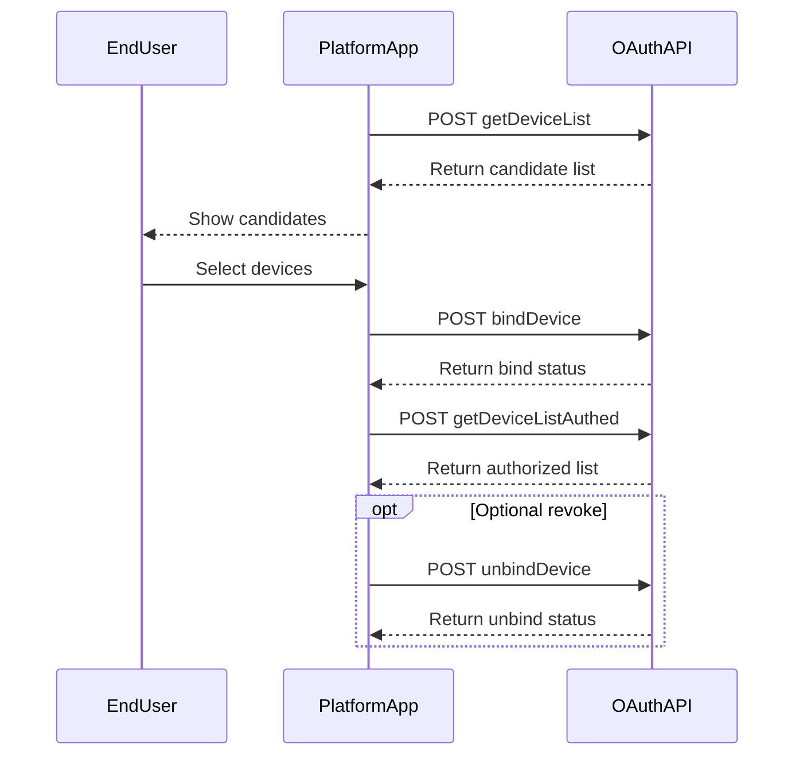

# Device Authorization API

This page documents `getDeviceList`, `bindDevice`, `getDeviceListAuthed`, and `unbindDevice`.

## Authorization Sequence



## 1 Get Candidate Devices

### Brief Description

- Get the device list that can be authorized to the third-party platform.
- Prerequisite: the end user has already registered a Growatt account and added devices under that account.
- Supported only in `authorization_code` mode.

### Request URL

- `/oauth2/getDeviceList`

### Request Method

- `POST`
- `Authorization: Bearer <token>`

### Request Example

```json
// No request body
```

### Response Parameters

| Parameter | Vendor-table Type | Description |
| :--- | :--- | :--- |
| `code` | int | `0` means success; any other value means failure |
| `data` | string | The vendor table says `string`, while the sample payload is an array of devices |
| `message` | string | Response description |

### Response Example

```json
{
    "code": 0,
    "data": [
        {
            "deviceSn": "DEVICE_SN_1",
            "deviceTypeName": "sph-s",
            "model": "SPH 10000TL-HU (AU)",
            "nominalPower": 15000,
            "datalogSn": "DATALOG_SN_1",
            "dtc": 21300,
            "communicationVersion": "ZCEA-0005",
            "authFlag": true
        },
        {
            "deviceSn": "DEVICE_SN_2",
            "deviceTypeName": "min",
            "model": "MIN 5000TL-XH2",
            "nominalPower": 6000,
            "datalogSn": "DATALOG_SN_2",
            "dtc": 5100,
            "communicationVersion": "ZABA-0023",
            "authFlag": false
        }
    ],
    "message": "SUCCESSFUL_OPERATION"
}
```

```json
{
    "code": 2,
    "message": "TOKEN_IS_INVALID"
}
```

### `data` Fields

| Parameter | Description |
| :--- | :--- |
| `deviceSn` | Device serial number |
| `deviceTypeName` | Device type name |
| `model` | Device model |
| `nominalPower` | Rated inverter power in W |
| `datalogSn` | Datalogger serial number |
| `dtc` | Numeric device-type code |
| `communicationVersion` | Firmware communication version |
| `authFlag` | Whether the device is already authorized |

## 2 Bind Devices

### Brief Description

- Authorize end-user devices to the third-party platform.

### Request URL

- `/oauth2/bindDevice`

### Request Method

- `POST`
- `Content-Type: application/json`
- `Authorization: Bearer <token>`

### Request Parameters

| Parameter | Type | Required | Description |
| :--- | :--- | :--- | :--- |
| `deviceSnList` | array | Yes | Non-empty list of device serials and `pinCode` values |
| `deviceSnList[].deviceSn` | string | Yes | Device serial number |
| `deviceSnList[].pinCode` | string | Required in client mode | Device `PinCode` |

### Request Examples

#### Authorization-Code Mode

```json
{
    "deviceSnList": [
        {
            "deviceSn": "DEVICE_SN_1"
        },
        {
            "deviceSn": "DEVICE_SN_2"
        }
    ]
}
```

#### Client Mode

```json
{
    "deviceSnList": [
        {
            "deviceSn": "DEVICE_SN_1",
            "pinCode": "PIN001"
        },
        {
            "deviceSn": "DEVICE_SN_2",
            "pinCode": "PIN002"
        }
    ]
}
```

### Response Parameters

| Parameter | Vendor-table Type | Description |
| :--- | :--- | :--- |
| `code` | int | `0` means success; any other value means failure |
| `data` | string | The vendor table says `string`; published successful samples use `null`, the latest global success sample returned `1`, and partial failures use arrays |
| `message` | string | Response description |

### Response Examples

```json
{
    "code": 0,
    "data": null,
    "message": "SUCCESSFUL_OPERATION"
}
```

```json
{
    "code": 0,
    "data": 1,
    "message": "SUCCESSFUL_OPERATION"
}
```

```json
{
    "code": 2,
    "message": "TOKEN_IS_INVALID"
}
```

```json
{
    "code": 19,
    "message": "DEVICE_ID_ALREADY_EXISTS"
}
```

```json
{
    "code": 12,
    "data": [
        "DEVICE_SN_2"
    ],
    "message": "DEVICE_SN_DOES_NOT_HAVE_PERMISSION"
}
```

### Latest Global Observation (2026-03-27)

- The latest global authorization-code run used `{"deviceSnList":[{"deviceSn":"WCK6584462"}]}` and succeeded without `pinCode`.
- The successful response in that run returned `data: 1`.
- The same report distinguished `deviceSn=WCK6584462` from `datalogSn=ZGQ0E820UH`; device-level APIs used `deviceSn`.

## 3 Get Authorized Devices

### Brief Description

- Get the devices that are already authorized under the current token.

### Request URL

- `/oauth2/getDeviceListAuthed`

### Request Method

- `POST`
- `Authorization: Bearer <token>`

### Request Example

```json
// No request body
```

### Response Parameters

| Parameter | Vendor-table Type | Description |
| :--- | :--- | :--- |
| `code` | int | `0` means success; any other value means failure |
| `data` | string | The vendor table says `string`, while the sample payload is an array of devices |
| `message` | string | Response description |

### Response Example

```json
{
    "code": 0,
    "data": [
        {
            "deviceSn": "DEVICE_SN_1",
            "deviceTypeName": "sph-s",
            "model": "SPH 10000TL-HU (AU)",
            "nominalPower": 15000,
            "datalogSn": "DATALOG_SN_1",
            "dtc": 21300,
            "communicationVersion": "ZCEA-0005",
            "authFlag": true
        }
    ],
    "message": "SUCCESSFUL_OPERATION"
}
```

```json
{
    "code": 2,
    "message": "TOKEN_IS_INVALID"
}
```

## 4 Unbind Devices

### Brief Description

- Remove device authorization from the third-party platform.

### Request URL

- `/oauth2/unbindDevice`

### Request Method

- `POST`
- `Content-Type: application/json`
- `Authorization: Bearer <token>`

### Request Parameters

| Parameter | Type | Required | Description |
| :--- | :--- | :--- | :--- |
| `deviceSnList` | array | Yes | List of device serial numbers to unbind |

### Request Example

```json
{
    "deviceSnList": [
        "DEVICE_SN_1",
        "DEVICE_SN_2"
    ]
}
```

### Response Parameters

| Parameter | Vendor-table Type | Description |
| :--- | :--- | :--- |
| `code` | int | `0` means success; any other value means failure |
| `data` | string | The vendor table says `string`, while the successful sample returns `null` |
| `message` | string | Response description |

### Response Examples

```json
{
    "code": 0,
    "data": null,
    "message": "SUCCESSFUL_OPERATION"
}
```

```json
{
    "code": 2,
    "message": "TOKEN_IS_INVALID"
}
```

## Related Documentation

- [Authentication Guide](./01_authentication.md)
- [Troubleshooting FAQ](./11_api_troubleshooting.md)
- [ESS Terminology Glossary](./12_ess_terminology.md)
