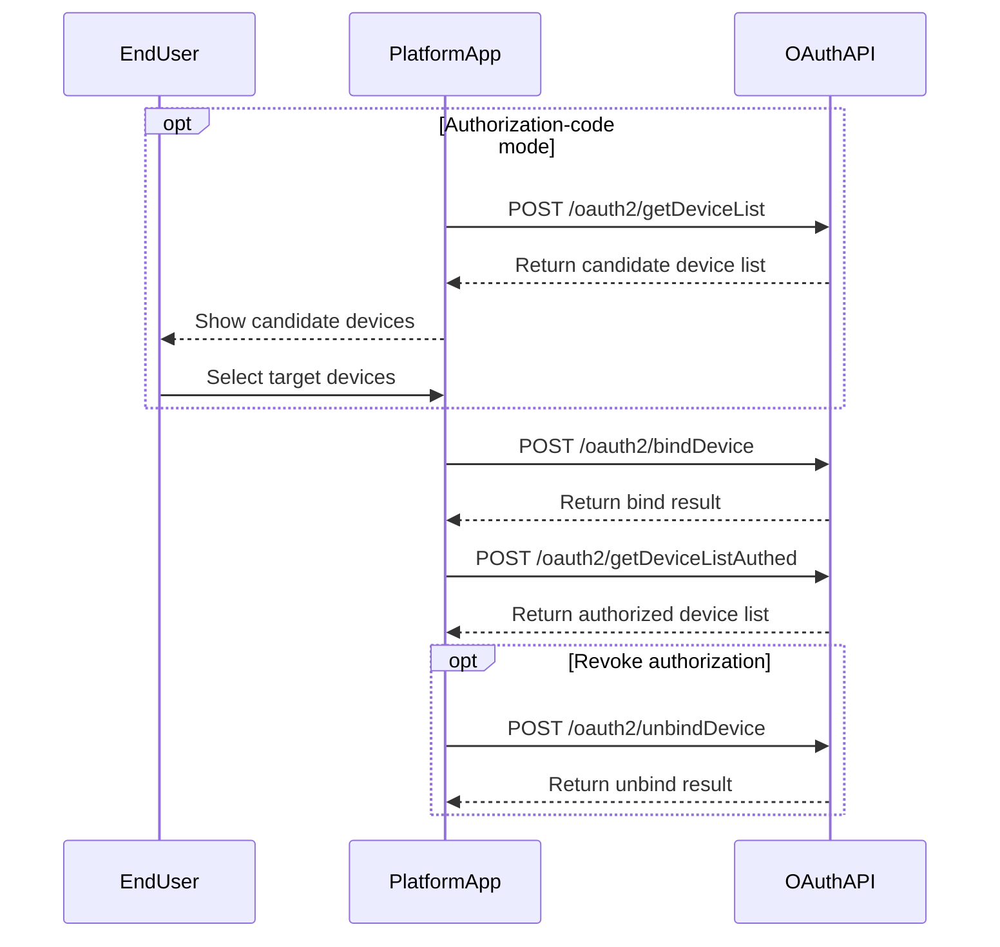

# Device Authorization API

This document covers the normative flows for device discovery, authorization, authorization-result lookup, and authorization removal.

## Authorization Flow



---

## 1 Get Candidate Device List

**Brief Description**

- Returns the list of devices that a Growatt end-user can authorize to a third-party platform.
- Supported only in `authorization_code` mode.
- Prerequisite: the end-user has already registered the devices under the Growatt account.

**Request URL**

- `/oauth2/getDeviceList`

**Request Method**

- `POST`
- The request must include a valid bearer token
- `Authorization: Bearer <token>`

### Request Example

```json
// No request body
```

### Response Example

```json
{
    "code": 0,
    "data": [
        {
            "deviceSn": "HCQSKJMSJ1",
            "deviceTypeName": "sph-s",
            "model": "SPH 10000TL-HU (AU)",
            "nominalPower": 15000,
            "datalogSn": "ZGQ0E8511G",
            "dtc": 21300,
            "communicationVersion": "ZCEA-0005",
            "authFlag": true
        }
    ],
    "message": "SUCCESSFUL_OPERATION"
}
```

### Device Object Fields

| Parameter | Type | Description |
| :--- | :--- | :--- |
| `deviceSn` | string | Device serial number |
| `deviceTypeName` | string | Device type name |
| `model` | string | Device model |
| `nominalPower` | number | Rated power in watts |
| `datalogSn` | string | Datalogger serial number |
| `dtc` | number | Device type code |
| `communicationVersion` | string | Communication firmware version |
| `authFlag` | boolean | Whether the device is already authorized |

### Mode Boundary Note

Calling this endpoint with a `client_credentials` token is outside the supported mode boundary and may return a grant-type error such as:

```json
{
    "code": 103,
    "data": null,
    "message": "WRONG_GRANT_TYPE"
}
```

Correct handling:

- Use `getDeviceList` only in `authorization_code` mode.
- In `client_credentials` mode, start from `bindDevice` with a known raw SN.

---

## 2 Bind Device

**Brief Description**

- Authorizes one or more devices to the third-party platform.
- The request body is JSON.
- The normative `deviceSnList` structure depends on the OAuth mode.

**Request URL**

- `/oauth2/bindDevice`

**Request Method**

- `POST`
- `Content-Type: application/json`
- `Authorization: Bearer <token>`

### Request Parameters

| Parameter | Required | Type | Description |
| :--- | :--- | :--- | :--- |
| `deviceSnList` | Yes | array | Non-empty array |
| `deviceSnList[]` | Yes | string or object | In authorization-code mode, use a device-SN string. In client-credentials mode, use an object containing `deviceSn` and `pinCode` |
| `deviceSnList[].deviceSn` | Required in client-credentials mode | string | Device serial number |
| `deviceSnList[].pinCode` | Required in client-credentials mode | string | Device PIN code |

### Request Examples

#### Authorization-code mode

```json
{
    "deviceSnList": [
        "LXG1234567",
        "LPL1234567"
    ]
}
```

#### Client-credentials mode

```json
{
    "deviceSnList": [
        {
            "deviceSn": "LXG1234567",
            "pinCode": "123"
        },
        {
            "deviceSn": "EGM1234567",
            "pinCode": "456"
        }
    ]
}
```

### Response Example

```json
{
    "code": 0,
    "data": null,
    "message": "SUCCESSFUL_OPERATION"
}
```

Failure example:

```json
{
    "code": 12,
    "data": [
        "WAQ1234567"
    ],
    "message": "DEVICE_SN_DOES_NOT_HAVE_PERMISSION"
}
```

### Request-Format Note

- Use `Authorization: Bearer <access_token>` together with `Content-Type: application/json`.
- `deviceSn` values must use the raw SN without display prefixes such as `SPH:` or `SPM:`.
- In `client_credentials` mode, object entries with `pinCode` are used.

Reference example:

```json
{
    "deviceSnList": [
        {
            "deviceSn": "RAW_DEVICE_SN",
            "pinCode": "TEST_PIN_CODE"
        }
    ]
}
```

---

## 3 Get Authorized Device List

**Brief Description**

- Returns the list of devices already authorized for the current token.

**Request URL**

- `/oauth2/getDeviceListAuthed`

**Request Method**

- `POST`
- `Authorization: Bearer <token>`

### Request Example

```json
// No request body
```

### Response Example

```json
{
    "code": 0,
    "data": [
        {
            "deviceSn": "HCQSKJMSJ1",
            "deviceTypeName": "sph-s",
            "model": "SPH 10000TL-HU (AU)",
            "nominalPower": 15000,
            "datalogSn": "ZGQ0E8511G",
            "dtc": 21300,
            "communicationVersion": "ZCEA-0005",
            "authFlag": true
        }
    ],
    "message": "SUCCESSFUL_OPERATION"
}
```

---

## 4 Unbind Device

**Brief Description**

- Removes the authorization relationship between the platform and one or more devices.

**Request URL**

- `/oauth2/unbindDevice`

**Request Method**

- `POST`
- `Content-Type: application/json`
- `Authorization: Bearer <token>`

### Request Parameters

| Parameter | Required | Type | Description |
| :--- | :--- | :--- | :--- |
| `deviceSnList` | Yes | array(string) | List of device serial numbers to unbind |

### Request Example

```json
{
    "deviceSnList": [
        "LXG1234567",
        "LPL1234567"
    ]
}
```

### Response Example

```json
{
    "code": 0,
    "data": null,
    "message": "SUCCESSFUL_OPERATION"
}
```

---

## Related Documentation

- [Authentication Guide](./01_authentication.md)
- [Device Dispatch API](./05_api_device_dispatch.md)
