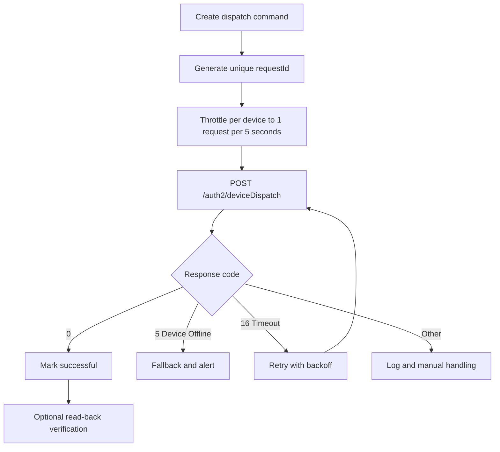

# Device Dispatch API

**Brief Description**
- Set relevant parameters of the device based on the device's SN. The interface will only return setting results for devices that the secret token has permission to access. Devices without permission will not be set, and no results will be returned.
- Current interface frequency limit: once every 5 seconds per device.

**Request URL**
- `/auth2/deviceDispatch`

**Request Method**
- `POST`
- The `ContentType` of the request must be `application/x-www-form-urlencoded;`
- The request header must carry a valid `access_token` placed in the `Authorization` parameter, and it must include the prefix `Bearer `.

## Dispatch Control Flow (Mermaid)



---

## Http Body Parameters

| Parameter Name | Required | Type | Description |
| :--- | :--- | :--- | :--- |
| `deviceSn` | Yes | string | Device SN, example: xxxxxxx |
| `setType` | Yes | string | Setting parameter enum, example: `enable_control` |
| `value` | Yes | string | Setting parameter value. See "Global Parameter Description" |
| `requestId` | Yes | String | Unique identifier for this request (32-character string: current time + random number, e.g., yyyyMMddHHmmssSSSxxxxxxxxxxxxxxx) |

---

## Interface Return Parameters

| Parameter Name | Type | Description |
| :--- | :--- | :--- |
| `code` | int | Interface return status code. 0 - Success, Others - Failure |
| `data` | string | Returned data |
| `message` | string | Return description |

---

## Request Example

```json
{
    "deviceSn": "FDCJQ00003",
    "setType": "enable_control",
    "value": "0",
    "requestId": "32-character string (yyyyMMddHHmmssSSSxxxxxxxxxxxxxxx)"
}
```

---

## Return Examples

### Setting Successful

```json
{
    "code": 0,
    "data": null,
    "message": "PARAMETER_SETTING_SUCCESSFUL"
}
```

### Device Offline

```json
{
    "code": 5,
    "data": null,
    "message": "DEVICE_OFFLINE"
}
```

### Parameter Setting Response Timeout

```json
{
    "code": 16,
    "data": null,
    "message": "PARAMETER_SETTING_RESPONSE_TIMEOUT"
}
```

### Wrong Device Type

```json
{
    "code": 7,
    "data": null,
    "message": "WRONG_DEVICE_TYPE"
}
```

---

## Related Documentation

- [Device Authorization API](../04_api_device_auth.md)
- [Read Device Dispatch Parameters API](../06_api_read_dispatch.md)
- [Global Parameters](../10_global_params.md)
