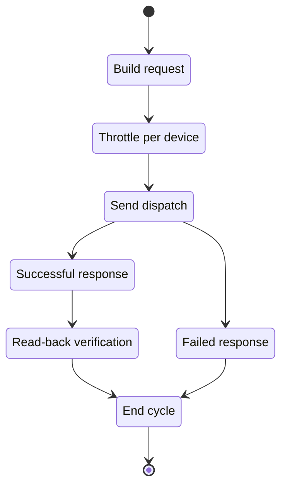

# Device Dispatch API

**Brief Description**

- Sets device parameters by device SN.
- The API returns only results for devices that the current token is allowed to access.
- Current rate limit: at most one request every 5 seconds per device.
- The normative request body is JSON and `requestId` is required.

**Request URL**

- `/oauth2/deviceDispatch`

**Request Method**

- `POST`
- `Content-Type: application/json`
- `Authorization: Bearer <token>`

## Dispatch Loop



---

## Request Parameters

| Parameter | Required | Type | Description |
| :--- | :--- | :--- | :--- |
| `deviceSn` | Yes | string | Device serial number |
| `setType` | Yes | string | Parameter enum, for example `enable_control` |
| `value` | Yes | string or object | Parameter value. The structure depends on `setType` |
| `requestId` | Yes | string | Unique request identifier, typically a 32-character string |

---

## Request Examples

### Simple-value dispatch

```json
{
    "deviceSn": "FDCJQ00003",
    "setType": "enable_control",
    "value": "0",
    "requestId": "20260323153000123abcdef123456789"
}
```

### Object-value dispatch

```json
{
    "deviceSn": "TEST123456",
    "value": {
        "duration": 10,
        "percentage": 20,
        "type": "dischargeCommand"
    },
    "setType": "duration_and_power_charge_discharge",
    "requestId": "20260323153000123abcdef123456789"
}
```

---

## Response Parameters

| Parameter | Type | Description |
| :--- | :--- | :--- |
| `code` | int | Business status code, `0` means success |
| `data` | null | Usually empty on success |
| `message` | string | Result description |

---

## Response Examples

### Successful Setting

```json
{
    "code": 0,
    "data": null,
    "message": "PARAMETER_SETTING_SUCCESSFUL"
}
```

### Device Offline

```json
{
    "code": 5,
    "data": null,
    "message": "DEVICE_OFFLINE"
}
```

### Device Not Responding

```json
{
    "code": 15,
    "data": null,
    "message": "PARAMETER_SETTING_DEVICE_NOT_RESPONDING"
}
```

### Parameter-Setting Response Timeout

```json
{
    "code": 16,
    "data": null,
    "message": "PARAMETER_SETTING_RESPONSE_TIMEOUT"
}
```

### Parameter-Setting Failure

```json
{
    "code": 6,
    "data": null,
    "message": "PARAMETER_SETTING_FAILED"
}
```

### Request-Format Note

- Use `Authorization: Bearer <access_token>`.
- Use `Content-Type: application/json`.
- The JSON body contains `deviceSn`, `setType`, `value`, and `requestId`.

## Related Documentation

- [Device Authorization API](./04_api_device_auth.md)
- [Read Device Dispatch Parameters API](./06_api_read_dispatch.md)
- [Global Parameters](./10_global_params.md)
