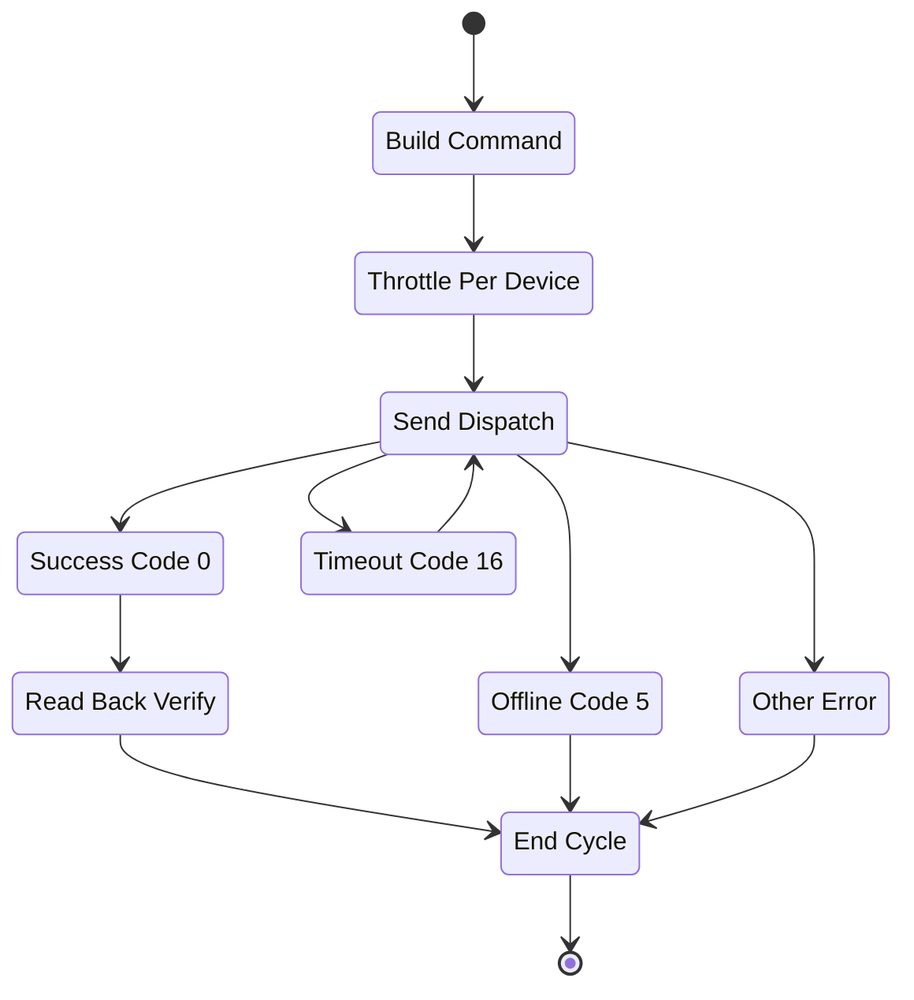

# Device Dispatch API

## Brief Description

- Set device parameters by device SN.
- The API returns results only for devices that the current token is allowed to access; unauthorized devices return `DEVICE_SN_DOES_NOT_HAVE_PERMISSION`.
- Maximum dispatch request rate: `1 request / 5 sec / device` (`12 RPM`).

## Request URL

- `/oauth2/deviceDispatch`

## Request Method

- `POST`
- `Content-Type: application/json`
- `Authorization: Bearer <token>`

## Dispatch Control State



## Request Parameters

| Parameter | Vendor-table Type | Required | Description |
| :--- | :--- | :--- | :--- |
| `deviceSn` | string | Yes | Device SN |
| `setType` | string | Yes | Parameter enum, for example `duration_and_power_charge_discharge` |
| `value` | string | Yes | Parameter value, see [Global Parameters](./10_global_params.md) |
| `requestId` | string | Yes | Unique request identifier, 32-character string |

## Request Example

```json
{
    "deviceSn": "DEVICE_SN_1",
    "value": {
        "duration": 10,
        "percentage": 20,
        "type": "dischargeCommand"
    },
    "setType": "duration_and_power_charge_discharge",
    "requestId": "20260402093000123abcdef123456789"
}
```

## Response Parameters

| Parameter | Vendor-table Type | Description |
| :--- | :--- | :--- |
| `code` | int | `0` means success; any other value means failure |
| `data` | string | The vendor table says `string`, while both success and failure samples return `null` |
| `message` | string | Response description |

## Response Format Example

```json
{
    "code": 0,
    "data": null,
    "message": "RESPONSE_MESSAGE"
}
```

## Response Cases

| Scenario | `code` | `data` | `message` |
| :--- | :--- | :--- | :--- |
| Successful setting | `0` | `null` | `PARAMETER_SETTING_SUCCESSFUL` |
| Device offline | `5` | `null` | `DEVICE_OFFLINE` |
| Response timeout | `16` | `null` | `PARAMETER_SETTING_RESPONSE_TIMEOUT` |
| Device not responding | `15` | `null` | `PARAMETER_SETTING_DEVICE_NOT_RESPONDING` |
| Parameter-setting failed | `6` | `null` | `PARAMETER_SETTING_FAILED` |
| Too many requests | `105` | `null` | `TOO_MANY_REQUEST` |

## Implementation Note

- The parameter table labels `value` as `string`, but the same page publishes an object-valued example for `duration_and_power_charge_discharge`.
- This page preserves both pieces of source wording without turning that discrepancy into a new API rule.

## Related Documentation

- [Read Device Dispatch Parameters API](./06_api_read_dispatch.md)
- [Global Parameters](./10_global_params.md)
- [ESS Terminology Glossary](./12_ess_terminology.md)
