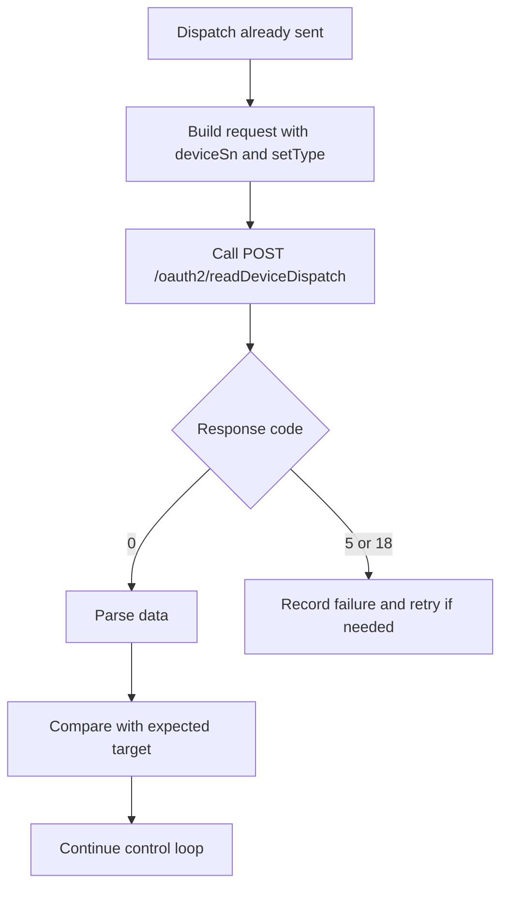

# Read Device Dispatch Parameters API

**Brief Description**

- Reads current dispatch parameters by `deviceSn` and `setType`.
- The API returns only results for devices that the current token is allowed to access.
- Current rate limit: at most one request every 5 seconds per device.
- The normative interface does not require `requestId`.

**Request URL**

- `/oauth2/readDeviceDispatch`

**Request Method**

- `POST`
- `Content-Type: application/json`
- `Authorization: Bearer <token>`

## Read-Back Verification Flow



---

## Request Parameters

| Parameter | Required | Type | Description |
| :--- | :--- | :--- | :--- |
| `deviceSn` | Yes | string | Device serial number |
| `setType` | Yes | string | Parameter enum, for example `time_slot_charge_discharge` |

---

## Request Example

```json
{
    "deviceSn": "FDCJQ00003",
    "setType": "time_slot_charge_discharge"
}
```

---

## Response Parameters

| Parameter | Type | Description |
| :--- | :--- | :--- |
| `code` | int | Business status code, `0` means success |
| `data` | object or array | Response shape depends on `setType` |
| `message` | string | Result description |

---

## Response Examples

### `time_slot_charge_discharge` Returns an Array

```json
{
    "code": 0,
    "data": [
        {
            "startTime": "16:00",
            "endTime": "18:00",
            "percentage": 80
        },
        {
            "startTime": "19:00",
            "endTime": "21:00",
            "percentage": -80
        }
    ],
    "message": "success"
}
```

### Device Offline

```json
{
    "code": 5,
    "data": null,
    "message": "DEVICE_OFFLINE"
}
```

### Read Failure

```json
{
    "code": 18,
    "data": null,
    "message": "READ_PARAMETER_FAILED"
}
```

### Shape Variability Note

Different `setType` values can legitimately return different shapes. For example, `duration_and_power_charge_discharge` may return an object such as:

```json
{
    "code": 0,
    "data": {
        "duration": 5,
        "percentage": 20,
        "acChargingEnabled": 1,
        "remotePowerControlEnable": 1
    },
    "message": "SUCCESSFUL_OPERATION"
}
```

This is a `setType`-specific shape variation and does not change the normative rule that `data` may be either an object or an array.

---

## Related Documentation

- [Device Dispatch API](./05_api_device_dispatch.md)
- [Device Information Query API](./07_api_device_info.md)
- [Global Parameters](./10_global_params.md)
