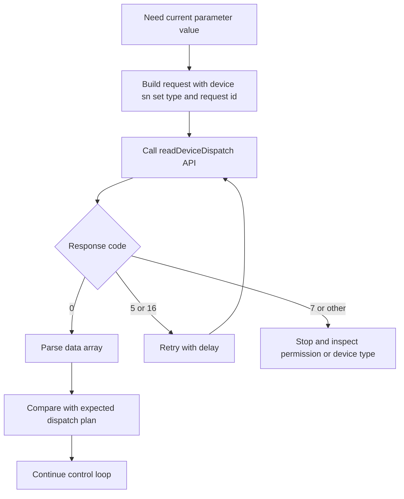
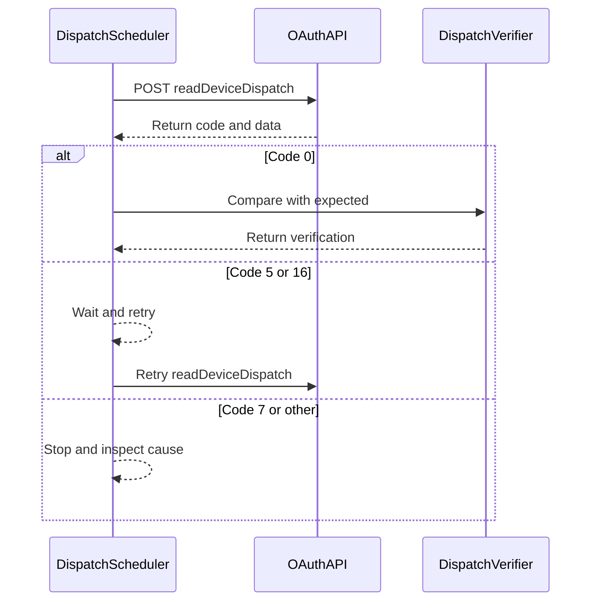

# Read Device Dispatch Parameters API

## Brief Description

- Read device parameters by device SN.
- The API returns results only for devices that the current token is allowed to access; unauthorized devices return `DEVICE_SN_DOES_NOT_HAVE_PERMISSION`.
- Current frequency limit: one call every 5 seconds per device.

## Request URL

- `/oauth2/readDeviceDispatch`

## Request Method

- `POST`
- `Content-Type: application/json`
- `Authorization: Bearer <token>`

## Read-Back Verification Flow (Concept)



## Read-Back Verification Flow (Sequence)



## Request Parameters

| Parameter | Vendor-table Type | Required | Description |
| :--- | :--- | :--- | :--- |
| `deviceSn` | string | Yes | Device SN |
| `setType` | string | Yes | Parameter enum, for example `time_slot_charge_discharge` |
| `requestId` | string | Yes | Unique request identifier |

## Request Example

```json
{
    "deviceSn": "DEVICE_SN_1",
    "setType": "time_slot_charge_discharge",
    "requestId": "20260402093000123abcdef123456789"
}
```

## Response Parameters

| Parameter | Vendor-table Type | Description |
| :--- | :--- | :--- |
| `code` | int | `0` means success; any other value means failure |
| `data` | string | The vendor table says `string`, while the success sample is an array |
| `message` | string | Response description |

## Response Examples

### Successful Read

```json
{
    "code": 0,
    "data": [
        {
            "startTime": "16:00",
            "endTime": "18:00",
            "percentage": 80
        },
        {
            "startTime": "19:00",
            "endTime": "21:00",
            "percentage": -80
        }
    ],
    "message": "success"
}
```

### Device Offline

```json
{
    "code": 5,
    "data": null,
    "message": "DEVICE_OFFLINE"
}
```

### Read Failure

```json
{
    "code": 18,
    "data": null,
    "message": "READ_DEVICE_PARAM_FAIL"
}
```

### Too Many Requests

```json
{
    "code": 105,
    "data": null,
    "message": "TOO_MANY_REQUEST"
}
```

## Implementation Note

- The parameter table marks `requestId` as required, even though the request sample omits it. This page follows the parameter table.
- The response table labels `data` as `string`, while the success sample is an array.

## Integration Observations

- Some environment reports under `test/` show object-shaped read-back payloads for certain `setType` values.
- That behavior is kept here only as an implementation observation.

## Related Documentation

- [Device Dispatch API](./05_api_device_dispatch.md)
- [Global Parameters](./10_global_params.md)
- [ESS Terminology Glossary](./12_ess_terminology.md)
