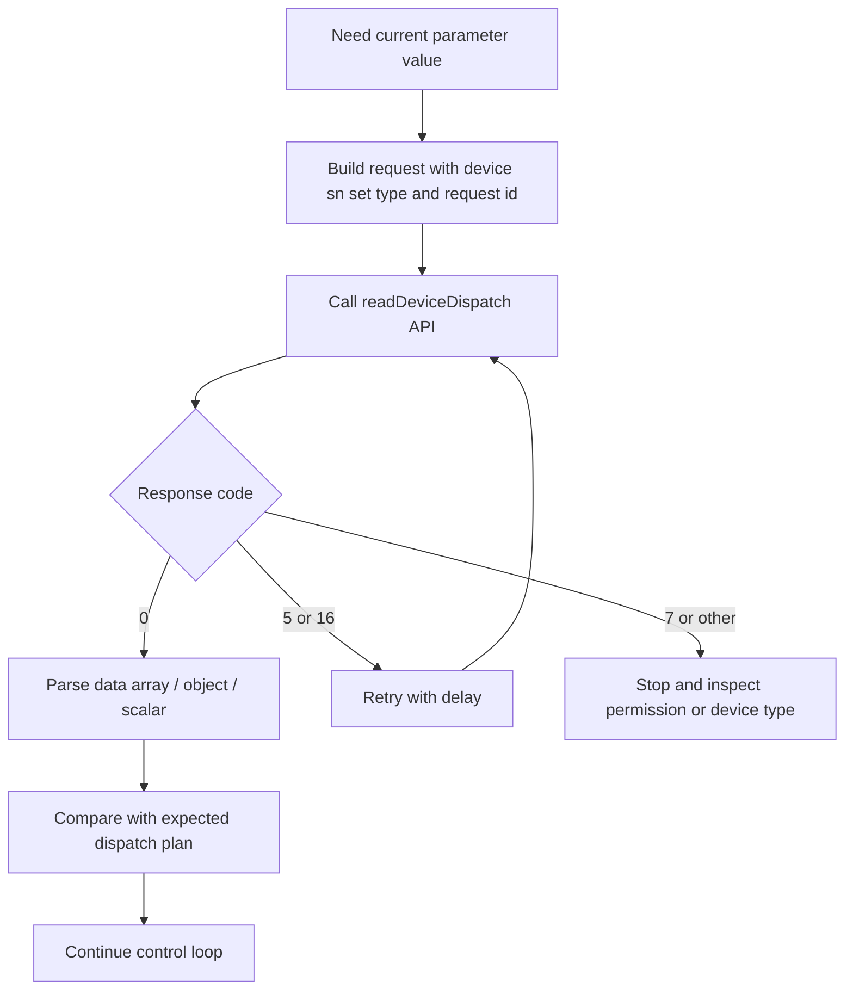
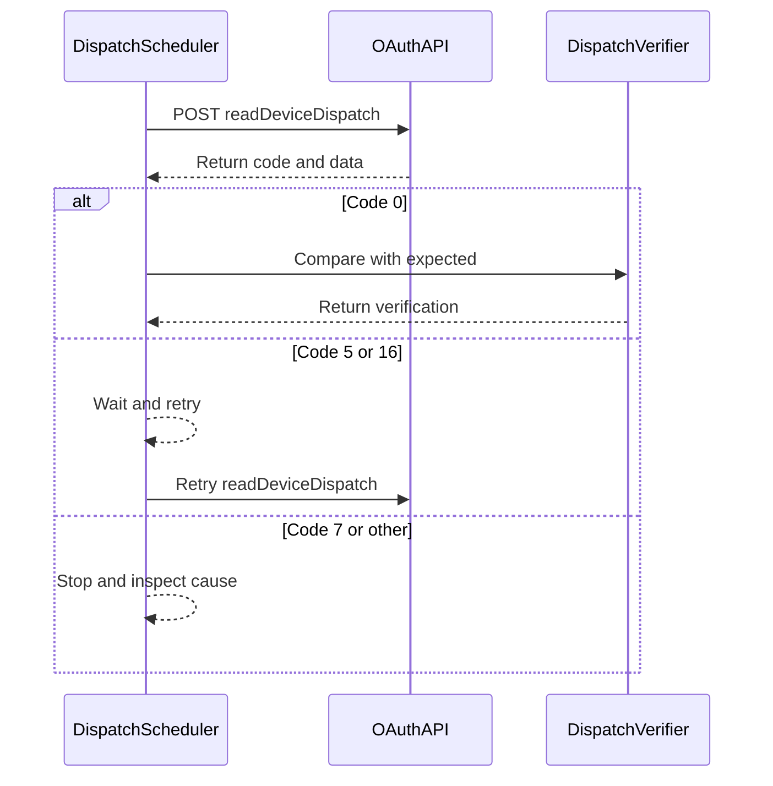

# Read Device Dispatch Parameters API

## Brief Description

- Read device parameters by device SN.
- The API returns results only for devices that the current token is allowed to access; unauthorized devices return `DEVICE_SN_DOES_NOT_HAVE_PERMISSION`.
- Maximum dispatch read-back request rate: `1 request / 5 sec / device` (`12 RPM`).

## Request URL

- `/oauth2/readDeviceDispatch`

## Request Method

- `POST`
- `Content-Type: application/json`
- `Authorization: Bearer <token>`

## Read-Back Verification Flow (Concept)


```mermaid
flowchart TD
    A["Need current parameter value"] --> B["Build request with device sn set type and request id"]
    B --> C["Call readDeviceDispatch API"]
    C --> D{"Response code"}
    D -->|"0"| E["Parse data array / object / scalar"]
    D -->|"5 or 16"| F["Retry with delay"]
    D -->|"7 or other"| G["Stop and inspect permission or device type"]
    E --> H["Compare with expected dispatch plan"]
    H --> I["Continue control loop"]
    F --> C
```

## Read-Back Verification Flow (Sequence)


```mermaid
sequenceDiagram
    participant Scheduler as DispatchScheduler
    participant API as OAuthAPI
    participant Verifier as DispatchVerifier

    Scheduler->>API: POST readDeviceDispatch
    API-->>Scheduler: Return code and data
    alt Code 0
        Scheduler->>Verifier: Compare with expected
        Verifier-->>Scheduler: Return verification
    else Code 5 or 16
        Scheduler-->>Scheduler: Wait and retry
        Scheduler->>API: Retry readDeviceDispatch
    else Code 7 or other
        Scheduler-->>Scheduler: Stop and inspect cause
    end
```

## Request Parameters

| Parameter | Type | Required | Description |
| :--- | :--- | :--- | :--- |
| `deviceSn` | string | Yes | Device SN |
| `setType` | string | Yes | Parameter enum, for example `export_limit` |
| `requestId` | string | Yes | Unique request identifier |

## Request Example

```json
{
    "deviceSn": "DEVICE_SN_1",
    "setType": "export_limit",
    "requestId": "20260402093000123abcdef123456789"
}
```

## Response Parameters

| Parameter | Type | Description |
| :--- | :--- | :--- |
| `code` | int | `0` means success; any other value means failure |
| `data` | array \| object \| number \| null | Result value; the successful shape depends on `setType` |
| `message` | string | Response description |

## Response Examples

### Successful Read: Array Shape

```json
{
    "code": 0,
    "data": [
        {
            "startTime": "16:00",
            "endTime": "18:00",
            "percentage": 80
        },
        {
            "startTime": "19:00",
            "endTime": "21:00",
            "percentage": -80
        }
    ],
    "message": "success"
}
```

### Successful Read: Object Shape

```json
{
    "code": 0,
    "data": {
        "exportLimitEnabled": 1,
        "percentage": 20
    },
    "message": "success"
}
```

### Successful Read: Scalar Shape

```json
{
    "code": 0,
    "data": 1,
    "message": "SUCCESSFUL_OPERATION"
}
```

### Device Offline

```json
{
    "code": 5,
    "data": null,
    "message": "DEVICE_OFFLINE"
}
```

### Read Failure

```json
{
    "code": 18,
    "data": null,
    "message": "READ_DEVICE_PARAM_FAIL"
}
```

### Too Many Requests

```json
{
    "code": 105,
    "data": null,
    "message": "TOO_MANY_REQUEST"
}
```

## Customer Implementation Guidance

- Always include the required `requestId` and generate a unique value for each request.
- Parse `data` according to `setType`; it may be an array, object, or scalar number on success.
- Apply the documented per-device rate limit when polling for a read-back result.

## Success Shapes by `setType`

- Array: `time_slot_charge_discharge`
- Object: `duration_and_power_charge_discharge`, `export_limit`
- Scalar number: `enable_control`, `active_power_derating_percentage`, `active_power_percentage`, `remote_charge_discharge_power`

## Related Documentation

- [Device Dispatch API](./05_api_device_dispatch.md)
- [Global Parameters](./10_global_params.md)
- [ESS Terminology Glossary](./12_ess_terminology.md)
