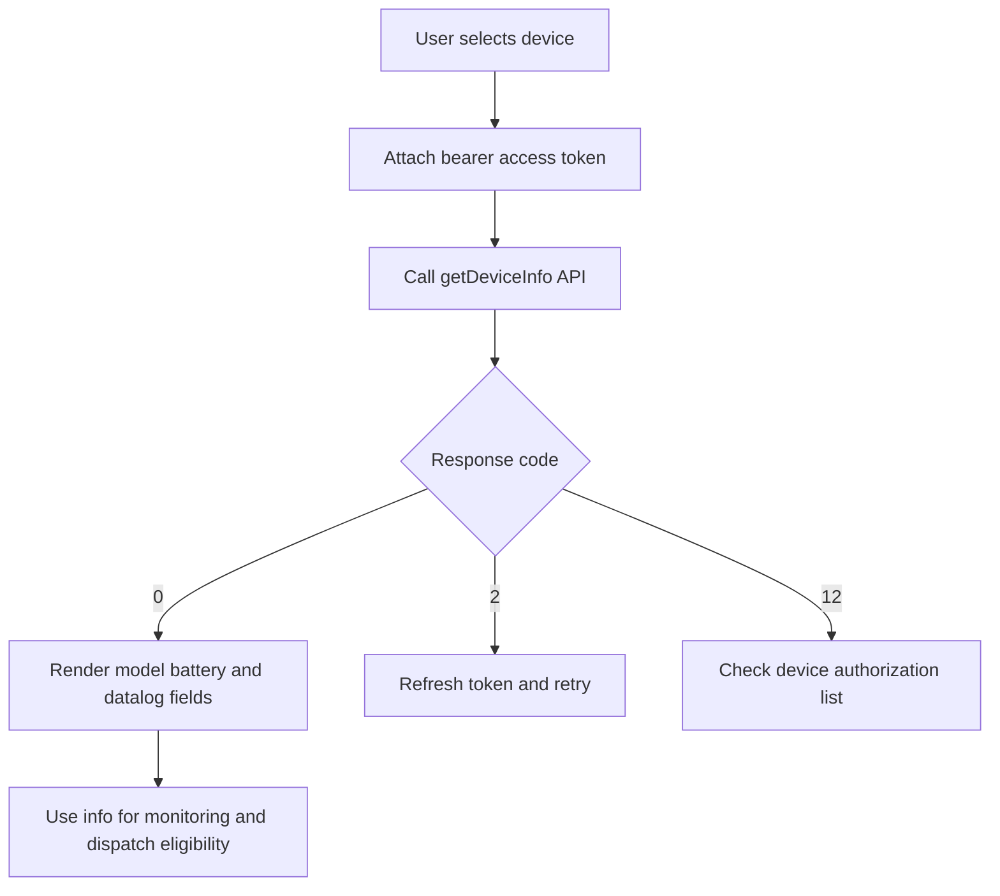
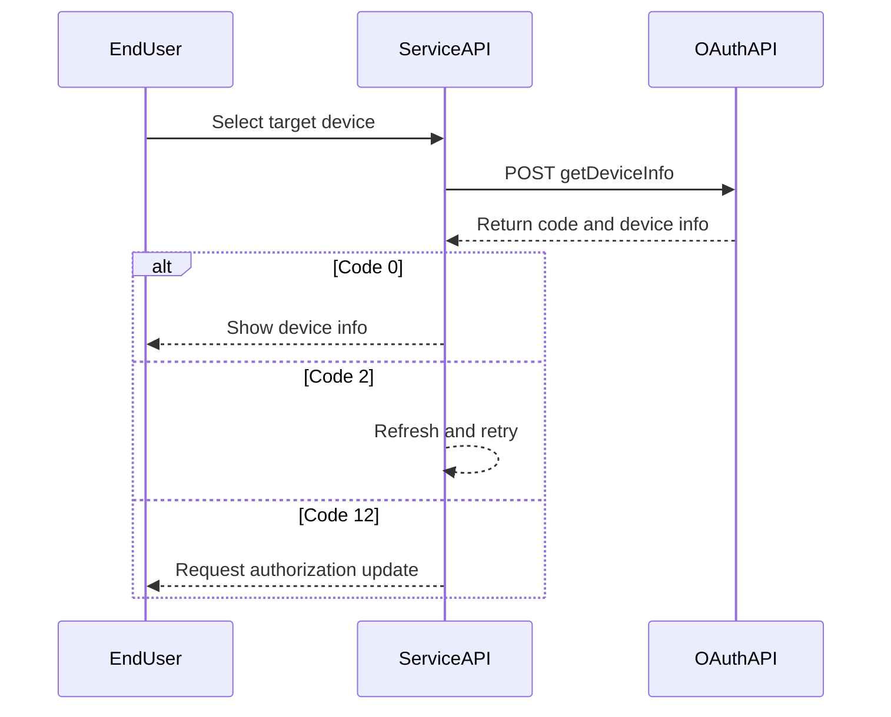

# Device Information Query API

## Brief Description

- Get information for devices already authorized to the current token.
- The API returns only device results that the current token is allowed to access; unauthorized devices return `DEVICE_SN_DOES_NOT_HAVE_PERMISSION`.

## Request URL

- `/oauth2/getDeviceInfo`

## Request Method

- `POST`
- `Content-Type: application/json`
- `Authorization: Bearer <token>`

## Device Info Query Flow (Concept)



## Device Info Query Flow (Sequence)



## HTTP Header Parameters

| Parameter | Required | Type | Description | Example |
| :--- | :--- | :--- | :--- | :--- |
| `Authorization` | Yes | string | Access-token header | `Bearer ACCESS_TOKEN` |

## HTTP Body Parameters

| Parameter | Required | Type | Description | Example |
| :--- | :--- | :--- | :--- | :--- |
| `deviceSn` | Yes | string | Unique device serial number (SN) | `"DEVICE_SN_1"` |

## Response Parameters

| Parameter | Type | Description | Example |
| :--- | :--- | :--- | :--- |
| `code` | int | `0` means success; any other value means failure | `0` |
| `data` | object | Response payload | `{...}` |
| `message` | string | Response description | `"SUCCESSFUL_OPERATION"` |

## Request Example

```json
{
    "deviceSn": "DEVICE_SN_1"
}
```

## Response Example

```json
{
    "code": 0,
    "data": {
        "deviceSn": "DEVICE_SN_1",
        "deviceTypeName": "min",
        "model": "BDCBAT",
        "nominalPower": 6000,
        "datalogSn": "DATALOG_SN_1",
        "datalogDeviceTypeName": "ShineWiFi-X",
        "dtc": 5100,
        "communicationVersion": "ZABA-0021",
        "existBattery": true,
        "batterySn": "BATTERY_SN_1",
        "batteryModel": "ARK 5.12-25.6XH-A1",
        "batteryCapacity": 5000,
        "batteryNominalPower": 2500,
        "authFlag": true,
        "batteryList": [
            {
                "batterySn": "BATTERY_SN_1",
                "batteryModel": "ARK 5.12-25.6XH-A1",
                "batteryCapacity": 5000,
                "batteryNominalPower": 2500
            }
        ]
    },
    "message": "SUCCESSFUL_OPERATION"
}
```

```json
{
    "code": 2,
    "message": "TOKEN_IS_INVALID"
}
```

## `data` Field Definitions

| Parameter | Type | Description | Example |
| :--- | :--- | :--- | :--- |
| `deviceSn` | string | Device serial number | `"DEVICE_SN_1"` |
| `deviceTypeName` | string | Device type name | `"min"` |
| `model` | string | Device model | `"BDCBAT"` |
| `nominalPower` | int | Rated inverter power in W | `6000` |
| `datalogSn` | string | Datalogger serial number | `"DATALOG_SN_1"` |
| `datalogDeviceTypeName` | string | Datalogger type name | `"ShineWiFi-X"` |
| `dtc` | int | Numeric device-type code | `5100` |
| `communicationVersion` | string | Firmware communication version | `"ZABA-0021"` |
| `existBattery` | boolean | Whether the device has a battery | `true` |
| `batterySn` | string | Battery serial number | `"BATTERY_SN_1"` |
| `batteryModel` | string | Battery model | `"ARK 5.12-25.6XH-A1"` |
| `batteryCapacity` | int | Battery rated capacity in Wh | `5000` |
| `batteryNominalPower` | int | Battery rated power in W | `2500` |
| `authFlag` | boolean | Whether the device is already authorized | `true` |
| `batteryList` | array | Battery list | `[{...}]` |
| `batteryList[].batterySn` | string | Battery serial number in the battery list | `"BATTERY_SN_1"` |
| `batteryList[].batteryModel` | string | Battery model in the battery list | `"ARK 5.12-25.6XH-A1"` |
| `batteryList[].batteryCapacity` | int | Battery rated capacity in Wh | `5000` |
| `batteryList[].batteryNominalPower` | int | Battery rated power in W | `2500` |

## Related Documentation

- [Device Authorization API](./04_api_device_auth.md)
- [Device Data Query API](./08_api_device_data.md)
- [ESS Terminology Glossary](./12_ess_terminology.md)
