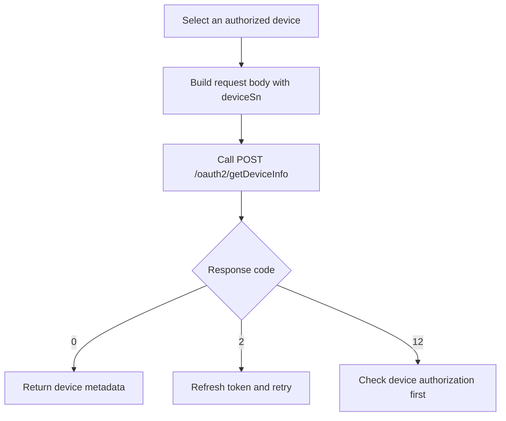

# Device Information Query API

**Brief Description**

- Returns static information for a device already authorized to the current token.
- The query target is a single `deviceSn`.
- The normative request body is JSON.

**Request URL**

- `/oauth2/getDeviceInfo`

**Request Method**

- `POST`
- `Content-Type: application/json`
- `Authorization: Bearer <token>`

## Query Flow



---

## Request Parameters

| Parameter | Required | Type | Description |
| :--- | :--- | :--- | :--- |
| `deviceSn` | Yes | string | Unique device serial number |

---

## Request Example

```json
{
    "deviceSn": "YRP0N4S00Q"
}
```

---

## Response Example

```json
{
    "code": 0,
    "data": {
        "deviceSn": "YRP0N4S00Q",
        "deviceTypeName": "sph",
        "model": "SPH 5000TL-HUB",
        "nominalPower": 6000,
        "datalogSn": "VWQ0F9W00L",
        "datalogDeviceTypeName": "ShineWiLan-X2",
        "dtc": 3503,
        "communicationVersion": "ZCBD-0004",
        "existBattery": true,
        "batterySn": "YRP0N4S00Q_battery",
        "batteryModel": "SPH 5000TL-HUB",
        "batteryCapacity": 9000,
        "batteryNominalPower": 6000,
        "authFlag": true,
        "batteryList": [
            {
                "batterySn": "YRP0N4S00Q_battery",
                "batteryModel": "BDCBAT",
                "batteryCapacity": 9000,
                "batteryNominalPower": 6000
            }
        ]
    },
    "message": "SUCCESSFUL_OPERATION"
}
```

### Common Failures

```json
{
    "code": 2,
    "message": "TOKEN_IS_INVALID"
}
```

```json
{
    "code": 12,
    "message": "DEVICE_SN_DOES_NOT_HAVE_PERMISSION"
}
```

### 9290 Compatibility Note

In `https://api-test.growatt.com:9290`:

- The request body must pass the raw SN, without `SPH:` / `SPM:` prefixes.
- The verified working combination is `Authorization: Bearer <access_token>` with `Content-Type: application/json`.

---

## Related Documentation

- [Device Authorization API](./04_api_device_auth.md)
- [Device Data Query API](./08_api_device_data.md)
