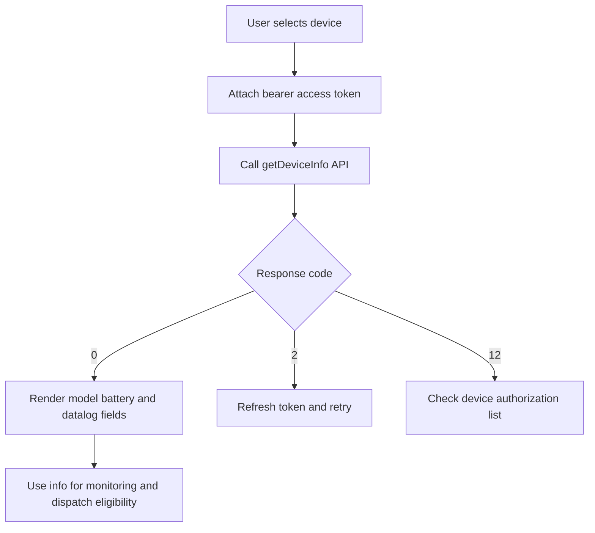

# Device Information Query API

**Brief Description**
- Get the information of authorized devices on the Growatt platform.

**Request URL**
- `/oauth2/getDeviceInfo`

**Request Method**
- `POST`
- `Content-Type`: `application/x-www-form-urlencoded`
- The request header must carry a valid `access_token`.
- Placed in the `Authorization` parameter of the request header, and must include the prefix `Bearer `.

## Device Info Query Flow (Concept)



## Device Info Query Flow (Sequence)

```mermaid
%% 本代码严格遵循AI生成Mermaid代码的终极准则v4.1（Mermaid终极大师）
sequenceDiagram
    participant User as User
    participant Service as Service
    participant API as OAuth API

    User->>Service: Select target device
    Service->>API: POST getDeviceInfo
    API-->>Service: Return code and device info
    alt Code 0
        Service-->>User: Show device info
    else Code 2
        Service-->>Service: Refresh and retry
    else Code 12
        Service-->>User: Request authorization update
    end```

---

## HTTP Header Parameters

| Parameter Name | Required | Type | Description |
| :--- | :--- | :--- | :--- |
| `Authorization` | Yes | String | Secret token |

---

## HTTP Body Parameters

| Parameter Name | Required | Type | Description |
| :--- | :--- | :--- | :--- |
| `deviceSn` | Yes | String | Device unique serial number (SN) |

---

## Interface Return Parameters

| Parameter Name | Type | Description |
| :--- | :--- | :--- |
| `code` | int | Interface return status code. 0 - Success, Others - Failure |
| `data` | obj | Returned data |
| `message` | string | Return description |

---

## Return Example

```json
// Success, code=0
{
    "code": 0,
    "data": {
        "deviceSn": "USQ1234567",
        "deviceTypeName": "min",
        "model": "BDCBAT",
        "nominalPower": 6000,
        "datalogSn": "XGD6E3P029",
        "datalogDeviceTypeName": "ShineWiFi-X",
        "dtc": 5100,
        "communicationVersion": "ZABA-0021",
        "existBattery": true,
        "batterySn": "0YXH123456789632",
        "batteryModel": "ARK 5.12-25.6XH-A1",
        "batteryCapacity": 5000,
        "batteryNominalPower": 2500,
        "authFlag": true,
        "batteryList": [
            {
                "batterySn": "0YXH123456789632",
                "batteryModel": "ARK 5.12-25.6XH-A1",
                "batteryCapacity": 5000,
                "batteryNominalPower": 2500
            }
        ]
    },
    "message": "SUCCESSFUL_OPERATION"
}

// Failure, code non-zero
{
    "code": 2,
    "message": "TOKEN_IS_INVALID"
}
```

*(Note: The `data` parameter description table is identical to section 3.3.1).*

---

## Related Documentation

- [Device Authorization API](../04_api_device_auth.md)
- [Device Data Query API](../08_api_device_data.md)
