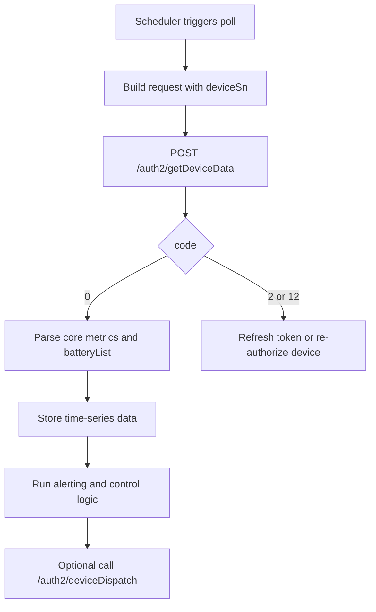

# Device Data Query API

**Brief Description**
- Query high-frequency data of a specified device based on the device serial number. This interface only returns device data that the secret token has permission to access. Devices without access permission will not be returned.

**Request URL**
- `/auth2/getDeviceData`

**Request Method**
- `POST`
- `Content-Type`: `application/x-www-form-urlencoded`

## Telemetry Consumption Flow (Mermaid)



---

## HTTP Header Parameters

| Parameter Name | Required | Type | Description |
| :--- | :--- | :--- | :--- |
| `token` | Yes | String | Secret token |

---

## HTTP Body Parameters

| Parameter Name | Required | Type | Description |
| :--- | :--- | :--- | :--- |
| `deviceSn` | Yes | String | Device unique serial number (SN) |

---

## Interface Return Parameters

| Parameter Name | Type | Description |
| :--- | :--- | :--- |
| `code` | int | Interface return status code. 0 - Success, Others - Failure |
| `data` | string | Returned data |

---

## Request Example

```json
{
    "deviceSn": "FDCJQ00003"
}
```

---

## Return Example

```json
{
    "code": 0,
    "data": {
        "activePower": 0.00,
        "batPower": -4816.00,
        "batteryList": [
            {
                "chargePower": 0.00,
                "dischargePower": 2511.00,
                "ibat": -6.40,
                "index": 1,
                "soc": 100,
                "vbat": 376.50
            },
            {
                "chargePower": 0.00,
                "dischargePower": 2305.00,
                "ibat": -6.10,
                "index": 2,
                "soc": 100,
                "vbat": 375.80
            }
        ],
        "batteryStatus": 3,
        "pac": 4562.80,
        "payLoadPower": 365.90,
        "ppv": 0.00,
        "priority": 2,
        "reverActivePower": 4450.10,
        "deviceSn": "TEST123456",
        "soc": 100,
        "status": 6,
        "utcTime": "2026-02-25 00:10:01",
        "vac1": 234.64,
        "vac2": 235.04,
        "vac3": 234.17
    }
}
```

---

## Return Parameter Description

| Parameter Name | Type | Example | Description |
| :--- | :--- | :--- | :--- |
| `dataType` | string | dfcData | Fixed value: dfcData |
| `data` | object | - | Main data object |
| `data.activePower` | double | 0 | Power drawn from grid (positive value), unit: W |
| `data.pac` | double | 2871.4 | AC output power, unit: W |
| `data.ppv` | double | 3045.3 | PV generation power, unit: W |
| `data.payLoadPower` | double | 258.4 | Total load power (calculated value), unit: W |
| `data.reverActivePower` | double | 2781.9 | Power fed into grid, unit: W |
| `data.batteryStatus` | int | 3 | Overall battery status |
| `data.batPower` | double | 200.5 | Total battery charge/discharge power (positive=charging, negative=discharging, 0=idle), unit: W |
| `data.priority` | int | 2 | Work priority |
| `data.deviceSn` | string | TEST123456 | Device serial number |
| `data.status` | int | 6 | Device operation status code |
| `data.utcTime` | string | 2026/2/25 0:10 | UTC timestamp (offset +00:00), format is yyyy-MM-dd HH:mm:ss |
| `data.vac1` | double | 234 | Phase voltage 1, unit: V |
| `data.vac2` | double | 233 | Phase voltage 2, unit: V |
| `data.vac3` | double | 234.5 | Phase voltage 3, unit: V |
| `data.soc` | int | 3 | Average battery state of charge (SOC) |
| `data.batteryList` | array | [...] | Battery information list |
| `data.batteryList[].index` | int | 1 | Battery index (starting from 1) |
| `data.batteryList[].soc` | int | 22 | Battery state of charge (percentage) |
| `data.batteryList[].chargePower` | double | 5 | Battery charge power, unit: W |
| `data.batteryList[].dischargePower` | double | 0 | Battery discharge power, unit: W |
| `data.batteryList[].ibat` | double | 0 | Battery current (low voltage side), unit: A |
| `data.batteryList[].vbat` | double | 370.6 | Battery voltage (low voltage side), unit: V |

---

## Status Value Definitions

### Device operation status (`status`)
- 0: Standby
- 1: Self-test
- 3: Fault
- 4: Upgrade
- 5: PV online & Battery offline & Grid-tied
- 6: PV offline (or online) & Battery online & Grid-tied
- 7: PV online & Battery online & Off-grid
- 8: PV offline & Battery online & Off-grid
- 9: Bypass mode

### Overall battery status (`batteryStatus`)
- 0: Battery standby
- 1: Battery disconnected
- 2: Battery charging
- 3: Battery discharging
- 4: Fault
- 5: Upgrade

### Work priority (`priority`)
- 0: Load priority
- 1: Battery priority
- 2: Grid priority

---

## Related Documentation

- [Device Information Query API](../07_api_device_info.md)
- [Device Data Push API](../09_api_device_push.md)
