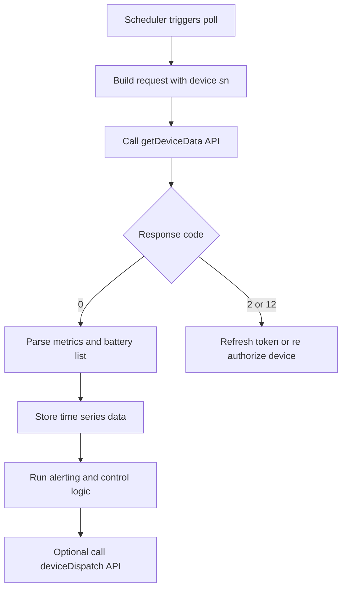
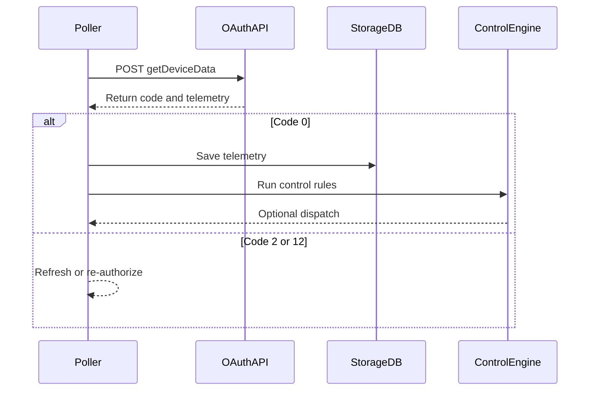

# Device Data Query API

## Brief Description

- Query high-frequency runtime data for a device by device serial number.
- The API returns only device results that the current token is allowed to access; unauthorized devices return `DEVICE_SN_DOES_NOT_HAVE_PERMISSION`.
- Maximum telemetry request rate: `1 request / min / device`.
- If this per-device limit is exceeded, the API may return `TOO_MANY_REQUEST`.

## Request URL

- `/oauth2/getDeviceData`

## Request Method

- `POST`
- `Content-Type: application/json`
- `Authorization: Bearer <token>`

## Telemetry Consumption Flow (Concept)



## Telemetry Consumption Flow (Sequence)



## HTTP Header Parameters

| Parameter | Required | Type | Description | Example |
| :--- | :--- | :--- | :--- | :--- |
| `Authorization` | Yes | string | Access-token header | `Bearer ACCESS_TOKEN` |

## HTTP Body Parameters

| Parameter | Required | Type | Description | Example |
| :--- | :--- | :--- | :--- | :--- |
| `deviceSn` | Yes | string | Unique device serial number (SN) | `"DEVICE_SN_1"` |

## Response Parameters

| Parameter | Vendor-table Type | Description | Example |
| :--- | :--- | :--- | :--- |
| `code` | int | `0` means success; any other value means failure | `0` |
| `data` | string | The vendor table says `string`, while the success sample is an object | `{...}` |
| `message` | string | Response description | `"SUCCESSFUL_OPERATION"` |

## Request Example

```json
{
    "deviceSn": "DEVICE_SN_1"
}
```

## Response Example

```json
{
    "code": 0,
    "data": {
        "fac": 50.03,
        "backupPower": 0.20,
        "batPower": 0.00,
        "soc": 67,
        "pac": 41.30,
        "etoUserToday": 3.10,
        "meterPower": 0.00,
        "utcTime": "2026-03-13 07:48:25",
        "etoUserTotal": 44.80,
        "pexPower": 14.30,
        "batteryList": [
            {
                "chargePower": 0.00,
                "soc": 67,
                "echargeToday": 2.90,
                "vbat": 53.30,
                "index": 1,
                "echargeTotal": 80.70,
                "dischargePower": 0.00,
                "edischargeToday": 1.90,
                "ibat": -1.00,
                "soh": 100,
                "edischargeTotal": 57.60,
                "status": 0
            }
        ],
        "protectCode": 0,
        "reactivePower": 174.90,
        "deviceSn": "DEVICE_SN_1",
        "etoGridTotal": 270.70,
        "genPower": 0.00,
        "priority": 0,
        "vac3": 236.90,
        "etoGridToday": 1.50,
        "protectSubCode": 0,
        "vac2": 236.90,
        "vac1": 236.90,
        "payLoadPower": 14.50,
        "faultCode": 0,
        "faultSubCode": 0,
        "batteryStatus": 0,
        "ppv": 14.30,
        "epvTotal": 0.00,
        "smartLoadPower": 0.00,
        "status": 6
    },
    "message": "SUCCESSFUL_OPERATION"
}
```

## Response Field Definitions

| Parameter | Type | Description | Example |
| :--- | :--- | :--- | :--- |
| `code` | int | API status code; `0` means success | `0` |
| `data` | object | Main data object | `{...}` |
| `data.deviceSn` | string | Device serial number | `"DEVICE_SN_1"` |
| `data.meterPower` | double | Grid meter power. Positive means grid import and negative means grid export, unit: W | `0.00` |
| `data.reactivePower` | double | Reactive power (positive: capacitive, negative: inductive) | `174.90` |
| `data.fac` | double | Grid frequency in Hz | `50.03` |
| `data.backupPower` | double | Backup output power in W when reported. Public endpoint field; not part of Appendix C VPP core semantic telemetry | `0.20` |
| `data.etoUserToday` | double | Grid import energy today in kWh | `3.10` |
| `data.etoUserTotal` | double | Total grid import energy in kWh | `44.80` |
| `data.etoGridToday` | double | Grid export energy today in kWh | `1.50` |
| `data.etoGridTotal` | double | Total grid export energy in kWh | `270.70` |
| `data.faultCode` | int | Fault main code | `0` |
| `data.faultSubCode` | int | Fault sub-code | `0` |
| `data.protectCode` | int | Protection main code | `0` |
| `data.protectSubCode` | int | Protection sub-code | `0` |
| `data.pac` | double | AC output power in W | `41.30` |
| `data.pexPower` | double | External generation power in W for third-party meter / Solar Inverter sources. Treat as a non-negative external-generation magnitude, not a grid import/export sign field | `14.30` |
| `data.genPower` | double | Generator power in W for off-grid runtime when a generator source is present. Treat as a non-negative generator magnitude, not an AC-couple external-generation boundary signal | `0.00` |
| `data.ppv` | double | Device-local PV power in W. Core for Hybrid; auxiliary when reported alongside `pexPower` in AC-couple topologies | `14.30` |
| `data.epvTotal` | double | Total PV generation in kWh | `0.00` |
| `data.payLoadPower` | double | Total load power (calculated) in W | `14.50` |
| `data.smartLoadPower` | double | Smart-load power when the device reports a dedicated smart-load channel, unit: W | `0.00` |
| `data.batteryStatus` | int | Overall battery status | `0` |
| `data.batPower` | double | Battery power. Positive = charging, negative = discharging, `0` = idle, unit: W | `0.00` |
| `data.soc` | int | System-level battery state of charge (SOC) in percent; represents the overall ESS battery system SOC | `67` |
| `data.priority` | int | Operating priority | `0` |
| `data.status` | int | Runtime status code | `6` |
| `data.utcTime` | string | UTC timestamp in `yyyy-MM-dd HH:mm:ss` format | `"2026-03-13 07:48:25"` |
| `data.vac1` | double | Line voltage 1 in V | `236.90` |
| `data.vac2` | double | Line voltage 2 in V | `236.90` |
| `data.vac3` | double | Line voltage 3 in V | `236.90` |
| `data.batteryList` | array | Battery data list | `[{...}]` |
| `data.batteryList[].index` | int | Battery index (starts from 1) | `1` |
| `data.batteryList[].soc` | int | Battery state of charge (SOC) in percent | `67` |
| `data.batteryList[].chargePower` | double | Battery charging power in W | `0.00` |
| `data.batteryList[].dischargePower` | double | Battery discharging power in W | `0.00` |
| `data.batteryList[].ibat` | double | Battery current on the low-voltage side in A | `-1.00` |
| `data.batteryList[].vbat` | double | Battery voltage on the low-voltage side in V | `53.30` |
| `data.batteryList[].soh` | int | Battery state of health (SOH) `[0,100]` | `100` |
| `data.batteryList[].status` | int | Per-battery status code when present | `0` |
| `data.batteryList[].echargeToday` | double | Charged energy today in kWh | `2.90` |
| `data.batteryList[].echargeTotal` | double | Total charged energy in kWh | `80.70` |
| `data.batteryList[].edischargeToday` | double | Discharged energy today in kWh | `1.90` |
| `data.batteryList[].edischargeTotal` | double | Total discharged energy in kWh | `57.60` |

## Status Definitions

### Runtime Status (`status`)

- `0`: Standby
- `1`: Self-check
- `3`: Fault
- `4`: Upgrade
- `5`: PV online & battery offline & grid-connected
- `6`: PV offline (or online) & battery online & grid-connected
- `7`: PV online & battery online & off-grid
- `8`: PV offline & battery online & off-grid
- `9`: Bypass mode

### Overall Battery Status (`batteryStatus`)

- `0`: Battery standby
- `1`: Battery disconnected
- `2`: Battery charging
- `3`: Battery discharging
- `4`: Fault
- `5`: Upgrade

### Operating Priority (`priority`)

- `0`: Load priority
- `1`: Battery priority
- `2`: Grid priority

## Implementation Note

- The local header table uses `token`, while the global section standardizes `Authorization: Bearer xxxxxxx`. This page follows the global section.
- The response table labels the top-level `data` field as `string`, while the success sample is clearly an object.

## Related Documentation

- [Device Information Query API](./07_api_device_info.md)
- [Device Data Push API](./09_api_device_push.md)
- [ESS Terminology Glossary](./12_ess_terminology.md)
