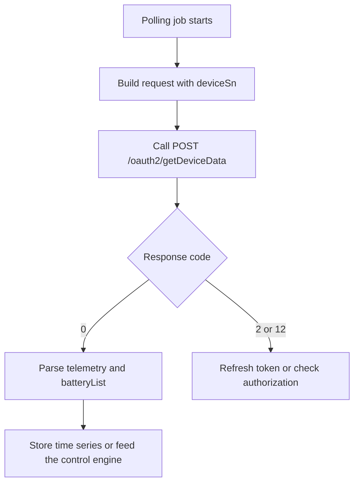

# Device Data Query API

**Brief Description**

- Queries high-frequency runtime telemetry for an authorized device by device SN.
- The normative telemetry model is centered on `meterPower`, `reactivePower`, `serialNum`, and `batteryList[]`.
- Historical test materials that use `activePower`, `reverActivePower`, or top-level `soc` are treated as compatibility fields rather than primary definitions.

**Request URL**

- `/oauth2/getDeviceData`

**Request Method**

- `POST`
- `Content-Type: application/json`
- `Authorization: Bearer <token>`

## Telemetry Consumption Flow



---

## Request Parameters

| Parameter | Required | Type | Description |
| :--- | :--- | :--- | :--- |
| `deviceSn` | Yes | string | Unique device serial number |

---

## Request Example

```json
{
    "deviceSn": "YRP0N4S00Q"
}
```

---

## Response Example (Normative Fields)

```json
{
    "code": 0,
    "data": {
        "fac": 50.03,
        "backupPower": 0.20,
        "batPower": 0.00,
        "pac": 41.30,
        "etoUserToday": 3.10,
        "meterPower": 0.00,
        "utcTime": "2026-03-13 07:48:25",
        "etoUserTotal": 44.80,
        "pexPower": 14.30,
        "batteryList": [
            {
                "chargePower": 0.00,
                "soc": 67,
                "echargeToday": 2.90,
                "vbat": 53.30,
                "index": 1,
                "echargeTotal": 80.70,
                "dischargePower": 0.00,
                "edischargeToday": 1.90,
                "ibat": -1.00,
                "soh": 100,
                "edischargeTotal": 57.60,
                "status": 0
            }
        ],
        "protectCode": 0,
        "reactivePower": 174.90,
        "serialNum": "YRP0N4S00Q",
        "etoGridTotal": 270.70,
        "genPower": 0.00,
        "priority": 0,
        "vac3": 236.90,
        "etoGridToday": 1.50,
        "protectSubCode": 0,
        "vac2": 236.90,
        "vac1": 236.90,
        "payLoadPower": 14.50,
        "faultCode": 0,
        "faultSubCode": 0,
        "batteryStatus": 0,
        "ppv": 14.30,
        "smartLoadPower": 0.00,
        "status": 6
    },
    "message": "SUCCESSFUL_OPERATION"
}
```

---

## Normative Field Definitions

| Parameter | Type | Description |
| :--- | :--- | :--- |
| `data.meterPower` | double | Meter-side power. Positive means importing from grid, negative means exporting to grid, unit: W |
| `data.reactivePower` | double | Reactive power |
| `data.fac` | double | Grid frequency |
| `data.etoUserToday` | double | Energy imported today, unit: kWh |
| `data.etoUserTotal` | double | Total imported energy, unit: kWh |
| `data.etoGridToday` | double | Energy exported today, unit: kWh |
| `data.etoGridTotal` | double | Total exported energy, unit: kWh |
| `data.pac` | double | AC output power, unit: W |
| `data.ppv` | double | PV power measured by the local inverter, unit: W |
| `data.payLoadPower` | double | Total load power, unit: W |
| `data.batPower` | double | Total battery charge/discharge power. Positive for charge, negative for discharge, unit: W |
| `data.serialNum` | string | Canonical device serial field in telemetry payloads |
| `data.status` | int | Device runtime status code |
| `data.utcTime` | string | UTC timestamp |
| `data.batteryList` | array | Battery object list |
| `data.batteryList[].soc` | int | State of charge per battery |
| `data.batteryList[].soh` | int | State of health per battery |
| `data.batteryList[].chargePower` | double | Charge power per battery |
| `data.batteryList[].dischargePower` | double | Discharge power per battery |
| `data.batteryList[].status` | int | Status per battery |

---

## Historical-Field Compatibility Note

Some historical materials and deployment-specific payloads have exposed the following differences:

- Telemetry may additionally expose `activePower`, and on some environments or devices it may also expose `reverActivePower`; these fields may coexist with `meterPower`, or only a subset may appear.
- Some payloads use `deviceSn` or top-level `soc` as compatibility fields.
- Requests still use the raw SN together with `Authorization: Bearer <access_token>` and a JSON body.

Recommended handling:

- Use the model on this page as the external semantic contract.
- If an environment actually returns `activePower` / `reverActivePower`, ingest them as compatibility fields without promoting them to primary semantics.

---

## Related Documentation

- [Device Information Query API](./07_api_device_info.md)
- [Device Data Push API](./09_api_device_push.md)
