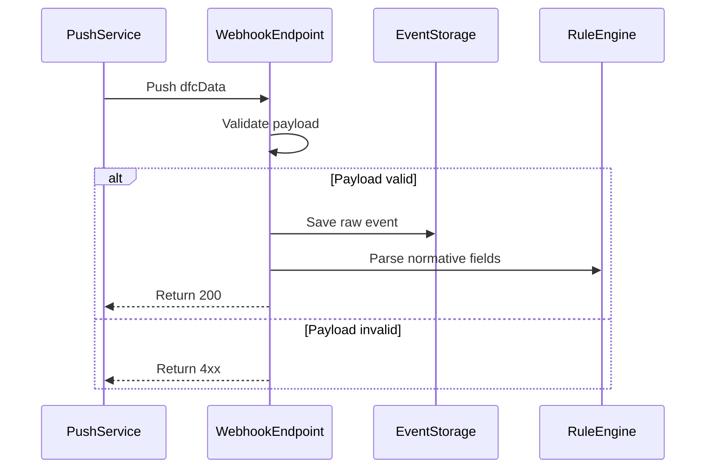

# Device Data Push API

**Brief Description**

- The third-party platform must provide its own functional receiving endpoint and share the webhook URL with Growatt.
- The primary payload model should follow the normative fields in [Device Data Query API](./08_api_device_data.md).
- If an environment still pushes historical compatibility fields, handle them as backward-compatible inputs instead of changing the primary model.

## Webhook Processing Sequence



---

## Push Example

```json
{
    "dataType": "dfcData",
    "data": {
        "meterPower": 0.00,
        "reactivePower": 174.90,
        "pac": 41.30,
        "ppv": 14.30,
        "batPower": 0.00,
        "payLoadPower": 14.50,
        "serialNum": "YRP0N4S00Q",
        "utcTime": "2026-03-13 07:48:25",
        "status": 6,
        "batteryList": [
            {
                "index": 1,
                "soc": 67,
                "soh": 100,
                "chargePower": 0.00,
                "dischargePower": 0.00,
                "ibat": -1.00,
                "vbat": 53.30,
                "status": 0
            }
        ]
    }
}
```

### Historical-Field Compatibility Note

Some historical or deployment-specific payloads may still contain `activePower`, `reverActivePower`, or top-level `soc`, and they may appear alongside `meterPower`. Treat them as compatibility inputs. The primary parser should continue to follow the model defined in [Device Data Query API](./08_api_device_data.md).

---

## Related Documentation

- [Device Data Query API](./08_api_device_data.md)
- [Global Parameters](./10_global_params.md)
