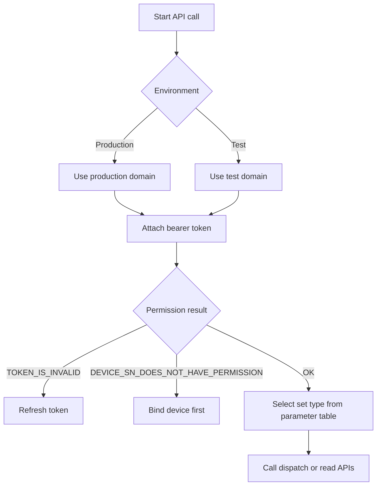
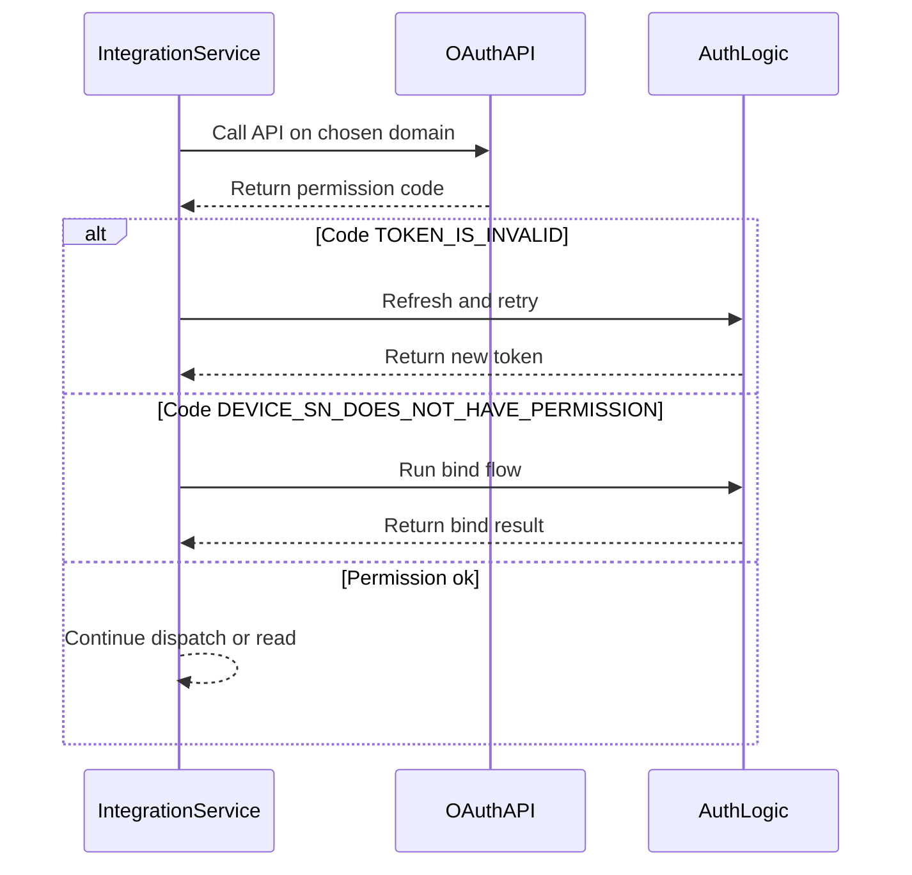

# Global Parameters

## Domains

### Production Environment

- `https://opencloud.growatt.com`
- `https://opencloud-au.growatt.com`

### Test Environment

- `https://opencloud-test.growatt.com`
- `https://opencloud-test-au.growatt.com`

## Environment and Parameter Decision Flow (Concept)



## Environment and Permission Handling (Sequence)



## HTTP Header

- Calling the API requires `access_token`.

| Parameter | Description | Value |
| :--- | :--- | :--- |
| `Authorization` | Token marker | `Bearer xxxxxxx` |

## Response Codes

### Response Format Example

```json
{
    "code": 0,
    "data": "<endpoint-dependent>",
    "message": "RESPONSE_MESSAGE"
}
```

| Scenario | `code` | `data` | `message` |
| :--- | :--- | :--- | :--- |
| Successful operation | `0` | Endpoint-dependent: object, array, number, `null`, or empty array depending on endpoint | `"SUCCESSFUL_OPERATION"` |
| Device SN does not have permission | `12` | `["DEVICE_SN_1"]` | `"DEVICE_SN_DOES_NOT_HAVE_PERMISSION"` |
| Token is invalid | `2` | Not returned | `"TOKEN_IS_INVALID"` |
| Device offline | `5` | `null` | `"DEVICE_OFFLINE"` |
| Read device parameter failed | `18` | `null` | `"READ_DEVICE_PARAM_FAIL"` |
| Wrong grant type | `103` | Not returned | `"WRONG_GRANT_TYPE"` |
| Parameter-setting response timeout | `16` | `null` | `"PARAMETER_SETTING_RESPONSE_TIMEOUT"` |
| Parameter-setting device not responding | `15` | `null` | `"PARAMETER_SETTING_DEVICE_NOT_RESPONDING"` |
| Parameter-setting failed | `6` | `null` | `"PARAMETER_SETTING_FAILED"` |
| Too many requests | `105` | `null` | `"TOO_MANY_REQUEST"` |

## Device Parameters

- The table below keeps only the `setType` entries documented for this page.

| Parameter | Description | Value Description |
| :--- | :--- | :--- |
| `time_slot_charge_discharge` | Time-slot charging/discharging. `percentage` range `[-100,100]`; `percentage > 0` means charging and `percentage < 0` means discharging; `startTime` / `endTime` are UTC times | `[{ "percentage": 100, "startTime": "00:00", "endTime": "23:59" }]` |
| `duration_and_power_charge_discharge` | Charging/discharging duration and power percentage. `percentage` range `[0,100]`; supports `selfConsumptionCommand`, `chargeOnlySelfConsumptionCommand`, `chargeCommand`, and `dischargeCommand` | `{ "duration": 10, "percentage": 20, "type": "dischargeCommand" }` |
| `anti_backflow` | Export Limit. `antiBackflowEnabled` is the enable switch; `percentage` range `[-100,100]`; positive values mean export limiting and negative values mean forward-flow control | `{ "antiBackflowEnabled": 1, "percentage": 20 }` |

## Related Documentation

- [Device Dispatch API](./05_api_device_dispatch.md)
- [Read Device Dispatch Parameters API](./06_api_read_dispatch.md)
- [ESS Terminology Glossary](./12_ess_terminology.md)
