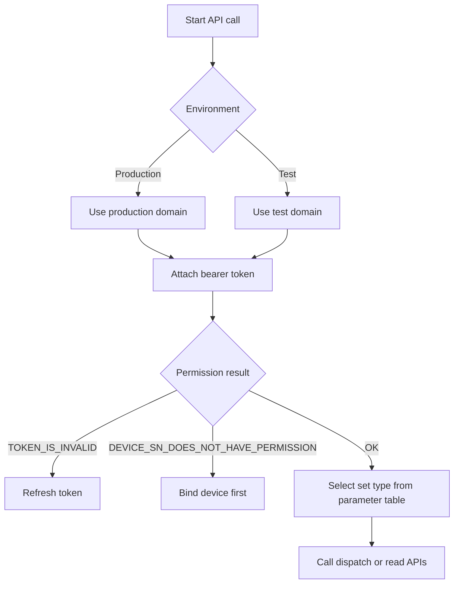

# Global Parameter Description

## Domains

### Production Environment
- `https://opencloud.growatt.com`
- `https://opencloud-au.growatt.com`

### Test Environment
- `https://opencloud-test.growatt.com`

## Environment and Parameter Decision Flow (Mermaid)



---

## Permission Parameters Description

### Device not authorized

```json
{
    "code": 12,
    "data": [
        "WAQ1234567"
    ],
    "message": "DEVICE_SN_DOES_NOT_HAVE_PERMISSION"
}
```

### access_token expired

```json
{
    "code": 2,
    "message": "TOKEN_IS_INVALID"
}
```

---

## Device Parameters Description

**Brief Description:**
- Parameter enumeration, parameter description, and parameter value description for each setting parameter.

| Parameter Name | Parameter Description | Parameter Value Description |
| :--- | :--- | :--- |
| `enable_control` | Control permission | 0: Disable<br>1: Enable<br>Default: Disable |
| `power_on_off_command` | Power on/off command | 0: Power off<br>1: Power on<br>Default: Power on<br>Not stored<br>Using this protocol to control the inverter requires enabling this register |
| `system_time_setting` | System time setting | Example: 2024-10-10 13:14:14 |
| `syn_enable` | SYN enable | Off-grid box enable<br>0: Disable<br>1: Enable<br>Default: 0 |
| `active_power_derating_percentage` | Active power derating percentage | Derating percentage: [0, 100]<br>Default value: 100 |
| `active_power_percentage` | Active power percentage | Derating percentage: [0, 100]<br>Default value: 100<br>The smaller value between active power percentage and active power derating percentage (1%) is taken as the actual value.<br>Not stored |
| `eps_enable` | EPS off-grid enable | 0: Disable<br>1: Enable<br>Default: 0 |
| `eps_frequency` | EPS off-grid frequency | 0: 50Hz<br>1: 60Hz<br>Default: 0 |
| `eps_voltage` | EPS off-grid voltage | 0: 230V<br>1: 208V<br>2: 240V<br>3: 220V<br>4: 127V<br>5: 277V<br>6: 254V<br>Default: 0 |
| `reactive_power_percentage` | Reactive power percentage | Derating percentage: [0, 60]<br>Default value: 60 |
| `reactive_power_mode` | Reactive power mode | 0: PF=1<br>1: PF value setting<br>2: Default PF curve (Reserved)<br>3: User-defined PF curve (Reserved)<br>4: Lagging reactive power (+)<br>5: Leading reactive power (-)<br>Default value: 0<br>When discharging, + represents lagging (inductive), - represents leading (capacitive); when charging, + represents leading (capacitive), - represents lagging (inductive) |
| `power_factor` | Power factor | [0, 20000]<br>Actual power factor = (10000 - Setting value) * 0.0001<br>Default value: 10000 |
| `anti_backfeed_enable` | Anti-backfeed enable | 0: Disable<br>1: Single unit anti-backfeed enable<br>Default value: 0 |
| `anti_backfeed_power_percentage` | Anti-backfeed power percentage | [-100, 100]<br>Default value: 0<br>Positive value indicates forward current control, negative value indicates reverse current control |
| `anti_backfeed_limit_invalid_value` | Anti-backfeed limit invalid value | [0, 100]<br>Default value: 0<br>When the actual reverse current to the grid exceeds the set anti-backfeed power, this register limits the reverse current power, can only do reverse current control, ≥0 |
| `anti_backfeed_invalid_duration` | Anti-backfeed invalid duration / EMS communication failure duration | [1, 300]<br>Default value: 30 |
| `ems_comm_failure_enable` | EMS communication failure function enable | 0: Disable<br>1: Enable<br>Default value: 0 |
| `over_backfeed_enable` | Over-backfeed enable | 0: Disable<br>1: Enable<br>Default value: 0 |
| `anti_backfeed_power_change_rate` | Anti-backfeed feed-in power change rate | [1, 20000]<br>Default value: 27 |
| `single_phase_anti_backfeed_enable` | Single-phase anti-backfeed control enable | 0: Disable<br>1: Enable<br>Default value: 0 |
| `anti_backfeed_protection_mode` | Anti-backfeed protection mode | 0: Default mode<br>1: Soft, hardware control mode<br>2: Software control mode<br>3: Hardware control mode<br>Default value: 0 |
| `charge_cutoff_soc` | Charge cutoff SOC | [70, 100]<br>Default value: 100 |
| `grid_discharge_cutoff_soc` | Grid-tied discharge cutoff SOC | [10, 30]<br>Default value: 10 |
| `load_priority_discharge_cutoff_soc` | Load priority discharge cutoff SOC | [10, 20]<br>Default value: 10 |
| `remote_power_control_enable` | Remote power control enable | 0: Disable<br>1: Enable<br>Default: 0<br>Not stored |
| `remote_power_control_charge_duration` | Remote power control charge duration | 0: Unlimited time<br>1~1440min: Control power duration according to set time<br>Default: 0<br>Not stored |
| `remote_charge_discharge_power` | Remote charge/discharge power | [-100, 100]<br>Positive: Charge<br>Negative: Discharge<br>Default: 0<br>Not stored |
| `ac_charge_enable` | AC charge enable | 0: Disable<br>1: Enable<br>Default: 0 |
| `time_slot_charge_discharge` | Time-slot charge/discharge | Set time slots (json format: `[{percentage: power, startTime: start time, endTime: end time}]`, time range: 0-1440, eg:<br>`[{ "percentage" :95," startTime" :0," endTime" :300}, { "percentage" :-60," startTime" :301," endTime" :720}]` |
| `off_grid_discharge_cutoff_soc` | Off-grid discharge cutoff SOC | [10, 30]<br>Default value: 10 |
| `battery_charge_cutoff_voltage` | Battery charge cutoff voltage | Used for lead-acid batteries<br>[0, 15000]<br>Default values divided by voltage level:<br>Voltage level 127V: 6500;<br>227V: 10000<br>Other voltage levels default value: 8000 |
| `battery_discharge_cutoff_voltage` | Battery discharge cutoff voltage | Used for lead-acid batteries<br>[0, 15000]<br>Default values divided by voltage level:<br>Voltage level 127V: 3800;<br>Voltage level 227V: 7500;<br>Other voltage levels default value: 6500 |
| `battery_max_charge_current` | Battery max charge current | Used for lead-acid batteries<br>[0, 2000]<br>Default value: 1500 |
| `battery_max_discharge_current` | Battery max discharge current | Used for lead-acid batteries<br>[0, 2000]<br>Default value: 1500 |

---

## Related Documentation

- [Authentication Guide](../01_authentication.md)
- [Device Dispatch API](../05_api_device_dispatch.md)
- [Read Device Dispatch Parameters API](../06_api_read_dispatch.md)
