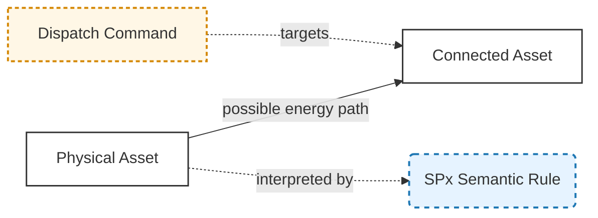
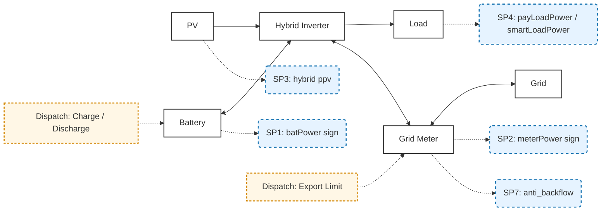
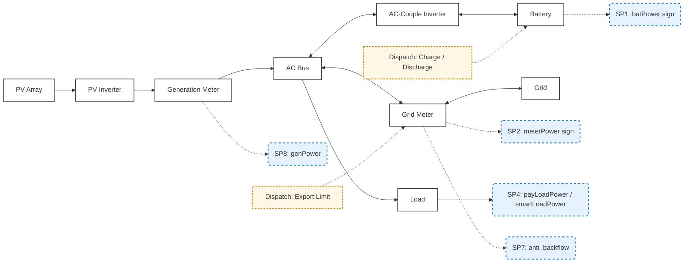
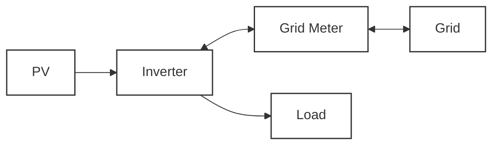
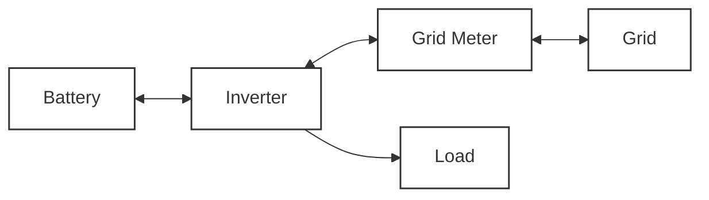
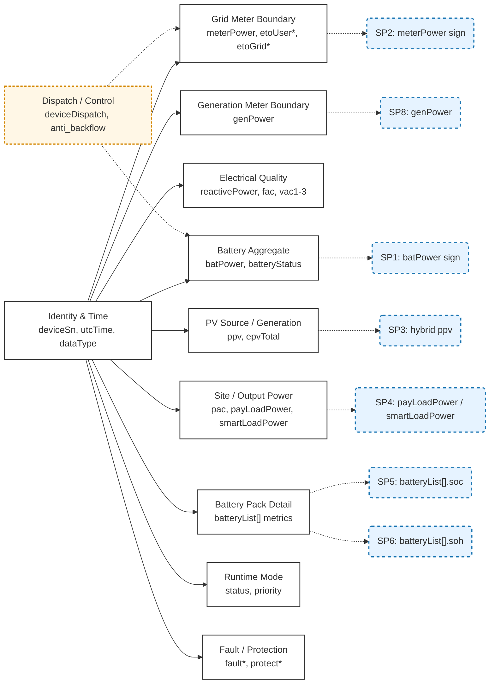
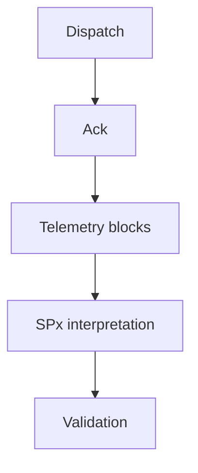
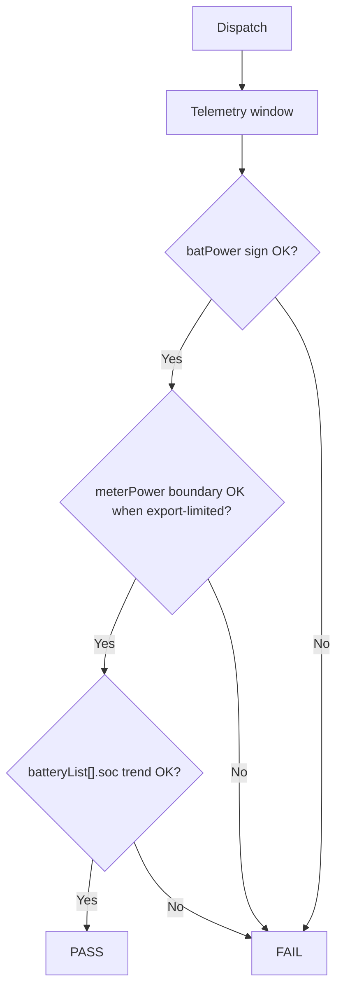

# Growatt ESS Semantic Model and Dispatch Specification

**Version**: v1.0  
**Status**: Public Standard  
**Scope**: Growatt Unified OpenAPI / EMS VPP-relevant runtime telemetry semantics and dispatch validation  
**Audience**: Integrators, solution architects, validation teams, and implementation teams

---

# 1. Overview

This specification defines the public runtime semantic model for VPP-relevant fields that binds:

* **Topology (energy flow paths)**
* **Telemetry (public runtime payload fields)**
* **Semantic interpretation (SPx)**
* **Dispatch commands**
* **Validation criteria**

The telemetry scope in this appendix focuses on the VPP-relevant subset of the currently published payloads in:

* `08_api_device_data.md`
* `09_api_device_push.md`

Static capability metadata from `07_api_device_info.md` remains outside this runtime telemetry catalog.

This revision presents four public topology references: `Hybrid`, `AC-Couple`, `PV Only`, and `Battery Only`. The normative runtime semantic, telemetry, and dispatch-validation coverage in the later sections remains limited to `Hybrid` and `AC-Couple`.

---

# 2. Core Principles

## 2.1 Layer Separation

| Layer | Description |
| ----- | ----------- |
| Topology | Physical energy paths |
| Telemetry | VPP-relevant public runtime payload fields |
| Semantic | Interpretation rules for core signals |
| Dispatch | Control commands and limits |
| Validation | Pass/Fail logic |

---

## 2.2 Key Rule

> Energy arrows represent possible power paths, not real-time direction.
> Actual direction is determined by runtime telemetry values interpreted via SPx.

---

# 3. Visual Standard (Mermaid SSOT)



---

# 4. Topology + Semantic + Dispatch Model

This revision includes four public topology reference diagrams: `Hybrid`, `AC-Couple`, `PV Only`, and `Battery Only`. Only `Hybrid` and `AC-Couple` are part of the normative runtime model in the later semantic, telemetry, and dispatch-validation sections.

## 4.1 Hybrid Topology



In the `Hybrid` topology, `ppv` remains the core public PV-source signal, while `meterPower` and `anti_backflow` are anchored at the dedicated grid-meter boundary between the inverter AC side and the utility grid.

## 4.2 AC-Couple Topology



In the `AC-Couple` topology, two public meter boundaries are distinguished:

* `Grid Meter`: bound to `meterPower`, `etoUser*`, `etoGrid*`, and `anti_backflow`
* `Generation Meter`: bound to `genPower`

If `ppv` is reported in an `AC-Couple` payload, it remains auxiliary device-local PV telemetry and does not replace the `Generation Meter` boundary signal.

## 4.3 PV Only Topology



`PV Only` is included here as a physical topology reference only. This revision does not add public runtime semantic mappings, SPx definitions, or dispatch mappings specific to this topology.

## 4.4 Battery Only Topology



`Battery Only` is included here as a physical topology reference only. This revision does not add public runtime semantic mappings, SPx definitions, or dispatch mappings specific to this topology.

---

# 5. Semantic System (SPx)

## 5.1 Definition

| SPx | Name | Field | Target | Topology |
| --- | ---- | ----- | ------ | -------- |
| SP1 | Battery Power Sign | `batPower` | Battery | Hybrid, AC Couple |
| SP2 | Grid Meter Exchange Sign | `meterPower` | Grid Meter | Hybrid, AC Couple |
| SP3 | Hybrid PV Source Power | `ppv` | PV Source | Hybrid core; AC Couple optional |
| SP4 | Load Power | `payLoadPower`, `smartLoadPower` | Load | Hybrid, AC Couple |
| SP5 | SOC | `batteryList[].soc` | Battery Pack | Hybrid, AC Couple |
| SP6 | SOH | `batteryList[].soh` | Battery Pack | Hybrid, AC Couple |
| SP7 | Export Limit | `anti_backflow` (control parameter) | Grid Meter | Hybrid, AC Couple |
| SP8 | Generation Meter Power | `genPower` | Generation Meter | AC Couple only |

---

## 5.2 Sign Convention

### SP1 - Battery Power

| Value | Meaning |
| ----- | ------- |
| >0 | Charging |
| <0 | Discharging |

---

### SP2 - Grid Meter Exchange

| Value | Meaning |
| ----- | ------- |
| >0 | Grid import |
| <0 | Grid export |

`meterPower` is interpreted at the grid-meter boundary between the site AC side and the utility grid.

---

### SP3 / SP4 / SP8

| Field | Rule |
| ----- | ---- |
| `ppv` | `>= 0`; core Hybrid PV-source signal and optional auxiliary telemetry in AC-Couple |
| `payLoadPower` | `>= 0` |
| `smartLoadPower` | `>= 0` when reported |
| `genPower` | `>= 0` when reported; AC-Couple generation-meter power with no import/export sign semantics |

`genPower` is observational telemetry only in this appendix. It does not define a public dispatch target or export-direction sign rule.

---

### SP5 / SP6

| Field | Rule |
| ----- | ---- |
| `batteryList[].soc` | `[0,100]` |
| `batteryList[].soh` | `[0,100]` |

---

### SP7

`anti_backflow` remains a dispatch/control semantic anchored on the `Grid Meter` boundary and is not treated as runtime telemetry in this appendix.

---

# 6. Runtime Telemetry Model

## 6.1 Core Semantic Signal Mapping

| Public Signal | Field | Rule | Unit | Payloads | Topology |
| ------------- | ----- | ---- | ---- | -------- | -------- |
| Battery Power | `batPower` | >0 charge, <0 discharge | `W` | Query, Push | Hybrid, AC Couple |
| Grid Meter Exchange | `meterPower` | >0 import, <0 export at the grid-meter boundary | `W` | Query, Push | Hybrid, AC Couple |
| Hybrid PV Source Power | `ppv` | >= 0; core in Hybrid and auxiliary when reported in AC-Couple | `W` | Query, Push | Hybrid core; AC Couple optional |
| Generation Meter Power | `genPower` | >= 0 when reported at the generation-meter boundary | `W` | Query, Push | AC Couple |
| Load Power | `payLoadPower` | Calculated site load | `W` | Query, Push | Hybrid, AC Couple |
| Smart-load Power | `smartLoadPower` | Auxiliary load channel when present | `W` | Query, Push | Hybrid, AC Couple |
| Battery SOC | `batteryList[].soc` | Per-pack SOC | `%` | Query, Push | Hybrid, AC Couple |
| Battery SOH | `batteryList[].soh` | Per-pack SOH | `%` | Query, Push | Hybrid, AC Couple |
| Export Limit | `anti_backflow` | Control-only grid-meter export constraint | Control parameter | Dispatch | Hybrid, AC Couple |

---

## 6.2 Telemetry Block Relationship



`Generation Meter Boundary` applies only to `AC-Couple`. `PV Source / Generation` remains a core semantic block in `Hybrid` and an optional auxiliary block in `AC-Couple` when `ppv` is reported.

---

## 6.3 Unit Normalization

| Category | Fields | Unit |
| -------- | ------ | ---- |
| Power | `meterPower`, `genPower`, `batPower`, `ppv`, `pac`, `payLoadPower`, `smartLoadPower`, `batteryList[].chargePower`, `batteryList[].dischargePower` | `W` |
| Energy | `etoUserToday`, `etoUserTotal`, `etoGridToday`, `etoGridTotal`, `epvTotal`, `batteryList[].echargeToday`, `batteryList[].echargeTotal`, `batteryList[].edischargeToday`, `batteryList[].edischargeTotal` | `kWh` |
| Voltage | `vac1`, `vac2`, `vac3`, `batteryList[].vbat` | `V` |
| Frequency | `fac` | `Hz` |
| Percentage | `batteryList[].soc`, `batteryList[].soh` | `%` |
| Current | `batteryList[].ibat` | `A` |
| Code / Enum | `status`, `priority`, `batteryStatus`, `batteryList[].status`, `faultCode`, `faultSubCode`, `protectCode`, `protectSubCode`, `dataType` | Code / enum |

`reactivePower` keeps its vendor payload form and public sign note; this appendix does not redefine its unit beyond the currently published documentation.

---

## 6.4 Telemetry Block Catalog

### Identity & Time

| Field | Payloads | Description |
| ----- | -------- | ----------- |
| `deviceSn` | Query, Push | Device serial number |
| `utcTime` | Query, Push | UTC timestamp in `yyyy-MM-dd HH:mm:ss` format |
| `dataType` | Push | Push envelope discriminator with fixed public value `dfcData` |

### Grid Meter Boundary

| Field | Payloads | Description |
| ----- | -------- | ----------- |
| `meterPower` | Query, Push | Grid meter power at the grid-meter boundary. Positive means grid import and negative means grid export |
| `etoUserToday` | Query, Push | Grid-meter-boundary import energy today |
| `etoUserTotal` | Query, Push | Total grid-meter-boundary import energy |
| `etoGridToday` | Query, Push | Grid-meter-boundary export energy today |
| `etoGridTotal` | Query, Push | Total grid-meter-boundary export energy |

### Generation Meter Boundary

| Field | Payloads | Description |
| ----- | -------- | ----------- |
| `genPower` | Query, Push | Generation meter power for AC-couple topologies. Treat as a non-negative generation-boundary magnitude rather than a grid import/export sign field |

### Electrical Quality

| Field | Payloads | Description |
| ----- | -------- | ----------- |
| `reactivePower` | Query, Push | Reactive power value with the published capacitive/inductive sign note |
| `fac` | Query, Push | Grid frequency |
| `vac1` | Query, Push | Line voltage 1 |
| `vac2` | Query, Push | Line voltage 2 |
| `vac3` | Query, Push | Line voltage 3 |

### PV Source / Generation

| Field | Payloads | Description |
| ----- | -------- | ----------- |
| `ppv` | Query, Push | Device-local PV source power. Core in Hybrid; auxiliary when reported in AC-couple topologies |
| `epvTotal` | Query, Push | Total PV generation |

### Site / Output Power

| Field | Payloads | Description |
| ----- | -------- | ----------- |
| `pac` | Query, Push | AC output power |
| `payLoadPower` | Query, Push | Calculated total load power |
| `smartLoadPower` | Query, Push | Dedicated smart-load power when the device reports a smart-load channel |

### Battery Aggregate

| Field | Payloads | Description |
| ----- | -------- | ----------- |
| `batPower` | Query, Push | Aggregate battery charge/discharge power. Positive means charging and negative means discharging |
| `batteryStatus` | Query, Push | Overall battery status code |

### Battery Pack Detail

| Field | Payloads | Description |
| ----- | -------- | ----------- |
| `batteryList[].index` | Query, Push | Battery pack index starting from 1 |
| `batteryList[].soc` | Query, Push | Per-pack battery state of charge |
| `batteryList[].chargePower` | Query, Push | Per-pack charging power |
| `batteryList[].dischargePower` | Query, Push | Per-pack discharging power |
| `batteryList[].ibat` | Query, Push | Battery current on the low-voltage side |
| `batteryList[].vbat` | Query, Push | Battery voltage on the low-voltage side |
| `batteryList[].soh` | Query, Push | Per-pack battery state of health |
| `batteryList[].status` | Query, Push | Per-pack status code when present |
| `batteryList[].echargeToday` | Query, Push | Charged energy today |
| `batteryList[].echargeTotal` | Query, Push | Total charged energy |
| `batteryList[].edischargeToday` | Query, Push | Discharged energy today |
| `batteryList[].edischargeTotal` | Query, Push | Total discharged energy |

### Runtime Mode

| Field | Payloads | Description |
| ----- | -------- | ----------- |
| `status` | Query, Push | Device runtime status code |
| `priority` | Query, Push | Operating priority code |

### Fault / Protection

| Field | Payloads | Description |
| ----- | -------- | ----------- |
| `faultCode` | Query, Push | Fault main code |
| `faultSubCode` | Query, Push | Fault sub-code |
| `protectCode` | Query, Push | Protection main code |
| `protectSubCode` | Query, Push | Protection sub-code |

---

# 7. Dispatch Model

## 7.1 Types

| Dispatch | Target |
| -------- | ------ |
| Charge | Battery |
| Discharge | Battery |
| Export Limit | Grid Meter |
| Mode | Inverter |

---

## 7.2 Mapping

| Dispatch | Observed Runtime Fields | Control Fields |
| -------- | ----------------------- | -------------- |
| Charge | `batPower`, `batteryList[].soc` | `time_slot_charge_discharge`, `duration_and_power_charge_discharge` |
| Discharge | `batPower`, `batteryList[].soc` | `time_slot_charge_discharge`, `duration_and_power_charge_discharge` |
| Export Limit | `meterPower`, `etoGridToday`, `etoGridTotal` | `anti_backflow` |
| Mode | `status`, `priority`, power blocks | Implementation-specific set types |

`genPower` is observational telemetry for AC-couple validation in this revision and does not map to a public dispatch/control field.

---

# 8. Runtime Coverage Matrix

## 8.1 Runtime Coverage by Topology

| Block | Hybrid | AC Couple |
| ----- | ------ | --------- |
| Identity & Time | Core | Core |
| Grid Meter Boundary | Core | Core |
| Generation Meter Boundary | N/A | Core |
| Electrical Quality | Core | Core |
| PV Source / Generation | Core | Optional |
| Site / Output Power | Core | Core |
| Battery Aggregate | Core | Core |
| Battery Pack Detail | Core | Core |
| Runtime Mode | Core | Core |
| Fault / Protection | Core | Core |

---

## 8.2 Notes

* `smartLoadPower` is optional and appears only when the published payload reports a dedicated smart-load channel.
* `ppv` remains the core PV-source semantic signal in `Hybrid`.
* In `AC-Couple`, `genPower` is the primary public generation-meter boundary signal and `ppv` remains auxiliary when present.
* `PV Only` and `Battery Only` are now included as physical topology references only and are not part of this revision's normative runtime coverage.

---

# 9. Dispatch Validation Framework

## 9.1 Validation Layers

| Layer | Check |
| ----- | ----- |
| Command | accepted |
| Telemetry | changed |
| Semantic | correct sign / boundary |
| Behavior | consistent over the observation window |

---

# 10. Validation Rules

## 10.1 Charge

**Expected**

* `batPower` > 0
* `batteryList[].soc` is non-decreasing over the observation window

**Pass**

```text
batPower remains positive and batteryList[].soc does not trend downward
```

---

## 10.2 Discharge

**Expected**

* `batPower` < 0
* `batteryList[].soc` is non-increasing over the observation window

---

## 10.3 Export Limit

**Expected**

* `meterPower` stays within the configured export boundary in the export direction
* In export-limited mode, `meterPower` does not become more negative than the configured export limit at the meter boundary

---

# 11. Acceptance Criteria

## 11.1 General

| Item | Requirement |
| ---- | ----------- |
| Ack | < 5s |
| First response | <= 1 cycle |
| Stable window | 2-5 cycles |

---

## 11.2 Tolerance

| Metric | Value |
| ------ | ----- |
| Power tolerance | +/-3% |
| Stabilization | 30-120s |

---

## 11.3 Result

| Result | Condition |
| ------ | --------- |
| Pass | all required layers satisfied |
| Fail | mismatch |
| Pending | insufficient data |

---

# 12. Failure Codes

| Code | Meaning |
| ---- | ------- |
| V001 | No ack |
| V002 | No telemetry |
| V003 | Wrong sign |
| V004 | Unstable |
| V005 | Limit not enforced |
| V006 | Insufficient window |
| V007 | Conflicting conditions |

---

# 13. Validation Flow



---

# 14. Dispatch Validation Logic



---

# 15. Executive Summary

This specification organizes public ESS topology references, runtime semantics, dispatch, and telemetry into one public model, with reference topology diagrams for `Hybrid`, `AC-Couple`, `PV Only`, and `Battery Only`.
Normative runtime semantic, telemetry, and dispatch-validation coverage in this revision remains focused on `Hybrid` and `AC-Couple`, while `PV Only` and `Battery Only` are included as physical topology references only.
