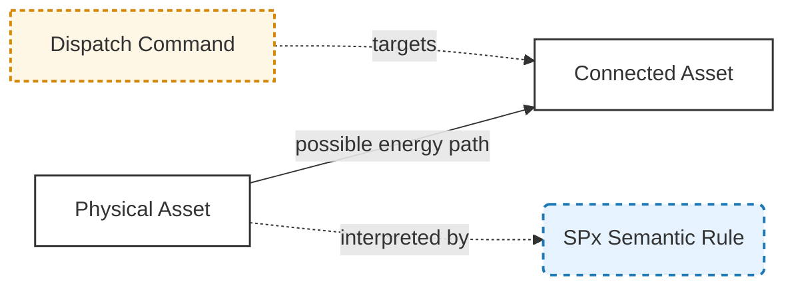
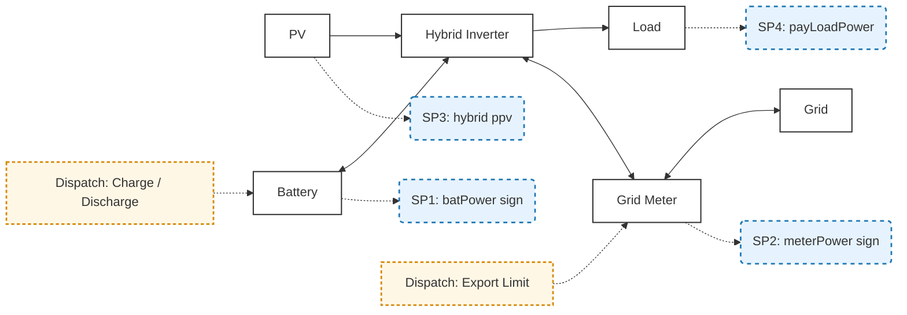
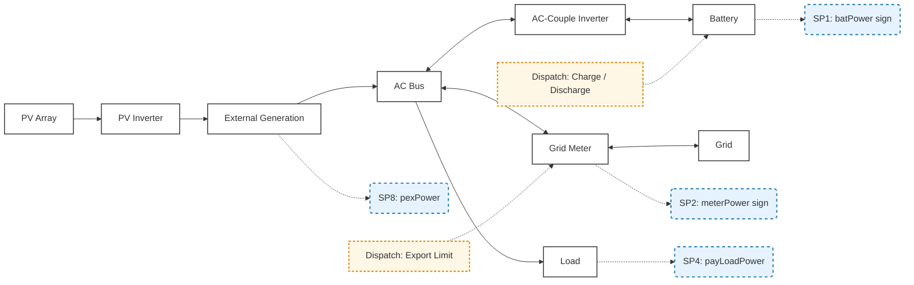
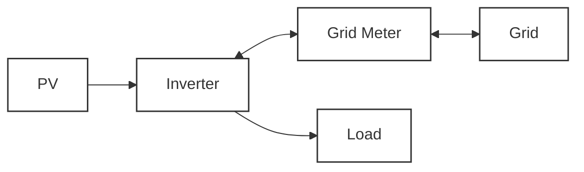
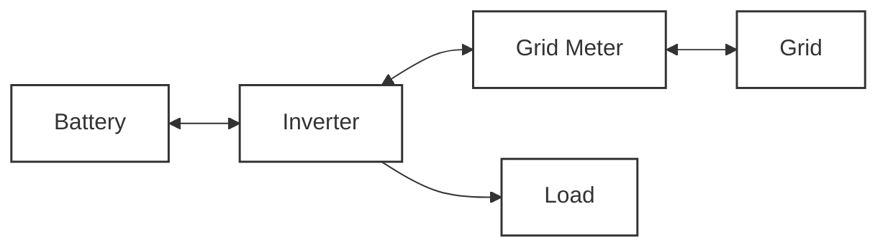
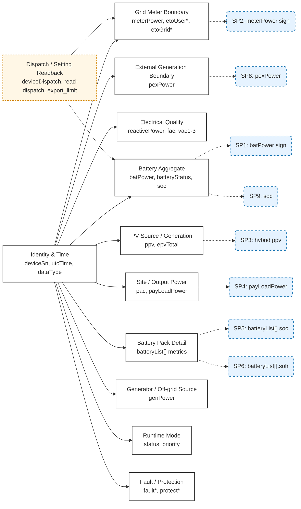

# Growatt ESS Semantic Model and Dispatch Specification

**Version**: v1.1
**Status**: Customer Integration Reference

**Scope**: VPP-relevant Growatt Open API runtime telemetry semantics and dispatch interpretation

**Audience**: API integrators, solution architects, and customer implementation teams

---

# 1. Overview

This appendix explains how customers can interpret VPP-relevant fields across:

* **Topology (energy flow paths)**
* **Telemetry (public runtime payload fields)**
* **Semantic interpretation (SPx)**
* **Dispatch commands**
* **Integration checks**

The telemetry scope in this appendix focuses on the VPP-relevant subset of the currently published payloads in:

* `08_api_device_data.md`
* `09_api_device_push.md`

Static capability metadata from `07_api_device_info.md` remains outside this runtime telemetry catalog.

The appendix presents four topology references: `Hybrid`, `AC-Couple`, `PV Only`, and `Battery Only`. Detailed runtime field and dispatch interpretation is provided for `Hybrid` and `AC-Couple`.

Top-level `soc` represents the system-level SOC for the whole ESS battery system; `batteryList[].soc` represents the SOC of an individual battery pack.

---

# 2. Core Principles

## 2.1 Layer Separation

| Layer | Description |
| ----- | ----------- |
| Topology | Physical energy paths |
| Telemetry | VPP-relevant public runtime payload fields |
| Semantic | Interpretation rules for core signals |
| Dispatch | Control commands and limits |
| Integration checks | Customer-side confirmation of command, read-back, and telemetry meaning |

---

## 2.2 Key Rule

> Energy arrows represent possible power paths, not real-time direction.
> Actual direction is determined by runtime telemetry values interpreted via SPx.

---

# 3. Topology Diagram Legend

```mermaid
flowchart LR

    AssetA[Physical Asset]
    AssetB[Connected Asset]
    SemanticNode(SPx Semantic Rule)
    DispatchNode[Dispatch Command]

classDef asset fill:#ffffff,stroke:#333,stroke-width:1.5px;
classDef semantic fill:#e6f3ff,stroke:#1f78b4,stroke-width:2px,stroke-dasharray: 5 5;
classDef dispatch fill:#fff7e6,stroke:#d48806,stroke-width:2px,stroke-dasharray: 4 3;

    AssetA -->|possible energy path| AssetB
    AssetA -.->|interpreted by| SemanticNode
    DispatchNode -.->|targets| AssetB

    class AssetA,AssetB asset;
    class SemanticNode semantic;
    class DispatchNode dispatch;
```

---

# 4. Topology + Semantic + Dispatch Model

The following diagrams cover `Hybrid`, `AC-Couple`, `PV Only`, and `Battery Only`. Detailed runtime field and dispatch interpretation is provided for `Hybrid` and `AC-Couple`; the other two diagrams are physical-topology references.

## 4.1 Hybrid Topology

```mermaid
flowchart LR

    classDef asset fill:#ffffff,stroke:#333,stroke-width:1.5px;
    classDef semantic fill:#e6f3ff,stroke:#1f78b4,stroke-width:2px,stroke-dasharray: 5 5;
    classDef dispatch fill:#fff7e6,stroke:#d48806,stroke-width:2px,stroke-dasharray: 4 3;

    PV[PV]
    Battery[Battery]
    Inverter[Hybrid Inverter]
    GridMeter[Grid Meter]
    Load[Load]
    Grid[Grid]

    PV --> Inverter
    Battery <--> Inverter
    Inverter --> Load
    Inverter <--> GridMeter
    GridMeter <--> Grid

    SP1(SP1: batPower sign)
    SP2(SP2: meterPower sign)
    SP3(SP3: hybrid ppv)
    SP4(SP4: payLoadPower)

    Battery -.-> SP1
    GridMeter -.-> SP2
    PV -.-> SP3
    Load -.-> SP4

    D1[Dispatch: Charge / Discharge]
    D2[Dispatch: Export Limit]

    D1 -.-> Battery
    D2 -.-> GridMeter

    class PV,Battery,Inverter,GridMeter,Load,Grid asset;
    class SP1,SP2,SP3,SP4 semantic;
    class D1,D2 dispatch;
```

In the `Hybrid` topology, `ppv` remains the core public PV-source signal and `meterPower` remains the observable grid-meter boundary signal. `export_limit` is the export-limit setting applied at that same boundary and is read back through the dispatch/read-dispatch flow rather than through runtime telemetry.

## 4.2 AC-Couple Topology

```mermaid
flowchart LR

    classDef asset fill:#ffffff,stroke:#333,stroke-width:1.5px;
    classDef semantic fill:#e6f3ff,stroke:#1f78b4,stroke-width:2px,stroke-dasharray: 5 5;
    classDef dispatch fill:#fff7e6,stroke:#d48806,stroke-width:2px,stroke-dasharray: 4 3;

    PV[PV Array]
    PVInverter[PV Inverter]
    ExternalGeneration[External Generation]
    ACBus[AC Bus]
    ACInverter[AC-Couple Inverter]
    Battery[Battery]
    GridMeter[Grid Meter]
    Load[Load]
    Grid[Grid]

    PV --> PVInverter
    PVInverter --> ExternalGeneration
    ExternalGeneration --> ACBus
    ACBus <--> ACInverter
    ACInverter <--> Battery
    ACBus --> Load
    ACBus <--> GridMeter
    GridMeter <--> Grid

    SP1(SP1: batPower sign)
    SP2(SP2: meterPower sign)
    SP4(SP4: payLoadPower)
    SP8(SP8: pexPower)

    Battery -.-> SP1
    GridMeter -.-> SP2
    Load -.-> SP4
    ExternalGeneration -.-> SP8

    D1[Dispatch: Charge / Discharge]
    D2[Dispatch: Export Limit]

    D1 -.-> Battery
    D2 -.-> GridMeter

    class PV,PVInverter,ExternalGeneration,ACBus,ACInverter,Battery,GridMeter,Load,Grid asset;
    class SP1,SP2,SP4,SP8 semantic;
    class D1,D2 dispatch;
```

In the `AC-Couple` topology, two public power boundaries are distinguished:

* `Grid Meter`: bound to `meterPower`, `etoUser*`, and `etoGrid*`
* `External Generation`: bound to `pexPower`

If `ppv` is reported in an `AC-Couple` payload, it remains auxiliary device-local PV telemetry and does not replace the `External Generation` boundary signal `pexPower`.

`export_limit` is not a telemetry boundary signal in `AC-Couple`. It is the export-limit setting read back through the dispatch/read-dispatch flow, while actual export behavior is observed from the `meterPower` sign at the grid-meter boundary.

`genPower`, when reported, represents off-grid `generator power` and is not part of the AC-couple external-generation boundary model in this appendix.

## 4.3 PV Only Topology

```mermaid
flowchart LR

    classDef asset fill:#ffffff,stroke:#333,stroke-width:1.5px;

    PV[PV]
    Inverter[Inverter]
    GridMeter[Grid Meter]
    Load[Load]
    Grid[Grid]

    PV --> Inverter
    Inverter --> Load
    Inverter <--> GridMeter
    GridMeter <--> Grid

    class PV,Inverter,GridMeter,Load,Grid asset;
```

`PV Only` is included as a physical-topology reference. This appendix does not define topology-specific runtime mappings or dispatch behavior for it.

## 4.4 Battery Only Topology

```mermaid
flowchart LR

    classDef asset fill:#ffffff,stroke:#333,stroke-width:1.5px;

    Battery[Battery]
    Inverter[Inverter]
    GridMeter[Grid Meter]
    Load[Load]
    Grid[Grid]

    Battery <--> Inverter
    Inverter --> Load
    Inverter <--> GridMeter
    GridMeter <--> Grid

    class Battery,Inverter,GridMeter,Load,Grid asset;
```

`Battery Only` is included as a physical-topology reference. This appendix does not define topology-specific runtime mappings or dispatch behavior for it.

---

# 5. Semantic System (SPx)

## 5.1 Definition

| SPx | Name | Field | Target | Topology |
| --- | ---- | ----- | ------ | -------- |
| SP1 | Battery Power Sign | `batPower` | Battery | Hybrid, AC Couple |
| SP2 | Grid Meter Exchange Sign | `meterPower` | Grid Meter | Hybrid, AC Couple |
| SP3 | Hybrid PV Source Power | `ppv` | PV Source | Hybrid core; AC Couple optional |
| SP4 | Load Power | `payLoadPower` | Load | Hybrid, AC Couple |
| SP5 | Battery Pack SOC | `batteryList[].soc` | Battery Pack | Hybrid, AC Couple |
| SP6 | Battery Pack SOH | `batteryList[].soh` | Battery Pack | Hybrid, AC Couple |
| SP7 | Export Limit Setting | `export_limit` (dispatch readback setting) | Grid Meter | Hybrid, AC Couple |
| SP8 | External Generation Power | `pexPower` | External Generation | AC Couple only |
| SP9 | System SOC | `soc` | Battery Aggregate | Hybrid, AC Couple |

---

## 5.2 Sign Convention

### SP1 - Battery Power

| Value | Meaning |
| ----- | ------- |
| >0 | Charging |
| <0 | Discharging |

---

### SP2 - Grid Meter Exchange

| Value | Meaning |
| ----- | ------- |
| >0 | Grid import |
| <0 | Grid export |

`meterPower` is interpreted at the grid-meter boundary between the site AC side and the utility grid.

---

### SP3 / SP4 / SP8

| Field | Rule |
| ----- | ---- |
| `ppv` | `>= 0`; core Hybrid PV-source signal and optional auxiliary telemetry in AC-Couple alongside `pexPower` |
| `payLoadPower` | `>= 0` |
| `pexPower` | `>= 0` when reported; AC-Couple external generation power for third-party meter / Solar Inverter sources with no import/export sign semantics |

`pexPower` is read-only telemetry in this appendix. It does not define a dispatch target or an export-direction sign rule.

`genPower` is generator power for off-grid runtime when reported. It is retained as auxiliary telemetry and is not mapped to a public boundary SPx or dispatch target in this appendix.

---

### SP5 / SP6 / SP9

| Field | Rule |
| ----- | ---- |
| `soc` | `[0,100]`; system-level SOC for the whole ESS battery system |
| `batteryList[].soc` | `[0,100]`; per-pack SOC |
| `batteryList[].soh` | `[0,100]`; per-pack SOH |

---

### SP7

`export_limit` is a dispatch setting value, not runtime telemetry. Its configured value is returned through the dispatch/read-dispatch flow. Actual grid export/import behavior is observed from SP2 (`meterPower`) at the grid-meter boundary, with `>0` = import and `<0` = export.

---

# 6. Runtime Telemetry Model

## 6.1 Core Semantic Signal Mapping

| Public Signal | Field | Rule | Unit | Payloads | Topology |
| ------------- | ----- | ---- | ---- | -------- | -------- |
| Battery Power | `batPower` | >0 charge, <0 discharge | `W` | Query, Push | Hybrid, AC Couple |
| Grid Meter Exchange | `meterPower` | >0 import, <0 export at the grid-meter boundary | `W` | Query, Push | Hybrid, AC Couple |
| Hybrid PV Source Power | `ppv` | >= 0; core in Hybrid and auxiliary when reported alongside `pexPower` in AC-Couple | `W` | Query, Push | Hybrid core; AC Couple optional |
| External Generation Power | `pexPower` | >= 0 when reported at the external-generation boundary | `W` | Query, Push | AC Couple |
| Generator Power | `genPower` | >= 0 when reported for off-grid generator runtime; not an AC-Couple boundary signal | `W` | Query, Push | Off-grid runtime only |
| Load Power | `payLoadPower` | Calculated site load | `W` | Query, Push | Hybrid, AC Couple |
| System SOC | `soc` | Overall ESS battery system SOC | `%` | Query, Push | Hybrid, AC Couple |
| Battery Pack SOC | `batteryList[].soc` | Per-pack SOC | `%` | Query, Push | Hybrid, AC Couple |
| Battery Pack SOH | `batteryList[].soh` | Per-pack SOH | `%` | Query, Push | Hybrid, AC Couple |

---

`export_limit` is intentionally excluded from this runtime telemetry mapping. It is an export-limit setting read back through the dispatch/read-dispatch flow rather than a runtime telemetry field. Actual export behavior is observed through `meterPower` sign plus the grid-meter energy counters (`etoGrid*`, `etoUser*`).

## 6.2 Telemetry Block Relationship

```mermaid
flowchart LR

    classDef block fill:#ffffff,stroke:#333,stroke-width:1.5px;
    classDef semantic fill:#e6f3ff,stroke:#1f78b4,stroke-width:2px,stroke-dasharray: 5 5;
    classDef dispatch fill:#fff7e6,stroke:#d48806,stroke-width:2px,stroke-dasharray: 4 3;

    Meta["Identity & Time<br/>deviceSn, utcTime, dataType"]
    GridMeterBlock["Grid Meter Boundary<br/>meterPower, etoUser*, etoGrid*"]
    ExternalGenerationBlock["External Generation Boundary<br/>pexPower"]
    Electrical["Electrical Quality<br/>reactivePower, fac, vac1-3"]
    PVBlock["PV Source / Generation<br/>ppv, epvTotal"]
    SiteBlock["Site / Output Power<br/>pac, payLoadPower"]
    BatteryAgg["Battery Aggregate<br/>batPower, batteryStatus, soc"]
    BatteryPack["Battery Pack Detail<br/>batteryList[] metrics"]
    GeneratorBlock["Generator / Off-grid Source<br/>genPower"]
    Runtime["Runtime Mode<br/>status, priority"]
    Fault["Fault / Protection<br/>fault*, protect*"]

    SP1("SP1: batPower sign")
    SP2("SP2: meterPower sign")
    SP3("SP3: hybrid ppv")
    SP4("SP4: payLoadPower")
    SP5("SP5: batteryList[].soc")
    SP6("SP6: batteryList[].soh")
    SP8("SP8: pexPower")
    SP9("SP9: soc")
    Dispatch["Dispatch / Setting Readback<br/>deviceDispatch, read-dispatch, export_limit"]

    Meta --> GridMeterBlock
    Meta --> ExternalGenerationBlock
    Meta --> Electrical
    Meta --> PVBlock
    Meta --> SiteBlock
    Meta --> BatteryAgg
    Meta --> BatteryPack
    Meta --> GeneratorBlock
    Meta --> Runtime
    Meta --> Fault

    GridMeterBlock -.-> SP2
    ExternalGenerationBlock -.-> SP8
    PVBlock -.-> SP3
    SiteBlock -.-> SP4
    BatteryAgg -.-> SP1
    BatteryAgg -.-> SP9
    BatteryPack -.-> SP5
    BatteryPack -.-> SP6
    Dispatch -.-> BatteryAgg
    Dispatch -.-> GridMeterBlock

    class Meta,GridMeterBlock,ExternalGenerationBlock,Electrical,PVBlock,SiteBlock,BatteryAgg,BatteryPack,GeneratorBlock,Runtime,Fault block;
    class SP1,SP2,SP3,SP4,SP5,SP6,SP8,SP9 semantic;
    class Dispatch dispatch;
```

`External Generation Boundary` applies only to `AC-Couple`. `Generator / Off-grid Source` is auxiliary runtime telemetry for generator-equipped off-grid modes and is not mapped to a boundary SPx. `PV Source / Generation` is a core semantic block in `Hybrid` and an optional auxiliary block in `AC-Couple` when `ppv` is reported.

---

## 6.3 Unit Normalization

| Category | Fields | Unit |
| -------- | ------ | ---- |
| Power | `meterPower`, `pexPower`, `genPower`, `batPower`, `ppv`, `pac`, `payLoadPower`, `batteryList[].chargePower`, `batteryList[].dischargePower` | `W` |
| Energy | `etoUserToday`, `etoUserTotal`, `etoGridToday`, `etoGridTotal`, `epvTotal`, `batteryList[].echargeToday`, `batteryList[].echargeTotal`, `batteryList[].edischargeToday`, `batteryList[].edischargeTotal` | `kWh` |
| Voltage | `vac1`, `vac2`, `vac3`, `batteryList[].vbat` | `V` |
| Frequency | `fac` | `Hz` |
| Percentage | `soc`, `batteryList[].soc`, `batteryList[].soh` | `%` |
| Current | `batteryList[].ibat` | `A` |
| Code / Enum | `status`, `priority`, `batteryStatus`, `batteryList[].status`, `faultCode`, `faultSubCode`, `protectCode`, `protectSubCode`, `dataType` | Code / enum |

`reactivePower` keeps its published payload form and sign convention; this appendix does not assign a unit beyond the endpoint documentation.

---

## 6.4 Telemetry Block Catalog

### Identity & Time

| Field | Payloads | Description |
| ----- | -------- | ----------- |
| `deviceSn` | Query, Push | Device serial number |
| `utcTime` | Query, Push | UTC timestamp in `yyyy-MM-dd HH:mm:ss` format |
| `dataType` | Push | Push envelope discriminator with fixed public value `dfcData` |

### Grid Meter Boundary

| Field | Payloads | Description |
| ----- | -------- | ----------- |
| `meterPower` | Query, Push | Grid meter power at the grid-meter boundary. Positive means grid import and negative means grid export |
| `etoUserToday` | Query, Push | Grid-meter-boundary import energy today |
| `etoUserTotal` | Query, Push | Total grid-meter-boundary import energy |
| `etoGridToday` | Query, Push | Grid-meter-boundary export energy today |
| `etoGridTotal` | Query, Push | Total grid-meter-boundary export energy |

### External Generation Boundary

| Field | Payloads | Description |
| ----- | -------- | ----------- |
| `pexPower` | Query, Push | External generation power for AC-couple topologies, typically sourced from a third-party meter or Solar Inverter. Treat as a non-negative external-generation magnitude rather than a grid import/export sign field |

### Generator / Off-grid Source

| Field | Payloads | Description |
| ----- | -------- | ----------- |
| `genPower` | Query, Push | Generator power for off-grid runtime when a generator source is present. Treat as a non-negative generator magnitude, not as an AC-couple external-generation boundary signal |

### Electrical Quality

| Field | Payloads | Description |
| ----- | -------- | ----------- |
| `reactivePower` | Query, Push | Reactive power value with the published capacitive/inductive sign note |
| `fac` | Query, Push | Grid frequency |
| `vac1` | Query, Push | Line voltage 1 |
| `vac2` | Query, Push | Line voltage 2 |
| `vac3` | Query, Push | Line voltage 3 |

### PV Source / Generation

| Field | Payloads | Description |
| ----- | -------- | ----------- |
| `ppv` | Query, Push | Device-local PV source power. Core in Hybrid; auxiliary when reported alongside `pexPower` in AC-couple topologies |
| `epvTotal` | Query, Push | Total PV generation |

### Site / Output Power

| Field | Payloads | Description |
| ----- | -------- | ----------- |
| `pac` | Query, Push | AC output power |
| `payLoadPower` | Query, Push | Calculated total load power |

### Battery Aggregate

| Field | Payloads | Description |
| ----- | -------- | ----------- |
| `batPower` | Query, Push | Aggregate battery charge/discharge power. Positive means charging and negative means discharging |
| `soc` | Query, Push | System-level battery state of charge for the whole ESS battery system |
| `batteryStatus` | Query, Push | Overall battery status code |

### Battery Pack Detail

| Field | Payloads | Description |
| ----- | -------- | ----------- |
| `batteryList[].index` | Query, Push | Battery pack index starting from 1 |
| `batteryList[].soc` | Query, Push | Per-pack battery state of charge |
| `batteryList[].chargePower` | Query, Push | Per-pack charging power |
| `batteryList[].dischargePower` | Query, Push | Per-pack discharging power |
| `batteryList[].ibat` | Query, Push | Battery current on the low-voltage side |
| `batteryList[].vbat` | Query, Push | Battery voltage on the low-voltage side |
| `batteryList[].soh` | Query, Push | Per-pack battery state of health |
| `batteryList[].status` | Query, Push | Per-pack status code when present |
| `batteryList[].echargeToday` | Query, Push | Charged energy today |
| `batteryList[].echargeTotal` | Query, Push | Total charged energy |
| `batteryList[].edischargeToday` | Query, Push | Discharged energy today |
| `batteryList[].edischargeTotal` | Query, Push | Total discharged energy |

### Runtime Mode

| Field | Payloads | Description |
| ----- | -------- | ----------- |
| `status` | Query, Push | Device runtime status code |
| `priority` | Query, Push | Operating priority code |

### Fault / Protection

| Field | Payloads | Description |
| ----- | -------- | ----------- |
| `faultCode` | Query, Push | Fault main code |
| `faultSubCode` | Query, Push | Fault sub-code |
| `protectCode` | Query, Push | Protection main code |
| `protectSubCode` | Query, Push | Protection sub-code |

---

# 7. Dispatch Model

## 7.1 Types

| Dispatch | Target |
| -------- | ------ |
| Charge | Battery |
| Discharge | Battery |
| Export Limit | Grid Meter |
| Control | Inverter |

---

## 7.2 Mapping

| Dispatch | Runtime Fields to Review | Control Fields |
| -------- | ----------------------- | -------------- |
| Charge | `batPower`, `soc`, `batteryList[].soc` | `time_slot_charge_discharge`, `duration_and_power_charge_discharge`, `remote_charge_discharge_power` |
| Discharge | `batPower`, `soc`, `batteryList[].soc` | `time_slot_charge_discharge`, `duration_and_power_charge_discharge`, `remote_charge_discharge_power` |
| Export Limit | `meterPower`, `etoGridToday`, `etoGridTotal` | `export_limit` (dispatch setting; read back via read-dispatch) |
| Control | `status`, `priority`, power blocks | `enable_control`, `active_power_derating_percentage`, `active_power_percentage` |

`pexPower` is read-only AC-couple external-generation telemetry and does not map to a dispatch/control field.

`genPower` remains auxiliary generator telemetry for off-grid runtime and also does not map to a public dispatch/control field.

`export_limit` is the configured export-limit setting read back via the dispatch/read-dispatch flow. Actual export direction and magnitude remain observed from `meterPower` (negative = export) together with `etoGrid*` / `etoUser*`.

`enable_control`, `active_power_derating_percentage`, `active_power_percentage`, and `remote_charge_discharge_power` are control parameters read back through the dispatch/read-dispatch surface. They are not part of this appendix's runtime telemetry mapping.

---

# 8. Runtime Coverage Matrix

## 8.1 Runtime Coverage by Topology

| Block | Hybrid | AC Couple |
| ----- | ------ | --------- |
| Identity & Time | Core | Core |
| Grid Meter Boundary | Core | Core |
| External Generation Boundary | N/A | Core |
| Electrical Quality | Core | Core |
| PV Source / Generation | Core | Optional |
| Site / Output Power | Core | Core |
| Battery Aggregate | Core | Core |
| Battery Pack Detail | Core | Core |
| Runtime Mode | Core | Core |
| Fault / Protection | Core | Core |

---

## 8.2 Notes

* `payLoadPower` is the only public load semantic signal modeled in this appendix.
* `ppv` remains the core PV-source semantic signal in `Hybrid`.
* In `AC-Couple`, `pexPower` is the primary public external-generation boundary signal and `ppv` remains auxiliary when present.
* `genPower` is auxiliary generator telemetry for off-grid runtime and is outside the Hybrid / AC-Couple boundary mapping.
* `PV Only` and `Battery Only` are physical-topology references and do not add topology-specific runtime mappings in this appendix.

---

# 9. Customer Integration Guidance

- A successful dispatch response confirms that the API accepted the request; use `readDeviceDispatch` to confirm the effective setting when your workflow requires reconciliation.
- Interpret `batPower` as positive for charging and negative for discharging.
- Interpret `meterPower` as positive for grid import and negative for grid export.
- For Export Limit workflows, read back the configured `export_limit` and use `meterPower` plus the grid energy counters to evaluate runtime grid flow.
- Use top-level `soc` for the whole ESS battery system and `batteryList[].soc` for individual battery packs.
- Respect the dispatch and telemetry rate limits documented on the endpoint pages. Do not create tighter pass/fail thresholds from the topology diagrams alone.

---

# 10. Summary

This appendix aligns ESS topology references, runtime field meanings, and dispatch settings for customer integrations. Detailed runtime mapping covers `Hybrid` and `AC-Couple`; `PV Only` and `Battery Only` are physical-topology references. `pexPower` represents the AC-couple external-generation boundary, while `genPower` is auxiliary off-grid generator telemetry.
