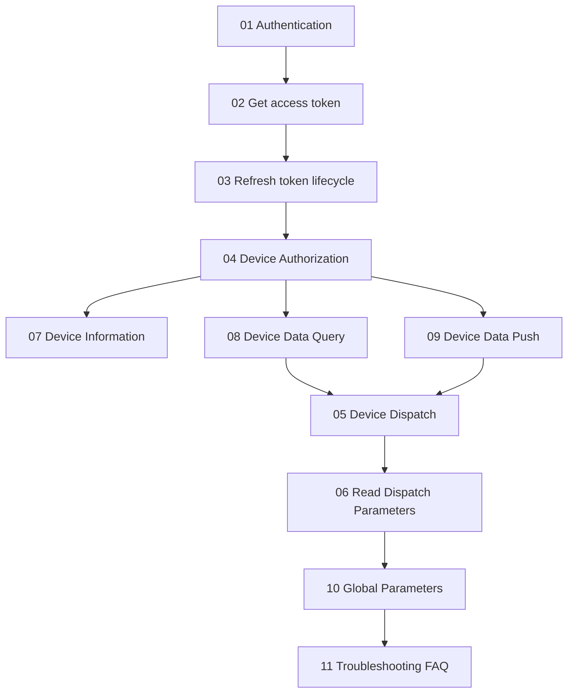
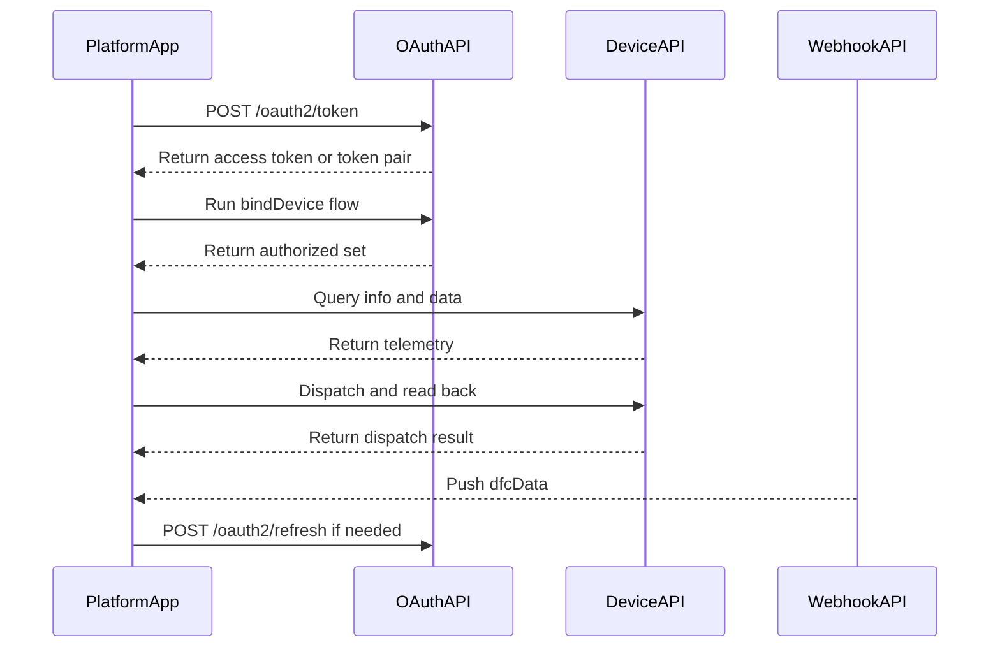

# Growatt Open API Documentation

This directory contains the English published split of the Growatt Open API documentation. It organizes endpoint pages, preserves cross-links, and keeps implementation observations separate from the main API descriptions.

## Integration Roadmap (Concept)

## Integration Roadmap (Request Sequence)

## Documentation Structure

| File | Description |
| :--- | :--- |
| [01_authentication.md](./01_authentication.md) | Authentication guide |
| [02_api_access_token.md](./02_api_access_token.md) | Get `access_token` |
| [03_api_refresh.md](./03_api_refresh.md) | Refresh `access_token` |
| [04_api_device_auth.md](./04_api_device_auth.md) | Device authorization and unbind |
| [05_api_device_dispatch.md](./05_api_device_dispatch.md) | Device dispatch |
| [06_api_read_dispatch.md](./06_api_read_dispatch.md) | Read device dispatch parameters |
| [07_api_device_info.md](./07_api_device_info.md) | Device information query |
| [08_api_device_data.md](./08_api_device_data.md) | Device data query |
| [09_api_device_push.md](./09_api_device_push.md) | Device data push |
| [10_global_params.md](./10_global_params.md) | Global parameter description |
| [11_api_troubleshooting.md](./11_api_troubleshooting.md) | Troubleshooting FAQ |

## Quick Navigation

- [Release Notes](/growatt-openapi/release-notes)
- [Authentication Guide](./01_authentication.md)
- [Get access_token API](./02_api_access_token.md)
- [OAuth2-refresh API](./03_api_refresh.md)
- [Device Authorization API](./04_api_device_auth.md)
- [Device Dispatch API](./05_api_device_dispatch.md)
- [Read Device Dispatch Parameters API](./06_api_read_dispatch.md)
- [Device Information Query API](./07_api_device_info.md)
- [Device Data Query API](./08_api_device_data.md)
- [Device Data Push API](./09_api_device_push.md)
- [Global Parameter Description](./10_global_params.md)
- [Troubleshooting FAQ](./11_api_troubleshooting.md)

## Key Notes

- `authorization_code` token requests require `redirect_uri` and return a refreshable token set.
- `client_credentials` token requests may omit `redirect_uri`; the 2026-04-23 AU run returned access-token-only fields.
- `POST /oauth2/getDeviceList` is supported only in `authorization_code` mode.
- In `POST /oauth2/bindDevice`, `deviceSnList[].pinCode` is required in client mode.
- The parameter table for `POST /oauth2/readDeviceDispatch` marks `requestId` as required.
- The test domains include `https://opencloud-test-au.growatt.com`.

## Entry Guide

For the consolidated integration guide, see:

- [Release Notes](/growatt-openapi/release-notes)
- [../Growatt Open API Professional Integration Guide.md](../Growatt Open API Professional Integration Guide.md)

## Appendix

- [Appendix A Growatt Codes](/growatt-openapi/growatt-codes)
- [Appendix B Glossary](./12_ess_terminology.md)
- [Appendix C Semantic Model](./13_ess_semantic_model.md)
- [Appendix D OpenAPI Product Support Scope](./14_appendix_d_openapi_support_scope.md)
