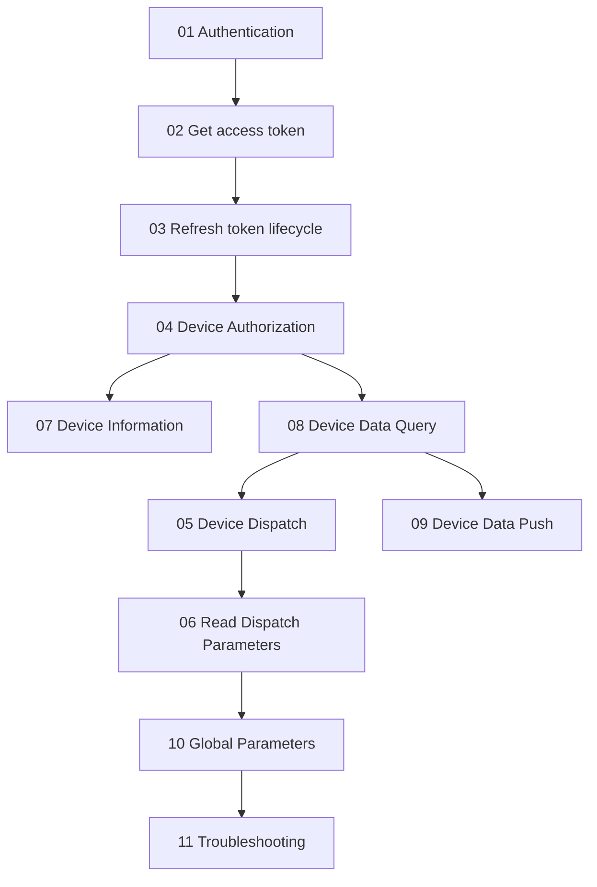

# Growatt Open API Documentation

Version: V1.0 | Release Date: March 4, 2026

This directory contains the English primary specification for Growatt Open API. Endpoint-level documents are the English SSOT. `11_api_troubleshooting.md` summarizes common integration errors and the corresponding corrective actions.

## Integration Roadmap (Concept)

## Documentation Structure

| File | Description |
| :--- | :--- |
| [01_authentication.md](./01_authentication.md) | OAuth2 mode boundary and capability matrix |
| [02_api_access_token.md](./02_api_access_token.md) | Get access token |
| [03_api_refresh.md](./03_api_refresh.md) | Refresh access token |
| [04_api_device_auth.md](./04_api_device_auth.md) | Device discovery, authorization, and unbind |
| [05_api_device_dispatch.md](./05_api_device_dispatch.md) | Device dispatch |
| [06_api_read_dispatch.md](./06_api_read_dispatch.md) | Dispatch read-back |
| [07_api_device_info.md](./07_api_device_info.md) | Device metadata query |
| [08_api_device_data.md](./08_api_device_data.md) | Device telemetry query |
| [09_api_device_push.md](./09_api_device_push.md) | Device data push |
| [10_global_params.md](./10_global_params.md) | Shared response codes and `setType` catalog |
| [11_api_troubleshooting.md](./11_api_troubleshooting.md) | Troubleshooting FAQ |

## Quick Start

### 1. Authentication and Token Handling

- [Authentication Guide](./01_authentication.md)
- [Get access_token API](./02_api_access_token.md)
- [OAuth2-refresh API](./03_api_refresh.md)

### 2. Device Authorization

- In `authorization_code` mode, start from [Device Authorization API](./04_api_device_auth.md) and use `getDeviceList` before `bindDevice`
- In `client_credentials` mode, the flow typically starts from `bindDevice`

### 3. Device Query and Dispatch

- [Device Information Query API](./07_api_device_info.md)
- [Device Data Query API](./08_api_device_data.md)
- [Device Dispatch API](./05_api_device_dispatch.md)
- [Read Device Dispatch Parameters API](./06_api_read_dispatch.md)
- [Device Data Push API](./09_api_device_push.md)

### 4. Shared Rules and Troubleshooting

- [Global Parameter Description](./10_global_params.md)
- [Troubleshooting FAQ](./11_api_troubleshooting.md)

## API Endpoint Summary

| Endpoint | Method | Description |
| :--- | :--- | :--- |
| `/oauth2/token` | POST | Get access token |
| `/oauth2/refresh` | POST | Refresh access token |
| `/oauth2/getDeviceList` | POST | Get candidate devices, supported only in `authorization_code` mode |
| `/oauth2/bindDevice` | POST | Authorize devices |
| `/oauth2/getDeviceListAuthed` | POST | Get authorized devices |
| `/oauth2/unbindDevice` | POST | Remove device authorization |
| `/oauth2/getDeviceInfo` | POST | Get device information |
| `/oauth2/getDeviceData` | POST | Get device telemetry |
| `/oauth2/deviceDispatch` | POST | Set device parameters |
| `/oauth2/readDeviceDispatch` | POST | Read device parameters |

## Domains

### Production Environment

- `https://opencloud.growatt.com`
- `https://opencloud-au.growatt.com`

### Test Environment

- `https://opencloud-test.growatt.com`

## Token Lifecycle

- The TTL values shown in the docs are example values and must not be treated as fixed constants.
- For both `authorization_code` and `client_credentials`, trust the actual `expires_in` / `refresh_expires_in` values returned by the environment.

## Integration Guide

For an integration-oriented consolidated guide, see:

- [../Growatt Open API Professional Integration Guide.md](../Growatt Open API Professional Integration Guide.md)

## Appendix

- [Growatt Codes](/growatt-openapi/growatt-codes)
