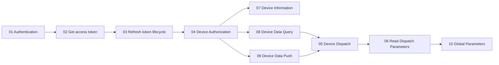
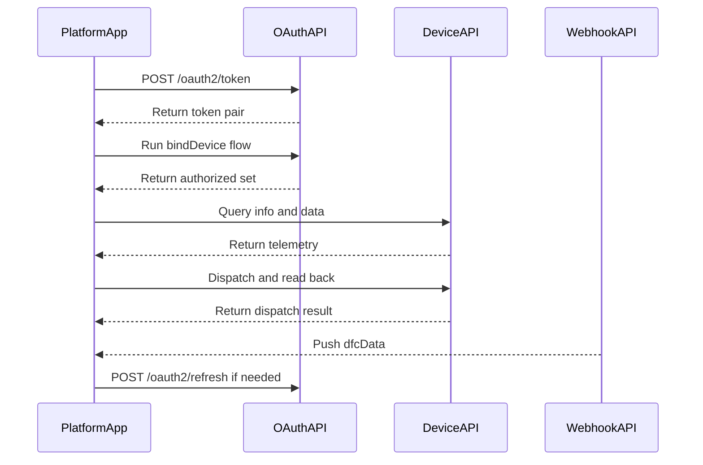

# Growatt Open API Documentation

Version: V1.0 | Release Date: March 4, 2026

This folder contains structured documentation for the Growatt Open API.

## Integration Roadmap (Concept)

## Integration Roadmap (Request Sequence)

## Documentation Structure

| File | Description |
| :--- | :--- |
| [01_authentication.md](./01_authentication.md) | OAuth2.0 authorization modes and flow overview |
| [02_api_access_token.md](./02_api_access_token.md) | Get access_token API |
| [03_api_refresh.md](./03_api_refresh.md) | OAuth2-refresh API |
| [04_api_device_auth.md](./04_api_device_auth.md) | Device Authorization APIs (bind/unbind devices) |
| [05_api_device_dispatch.md](./05_api_device_dispatch.md) | Device Dispatch API (set parameters) |
| [06_api_read_dispatch.md](./06_api_read_dispatch.md) | Read device dispatch parameters API |
| [07_api_device_info.md](./07_api_device_info.md) | Device Information Query API |
| [08_api_device_data.md](./08_api_device_data.md) | Device Data Query API |
| [09_api_device_push.md](./09_api_device_push.md) | Device Data Push API |
| [10_global_params.md](./10_global_params.md) | Global parameters (domains, permissions, device parameters) |

## Quick Start

### 1. Authentication

Start by understanding the [Authentication Guide](./01_authentication.md) to learn about:
- Authorization Code Mode
- Client Credentials Mode
- OAuth2.0 flow overview

### 2. Get Access Token

Use the [Get access_token API](./02_api_access_token.md) to obtain an access token.

### 3. Refresh Token

When your access token expires, use the [OAuth2-refresh API](./03_api_refresh.md) to refresh it.

### 4. Device Management

- [Get Authorizable Device List](./04_api_device_auth.md#get-authorizable-device-list)
- [Authorize Device](./04_api_device_auth.md#authorize-device)
- [Get Authorized Device List](./04_api_device_auth.md#get-authorized-device-list)
- [Unauthorize Device](./04_api_device_auth.md#unauthorize-device)

### 5. Device Operations

- [Device Dispatch](./05_api_device_dispatch.md) - Set device parameters
- [Read Dispatch Parameters](./06_api_read_dispatch.md) - Read device parameters
- [Device Information](./07_api_device_info.md) - Query device info
- [Device Data](./08_api_device_data.md) - Query device data
- [Device Data Push](./09_api_device_push.md) - Receive pushed data

## API Endpoints Summary

| Endpoint | Method | Description |
| :--- | :--- | :--- |
| `/oauth2/token` | POST | Get access_token |
| `/oauth2/refresh` | POST | Refresh access_token |
| `/oauth2/getApiDeviceList` | POST | Get authorizable device list |
| `/oauth2/bindDevice` | POST | Authorize device |
| `/oauth2/getApiDeviceListAuthed` | POST | Get authorized device list |
| `/oauth2/unbindDevice` | POST | Unauthorize device |
| `/oauth2/getDeviceInfo` | POST | Get device information |
| `/oauth2/deviceDispatch` | POST | Set device parameters |
| `/oauth2/readDdeviceDispatch` | POST | Read device parameters |
| `/oauth2/getDeviceData` | POST | Query device data |

## Domains

### Production
- `https://opencloud.growatt.com`
- `https://opencloud-au.growatt.com`

### Test
- `https://opencloud-test.growatt.com`

## Token Validity

- `access_token`: 2 hours (7200 seconds)
- `refresh_token`: 30 days (2592000 seconds)

## Quick Guide

For a quick start guide with simpler examples, see: [/growatt-openapi/quick-guide](/growatt-openapi/quick-guide)

## Original Documentation

For the complete unified document, see: [../Growatt Unified API.md](../Growatt Unified API.md)
