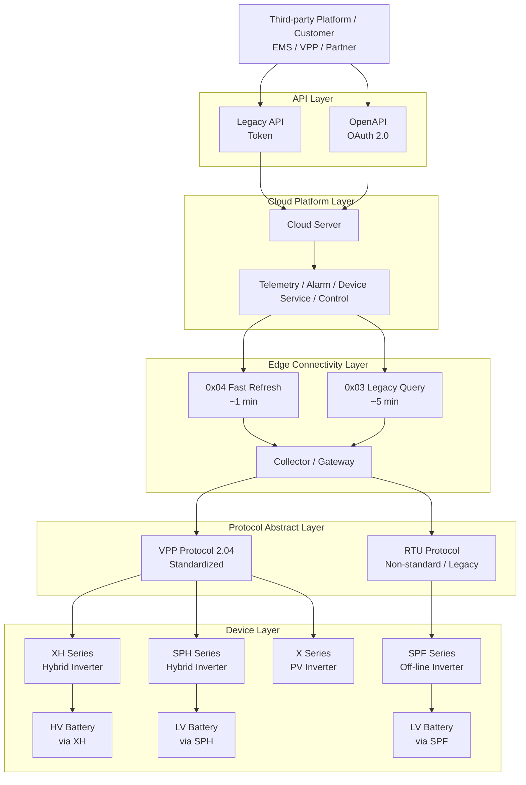

# 平台总体架构

## 3. 平台总体架构说明

平台整体采用以下分层架构：

1. **Ecosystem / Customer Layer**
2. **API Layer**
3. **Cloud Platform Layer**
4. **Edge Connectivity Layer**
5. **Protocol Abstract Layer**
6. **Device Layer**

整体链路为：

```text
Third-party Platform / Customer → API → Cloud → Collector → Protocol → Device
```

该架构的对外价值在于：

- 对外屏蔽底层设备差异
- 通过统一 API 提供稳定接入边界
- 通过云边协同实现统一接入与统一管理
- 在标准化能力与 legacy 兼容之间保持平衡

------

## 4. 企业平台总体架构图（完整总图）


