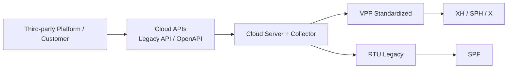

# 业务决策视图

## 适用场景

- 生态合作前的能力介绍
- 平台定位与开放能力沟通
- 多方合作中的架构边界说明
- 面向业务与管理层的整体汇报

## 适合谁看

- 企业管理者
- 业务决策者
- 生态合作负责人
- 对外合作管理层

## 关注重点

- 平台总体结构
- 标准化进展
- legacy 兼容情况
- 对外开放能力

## 视图图示

## 视图解读

平台对外通过 Legacy API 与 OpenAPI 提供统一能力；
平台通过云端与采集器支撑多系列设备接入；
当前 **XH / SPH / X** 已完成标准化，**SPF** 仍保留 legacy RTU 路径。
整体形成“**标准化主路径 + legacy 兼容路径**”的双轨架构。
