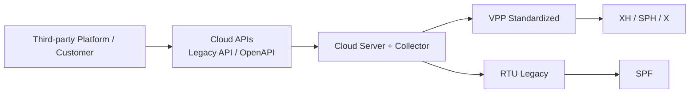

# 管理层视图

> 内部资料

## 5.1 管理层视图

### 适用对象

- VP
- CEO
- 总经办
- PMO 管理层

### 关注重点

- 平台总体结构
- 标准化进展
- legacy 兼容情况
- 对外开放能力

### 管理层视图图示

### 管理层解读

平台对外通过 Legacy API 与 OpenAPI 提供统一能力；
对内通过云端与采集器支撑设备接入；
当前 **XH / SPH / X** 已完成标准化，**SPF** 仍保留 legacy RTU 路径。
整体形成“**标准化主路径 + legacy 兼容路径**”的双轨架构。
