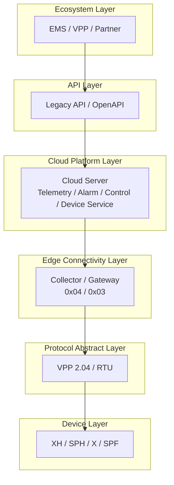

# 平台架构师视图

## 适用场景

- 平台总体架构说明
- 解决方案设计与技术评审
- 分层职责与扩展性讨论
- 新协议、新设备接入路径评估

## 适合谁看

- 平台架构师
- 系统架构师
- 解决方案架构师
- 技术负责人

## 关注重点

- 分层设计
- 云边职责
- 协议抽象层定位
- 后续可扩展性

## 视图图示

## 视图解读

这是一个分层清晰的企业平台架构。
其中 **Protocol Abstract Layer** 是边缘接入与设备协议之间的关键解耦层。
未来新增设备型号或协议版本时，应优先在协议抽象层做扩展，而非侵入云端服务和 API 层。
