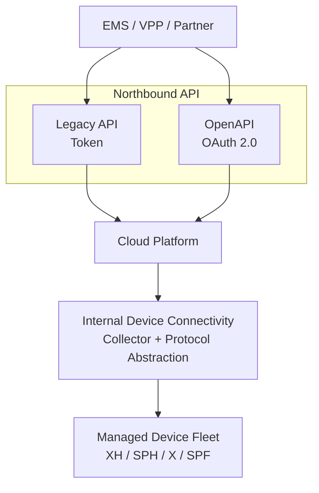

# API / 第三方接入视图

## 5.3 API / 第三方接入视图

### 适用对象

- 第三方平台
- EMS 平台
- VPP 平台
- 生态合作伙伴
- 接口集成人员

### 关注重点

- 接口边界
- 接入方式
- 底层复杂度是否被平台吸收

### API / 生态伙伴视图图示

### API 伙伴解读

对于第三方平台而言，主要关注 **Legacy API** 与 **OpenAPI** 即可。
设备协议差异、采集器实现细节、VPP/RTU 兼容性均由平台内部吸收。
平台对外提供的是统一接入边界，而非设备协议细节。
