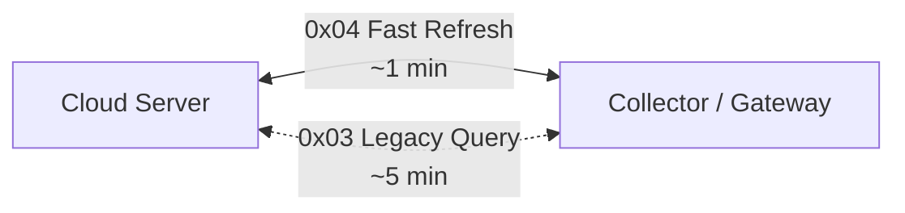

# 云边通信视图

> 内部资料

## 5.4 云边通信视图

### 适用对象

- 边缘接入团队
- 通信协议团队
- 采集器研发团队

### 关注重点

- 云端与采集器之间的链路类型
- 快速刷新与 legacy 查询的区分

### 云边通信视图图示

### 云边通信解读

当前北向通信链路分为两类：

- `0x04`：高频快速刷新链路
- `0x03`：legacy 查询链路

两条链路并存，可在满足较高实时性需求的同时，兼顾历史兼容性。
