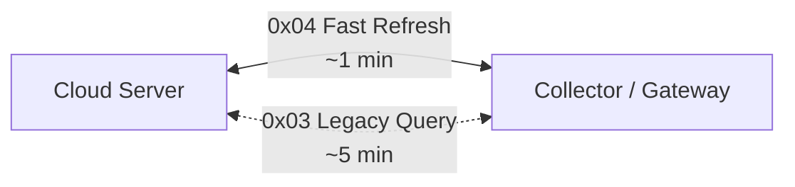

# 云边通信视图

## 适用场景

- 云边通信链路说明
- 数据刷新机制介绍
- 实时性与兼容性边界沟通
- 采集器通信方式理解

## 适合谁看

- 系统集成方
- 技术沟通对象
- 平台与设备连接方案相关团队

## 关注重点

- 云端与采集器之间的链路类型
- 快速刷新与 legacy 查询的区分

## 视图图示

## 视图解读

当前北向通信链路分为两类：

- `0x04`：高频快速刷新链路
- `0x03`：legacy 查询链路

两条链路并存，可在满足较高实时性需求的同时，兼顾历史兼容性。
