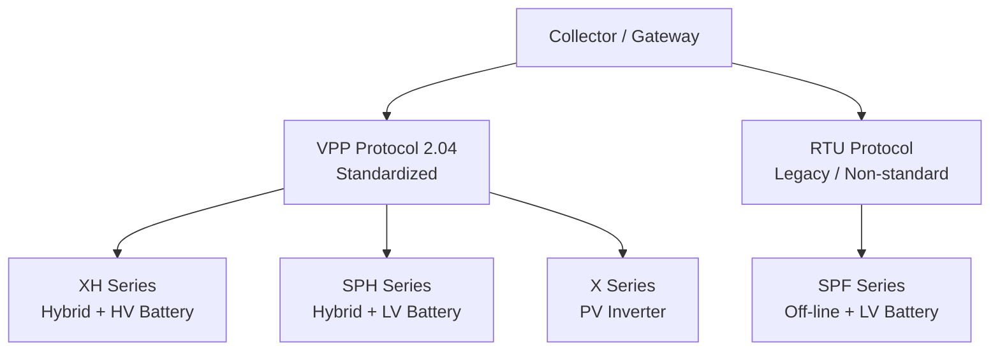

# 协议与设备接入视图

## 5.5 协议与设备接入视图

### 适用对象

- 设备接入合作方
- 协议适配相关团队
- 系统集成方
- 技术方案对接人员

### 关注重点

- 哪些设备已完成标准化
- 哪些设备仍处于 RTU 路径
- 协议演进方向

### 协议与设备接入视图图示

### 协议与设备解读

当前协议标准化进展明确：

- **已完成 VPP 标准化**：XH / SPH / X
- **仍走 RTU 路径**：SPF

这说明当前平台已经形成以 **VPP 标准化为主、RTU legacy 为辅** 的演进格局。
