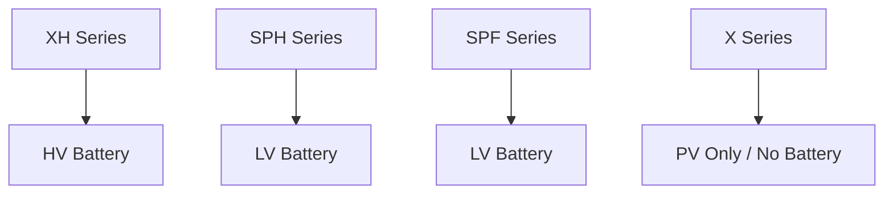

# 设备建模视图

## 5.6 设备建模视图

### 适用对象

- 第三方平台建模人员
- API 集成人员
- 数据语义设计人员
- 设备接入与产品方案团队

### 关注重点

- 电池从属关系
- 逆变器与电池平台映射
- 纯光伏机型的边界

### 设备建模视图图示

### 设备建模解读

设备模型中，逆变器是主对象，电池是其下挂资源：

- XH 对应高压电池
- SPH 对应低压电池
- SPF 对应低压电池
- X 为纯光伏逆变器，不管理电池

该口径应在架构、协议、API 字段、遥测语义中保持一致。
