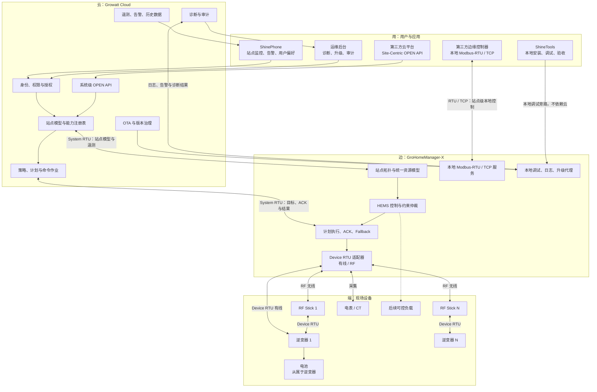
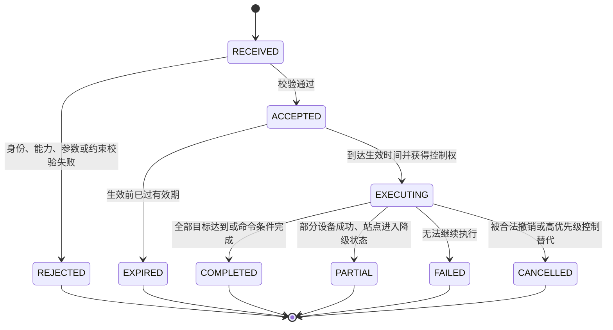
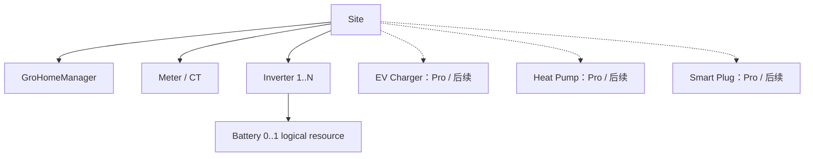

# GroHomeManager-X 系统 SPEC（用—云—边—端）

> 状态：Draft for Review
> 版本：0.10
> 日期：2026-07-20
> 适用产品：GroHomeManager-X MVP、GroHomeManager Pro 后续版本

## 1. 文档目的

本文从“用—云—边—端”视角定义 GroHomeManager-X 的系统边界、用户体验、云边端职责、协议接口、HEMS 能源管理能力、设备兼容原则和验收口径。

本文重点回答三个问题：

1. 当前 GroHomeManager-X 已经具备什么能力，尚缺什么闭环；
2. 哪些能力是 GroHomeManager-X MVP 成为可交付产品所必须具备的；
3. 哪些能力应保留为 GroHomeManager Pro 的硬件或高级场景差异化能力。

本文的主要输入包括：

- 《统一架构定义（更新版）》飞书文档；
- 《GroHomeManager-X & Pro 功能规划对比》功能矩阵；
- 当前产品 Gap 分析；
- 当前南向同时支持有线与无线通信、无线场景每台逆变器配置一个 RF Stick 的约束。

## 2. 核心产品判断

当前 GroHomeManager-X 更接近“具备防逆流、Peak Shaving 和电池协同能力的本地控制器”，尚未形成完整的站点级家庭能源管理平台。

GroHomeManager-X MVP 的目标产品定义为：

> 面向家庭单机与基础并机场景的标准 HEMS 网关，能够完成安装交付、站点建模、本地能源控制、云边控制闭环、远程运维和标准化集成。

GroHomeManager Pro 的目标产品定义为：

> 面向更高并机规模、相级控制、区域法规接口、离网微网和多能源设备协同的高级家庭微网控制器。

产品划分应遵循以下原则：

- 安装、升级、诊断、监控、权限、审计和命令闭环属于平台基础能力，不应只由 Pro 提供；
- 需要新物理接口、更高实时性、更强本地算力或区域认证的能力，适合作为 Pro 差异化；
- AI 优化算法可以按云服务或订阅区分，但边缘侧的通用计划执行器、约束校验和异常回退应由 X 与 Pro 共用；
- 对外对象必须以 Site 为中心，不能把单机协议差异暴露给用户或第三方云平台。

## 3. 名词与规范用语

| 术语 | 定义 |
|-|-|
| 用 | 使用系统的人员和应用，包括 ShinePhone、ShineTools、运维后台、第三方 OPEN API 调用方和第三方边缘控制器 |
| 云 | Growatt 云平台及其站点、设备、策略、告警、OTA、开放接口和审计服务 |
| 边 | GroHomeManager-X 或 GroHomeManager Pro，负责站点聚合、本地自治和设备控制 |
| 端 | 逆变器、电池、电表及后续 EV Charger、热泵、智能插座等现场设备 |
| Device RTU | 端与边之间的单机设备协议，每台设备作为独立逻辑端点接入 |
| System RTU | 边与云之间的站点级聚合协议，上传站点模型并接收系统级控制目标 |
| 本地 Modbus-RTU | GroHomeManager 对第三方边缘控制器提供的串行本地站点级接口 |
| 本地 Modbus TCP | GroHomeManager 对第三方边缘控制器提供的以太网本地站点级接口，与 Modbus-RTU 使用相同业务语义 |
| Site-Centric | 以站点为查询、监控、控制和权限边界，不要求调用方理解具体机型 |
| MVP MUST | GroHomeManager-X MVP 发布前必须完成并通过验收 |
| MVP SHOULD | 建议在 MVP 完成；若延期，必须有明确降级方案且不破坏平台基础闭环 |
| PRO | GroHomeManager Pro 或后续高级版本范围 |

## 4. 现状基线与建议范围

下表将“当前能力事实”与“建议范围”分开。当前状态来源于现有功能矩阵，最终发布状态仍需用机型、固件和区域能力矩阵逐项确认。

| 能力 | 当前 GroHomeManager-X | X MVP 建议 | Pro / 后续范围 |
|-|-|-|-|
| 单机防逆流 | 已具备本地能力 | MUST：产品化、云端可视、闭环验收 | 共用基础 |
| 多机防逆流 | 已具备或部分具备本地能力 | MUST：站点级聚合、异常降级、云端可视 | 更高并机规模与动态并网 |
| Peak Shaving | 已具备 | MUST：统一配置、执行结果和告警 | 按钮/硬接点及高性能控制可由 Pro 扩展 |
| 电池低功耗休眠与唤醒 | 已具备 | MUST：状态、原因和结果可追踪 | 共用基础 |
| 电池 SOC 均衡 | 已具备 | MUST：站点级状态与限制原因可见 | 共用基础 |
| 三相不平衡控制 | 不支持 | 非 MVP | PRO |
| ECO | X 与现有 Pro 规划均未支持 | Out of Scope，待重新定义业务含义 | 待决策 |
| 冬季模式与保养补电 | 云端处理 | MUST：边缘接受有效计划并安全执行 | 云算法可持续增强 |
| 一键建站 | 当前不支持，原规划放在 Pro | MUST | 共用基础 |
| 自动拓扑识别 | 当前不完整 | MUST | 更复杂拓扑由 Pro 扩展 |
| 相序检测/适配 | 当前不支持 | MUST：至少检测、阻断错误交付并给出修复指引 | PRO 可支持自动相级控制 |
| 系统一键升级 | 当前不支持，原规划放在 Pro | MUST：分批、校验、结果回传、失败保护 | Pro 共用同一平台能力 |
| 改造模式 | 当前不支持 | SHOULD：若首发市场有存量改造场景则升级为 MUST | 高级改造拓扑 |
| 并机本地控制 | 部分具备 | MUST：站点级分配、ACK、降级运行 | 更高并机数量和性能 |
| 并机云端监控 | 当前不支持 | MUST | Pro 扩展规模，不另建平台 |
| 并机云端控制 | 当前不完整或不支持 | MUST：权限、状态机和执行闭环 | 高级 VPP / 区域控制 |
| 智能诊断 | 当前不支持 | MUST：规则诊断与诊断链 | PRO 可增加高级算法诊断 |
| 离网监控 | 当前不支持 | 非 MVP，除非 X 首发即覆盖离网场景 | PRO |
| AI 动态电价 | 当前云端不支持 | MVP MUST 提供通用计划执行底座；优化算法可后置 | 云服务/高级策略，不应强绑定新硬件 |
| PV/负载预测 | 当前不支持 | 非 MVP | 云服务后续能力 |
| Modbus TCP | 通道或部分能力存在，但尚未完全产品化 | MUST：正式本地开放接口，站点级、版本化、可授权 | Pro 扩展对象和控制能力 |
| 本地 Modbus-RTU | 更新版统一架构的目标口径 | MUST：站点级、版本化、可授权 | Pro 扩展对象和控制能力 |
| 本地 WebAPI | 当前不支持 | 非 MVP；不得阻塞站点级本地接口交付 | 后续可选 |
| 云端 OPEN API | 现有平台具备接口基础 | MUST：只提供 Site-Centric 系统级语义 | VPP 高级调度能力后续增强 |
| DRMS / DO / RRCR / 14A | 当前不支持 | 非 MVP | PRO，按区域准入实施 |
| 第三方负载接入 | 当前不支持 | 非 MVP | PRO：Shelly、EV Charger、热泵、EEBUS 等 |

## 5. 目标系统架构



### 5.1 三段协议硬边界

1. 端 ↔ 边：使用单机 Device RTU；每台设备独立寻址、独立上报、独立执行；
2. 边 ↔ 云：使用 System RTU；GroHomeManager 在边缘完成聚合，云端不依赖设备私有寄存器；
3. 边 ↔ 边：同时提供本地 Modbus-RTU 与 Modbus TCP；第三方边缘系统通过任一传输方式操作同一套站点级标准对象；
4. 云 ↔ 第三方：使用 Site-Centric OPEN API，不提供 Device-Centric 公共控制接口；
5. ShineTools 本地调试链路为“用 → 边 → 端”，在无云环境下仍须完成建站、调试和验收。

### 5.2 数据与控制主链路

数据主链路：

```text
端设备 → Device RTU → GroHomeManager 归一化与聚合 → System RTU → 云站点模型 → APP / 运维 / OPEN API
```

控制主链路：

```text
用户偏好 / 云策略 / OPEN API 目标
→ 云端生成站点级 CommandJob
→ System RTU 下发
→ GroHomeManager 权限与约束校验
→ 分解为设备级动作
→ Device RTU 执行
→ 聚合执行结果
→ System RTU 回传
→ APP / 运维 / OPEN API 展示实际结果
```

## 6. 用户与关键旅程

### 6.1 角色

| 角色 | 主要目标 | 默认权限 |
|-|-|-|
| 家庭用户 / 站点所有者 | 查看能源流、收益、告警和运行状态，管理授权与安全偏好 | 查看；安全范围内的偏好设置；不默认拥有任意远程设备写权限 |
| 安装商 | 快速完成接线、发现、配对、拓扑、相序、升级、参数设置和验收 | 仅对授权站点、限定时间窗口进行本地调试 |
| 运维人员 | 定位故障、查看日志、升级、恢复、审计 | 按租户、区域和职责授权 |
| Growatt 云服务 | 聚合站点、下发计划、管理 OTA、告警和诊断 | 受策略、站点授权和边缘安全约束 |
| 第三方云平台 | 读取站点级数据，按授权下发站点级目标 | OPEN API Scope + 站点授权 + 命令审计 |
| 第三方边缘控制器 | 在低时延或离线场景进行本地站点级控制 | 本地授权、地址白名单、读写权限和控制租约 |

### 6.2 安装交付旅程（MVP MUST）

1. 安装商在 ShineTools 中创建或选择站点；
2. ShineTools 与 GroHomeManager 建立本地连接，不依赖云端；
3. 选择有线、无线或混合接入方式；同一站点正式支持有线 Device RTU 与 RF 设备并发运行；
4. 有线设备完成扫描、地址冲突检查和通信质量检查；
5. 无线设备逐台绑定 RF Stick，每台逆变器必须对应唯一 RF Stick；
6. GroHomeManager 识别设备型号、序列号、协议、固件和能力；
7. 自动建立逆变器、电池、电表和并机关系；
8. 检查相序、计量方向、并网点和防逆流测量链路；
9. 检查固件组合，必要时执行受控升级；
10. 运行防逆流、Peak Shaving、通信中断和告警测试；
11. 生成验收报告，包含拓扑、版本、参数、测试结果和遗留问题；
12. 联网后将站点模型同步到云端，不重复创建逻辑设备。

验收结果必须是 `PASS`、`PASS_WITH_WARNING` 或 `FAIL`。存在相序错误、计量方向错误、设备身份冲突或关键固件不兼容时不得标记为 `PASS`。

### 6.3 家庭用户旅程（MVP MUST）

- 查看站点级实时功率流：PV、Grid、Load、Battery；
- 查看单机/并机聚合状态，并可下钻到设备健康信息；
- 查看当前 HEMS 模式、控制来源、策略有效期和执行状态；
- 查看告警、离线状态、降级运行和最近一次恢复结果；
- 配置用户偏好，例如最低备用 SOC、是否允许电网充电和模式时段；
- 对需要控制权限的操作完成显式授权和风险提示；
- 远程命令不能只显示“设置成功”，必须展示已接受、执行中、完成、部分完成或失败。

### 6.4 运维旅程（MVP MUST）

- 从云服务、GroHomeManager、拓扑、协议、固件、电表、相序、逆变器、电池到命令记录逐层诊断；
- 查看每台并机设备的在线状态、最后通信时间和被隔离原因；
- 按兼容矩阵执行系统升级，查看每个组件的升级结果；
- 导出脱敏诊断包；
- 对远程写操作进行完整审计；
- 在设备故障后确认站点是否进入降级模式以及哪些能力被暂停。

## 7. “用”层 SPEC

### 7.1 ShinePhone 用户 APP

| ID | MVP 要求 | 验收口径 |
|-|-|-|
| APP-01 | 以 Site 为首页对象，展示 PV、Battery、Grid、Load 和站点状态 | 单机与并机场景使用相同页面语义，不要求用户理解 Master/Slave |
| APP-02 | 展示当前 HEMS 模式、控制来源、有效期和约束原因 | 能区分用户、云策略、VPP、本地保护和 Fallback |
| APP-03 | 展示 CommandJob 全生命周期 | 不以 HTTP 成功或“已发送”替代设备执行结果 |
| APP-04 | 展示设备下钻健康信息 | 可查看设备在线、固件、通信质量、告警；不暴露私有寄存器 |
| APP-05 | 支持告警通知和恢复通知 | 告警关联站点、设备、时间、影响能力和建议动作 |
| APP-06 | 远程控制默认最小权限 | 未授权用户只能查看；写操作需权限、站点授权和审计 |
| APP-07 | 支持安全范围内的用户偏好 | 偏好不能覆盖设备安全、并网法规和本地保护 |

### 7.2 ShineTools 调试 APP

| ID | MVP 要求 | 验收口径 |
|-|-|-|
| TOOL-01 | 无云本地连接 GroHomeManager | 断开互联网仍能完成发现、配置、测试和验收 |
| TOOL-02 | 一键发现与建站 | 自动生成拓扑草稿并提示未识别、重复或冲突设备 |
| TOOL-03 | 支持有线设备调试 | 展示总线地址、通信状态和地址冲突 |
| TOOL-04 | 支持无线设备逐台配对 | 一台逆变器只能绑定一个有效 RF Stick；重复绑定被阻止 |
| TOOL-05 | 展示无线链路质量 | 至少提供在线、最后通信和可用于诊断的链路质量指标 |
| TOOL-06 | 相序与计量方向检查 | 错误时阻断关键 HEMS 功能并给出可执行修复建议 |
| TOOL-07 | 固件兼容检查与系统升级 | 升级前检查组合兼容性，升级后重新验证拓扑与控制能力 |
| TOOL-08 | 调试测试与验收报告 | 报告可关联站点、安装商、拓扑、版本、参数和测试结果 |
| TOOL-09 | 操作审计与超时退出 | 本地调试权限在授权窗口结束后自动失效 |

## 8. “云”层 SPEC

| ID | MVP 要求 | 验收口径 |
|-|-|-|
| CLD-01 | 建立唯一 Site、GroHomeManager 和逻辑设备身份 | 本地建站与云端绑定不会产生重复站点或重复设备 |
| CLD-02 | 保存站点拓扑与能力快照 | 能查询某时刻站点支持的模式、功率、接口和设备数量 |
| CLD-03 | 接收 System RTU 站点级遥测 | 单机与并机使用相同站点字段，保留设备下钻来源 |
| CLD-04 | 提供站点、设备、告警和历史数据服务 | APP、运维和 OPEN API 使用同一语义模型 |
| CLD-05 | 提供策略与 CommandJob 服务 | 支持幂等键、相关 ID、版本、优先级、有效期和目标约束 |
| CLD-06 | 管理命令状态和结果 | 能区分拒绝、超时、部分完成、设备失败和边缘 Fallback |
| CLD-07 | OTA 编排与版本治理 | 按兼容矩阵生成升级计划，不允许任意组件独立升级破坏组合 |
| CLD-08 | 规则诊断与告警关联 | 可沿云—边—端诊断链定位失败层级 |
| CLD-09 | 身份、Scope、站点授权与审计 | 所有远程写操作可追溯到调用方、用户、站点、命令和结果 |
| CLD-10 | 提供 Site-Centric OPEN API | 不要求第三方传入具体逆变器私有地址或寄存器 |
| CLD-11 | 支持能力协商 | 调用方可先查询 SiteCapabilities，再决定显示或调用哪些能力 |
| CLD-12 | 支持边缘离线重连 | 重连后按版本和序号补传关键状态，避免旧命令覆盖新状态 |

### 8.1 OPEN API 最小资源模型

MVP OPEN API 至少应提供以下站点级资源语义，具体 URL 和字段名由 API 设计文档冻结：

- `SiteSummary`：站点身份、状态、聚合功率、当前模式；
- `SiteTelemetry`：PV、Grid、Load、Battery、SOC 和能量统计；
- `SiteCapabilities`：支持的模式、控制范围、并机规模和约束；
- `TopologySnapshot`：站点组件与父子关系，仅暴露标准化字段；
- `EnergyPlan`：分时目标、SOC 约束、出口约束和有效期；
- `CommandJob`：命令输入、状态、结果、失败原因和相关 ID；
- `AlarmEvent`：告警、恢复、影响范围和建议动作；
- `FirmwareInventory`：组件版本和兼容状态，只读为主。

第三方云平台不得直接通过公共 OPEN API 对某个私有寄存器写值。确需设备下钻控制时，也必须由站点级标准命令表达，再由 GroHomeManager 分解。

## 9. “边”层 SPEC：GroHomeManager-X

### 9.1 接入与站点建模

| ID | MVP 要求 | 验收口径 |
|-|-|-|
| EDG-01 | 同时具备有线和无线 Device RTU 接入能力，并支持同站点混合并发 | 有线设备与 RF 设备在同一站点同时在线、采集和受控；任一链路异常不影响另一链路继续运行 |
| EDG-02 | 无线场景一机一 RF Stick | 身份唯一、可解绑重配、防止跨站点误绑定 |
| EDG-03 | 归一化物理传输差异 | HEMS、云端和 API 不因有线或无线产生不同业务对象 |
| EDG-04 | 自动发现与拓扑建立 | 识别 GroHomeManager、逆变器、电池、电表及并机关系 |
| EDG-05 | 持久化站点身份与配置版本 | 断电重启后恢复最后一个已提交且校验通过的配置 |
| EDG-06 | 维护设备能力注册表 | 能力由机型、固件、协议版本和区域配置共同决定 |
| EDG-07 | 检测拓扑变化 | 新增、丢失、替换或错绑设备产生明确事件，不静默覆盖 |

### 9.2 HEMS 控制内核

| ID | MVP 要求 | 验收口径 |
|-|-|-|
| HEMS-01 | 单机/多机防逆流 | 以站点并网点为控制对象；设备离线时进入明确定义的降级模式 |
| HEMS-02 | Peak Shaving | 支持站点级阈值、实际执行反馈和受限原因 |
| HEMS-03 | 电池休眠唤醒与 SOC 均衡协同 | 能解释未执行原因，例如 SOC、BMS、温度、告警或通信限制 |
| HEMS-04 | 站点级功率聚合与分配 | 目标总功率分解到可用设备，结果回传单机明细与站点汇总 |
| HEMS-05 | 通用 EnergyPlan 执行器 | 支持时间片、充放电功率、目标/最低 SOC、电网充电许可、出口约束和有效期 |
| HEMS-06 | 本地约束校验 | 任何云端、APP、OPEN API 或本地接口命令均不得绕过安全与法规约束 |
| HEMS-07 | 控制权仲裁 | 同时存在多个控制来源时只产生一个可解释的有效目标 |
| HEMS-08 | 本地实时修正 | 云端下发站点目标，边缘根据实时测量、设备可用性和约束进行分配与修正 |
| HEMS-09 | 异常 Fallback | 云断开、设备断开、测量失效、计划过期和配置损坏均有确定行为 |
| HEMS-10 | 重启恢复 | 重启后不执行已过期命令，不因缓存重放产生危险功率跳变 |

### 9.3 控制优先级

边缘仲裁优先级从高到低为：

1. BMS、逆变器、电表和系统硬件安全；
2. 并网法规、区域认证和硬接点要求；
3. 防逆流、站点功率边界和本地保护；
4. 获得有效控制租约的 DRMS / VPP / 第三方调度；
5. 云端优化计划，例如动态电价计划；
6. 用户模式和用户偏好；
7. 默认 Fallback 模式。

高优先级约束覆盖低优先级目标时，系统必须记录 `requested_value`、`effective_value`、`limiting_constraint` 和 `control_owner`。

### 9.4 命令生命周期



每个命令必须包含：

- `command_id` 与幂等键；
- `site_id` 与调用主体；
- `control_source` 与优先级；
- `issued_at`、`effective_from`、`expires_at`；
- 目标值、约束和版本；
- `Accepted` 或 `Rejected` 结果；
- 实际生效值和设备分配；
- 最终状态、错误码和可读原因。

### 9.5 本地自治与运维

| ID | MVP 要求 | 验收口径 |
|-|-|-|
| EDG-20 | 无云持续运行 | 云断开时防逆流、Peak Shaving、安全约束和有效本地计划继续运行 |
| EDG-21 | 本地配置事务 | 新配置必须校验后原子提交，失败时保留上一稳定配置 |
| EDG-22 | 本地事件与环形日志 | 可定位最近的拓扑、通信、控制、升级、重启和异常回退事件 |
| EDG-23 | OTA 代理 | 下载/接收、校验、安装、重启、健康检查和结果回传形成闭环 |
| EDG-24 | 升级失败保护 | 不因部分组件升级导致站点失控；恢复策略由兼容矩阵定义 |
| EDG-25 | 诊断快照 | 能导出拓扑、版本、能力、链路、测量和最近命令的脱敏快照 |
| EDG-26 | 看门狗与健康状态 | 关键进程异常可恢复并形成可观测告警 |

### 9.6 本地第三方接口

GroHomeManager-X MVP 同时提供本地 Modbus-RTU 与 Modbus TCP。两者都是正式本地开放接口，不是主接口与兼容接口的关系；差异仅限传输方式，业务语义必须一致。

MVP 本地接口必须：

- 以站点级标准对象为主，不要求第三方理解各机型私有寄存器；
- Modbus-RTU 与 Modbus TCP 复用同一寄存器语义、数据类型、缩放系数、读写权限、错误码和版本策略；
- 同一能力在两种接口上的可读值、有效写入范围和执行结果必须一致；
- 提供只读遥测、能力查询、有限的站点级控制和 CommandJob 结果；
- 区分只读与读写角色；
- 支持接口版本、能力位图、错误码和弃用策略；
- 对高频写入限流；
- 使用控制租约防止本地第三方与云端策略互相抖动；
- 在离线场景可用，但仍受本地安全与法规约束；
- 提供调试示例、寄存器表、兼容性说明和自动化测试用例。

Modbus-RTU 与 Modbus TCP 必须共享同一控制仲裁器和控制租约。任一接口的写请求都必须进入统一 CommandJob 生命周期，禁止形成两套控制状态、两套寄存器语义或绕过本地安全约束的旁路。

## 10. “端”层 SPEC 与设备兼容

### 10.1 统一设备模型



设备建模要求：

- 逆变器是主要可寻址设备；
- 电池通过逆变器管理，不作为独立南向接入对象；
- 电表/CT 是站点并网点功率和防逆流闭环的关键测量对象；
- 同一业务能力不得因有线或无线传输方式改变字段语义；
- 第三方负载接入前必须先建立统一的可控能源资源模型。

### 10.2 设备能力等级

| 等级 | 定义 | 可进入的产品范围 |
|-|-|-|
| L0 Discover | 可发现、可识别身份和版本 | 仅安装诊断，不得宣称正式支持 |
| L1 Monitor | 标准遥测、状态和告警完整 | 监控兼容 |
| L2 Safe Control | 支持标准控制、ACK、错误码和安全限制 | 单机控制兼容 |
| L3 HEMS Coordinated | 支持站点级功率分配、Fallback 和并机协同 | X MVP HEMS 正式兼容 |
| L4 Regulatory / Microgrid | 支持区域法规、相级控制、离网或高级微网能力 | Pro |

设备只有在目标机型、固件和通信方式均通过对应等级验收后，才能进入公开兼容列表。

### 10.3 MVP 兼容范围建议

基于现有规划，X MVP 的首批候选机型为：

- 现有 XH 系列；
- MINA；
- MODA 一体机；
- SPH HUB。

上述列表是候选范围，不代表所有固件版本自动兼容。发布前必须形成以下维度的 SSOT 能力矩阵：

| 维度 | 必填内容 |
|-|-|
| 机型 | 产品系列、具体型号、区域版本 |
| 固件 | 最低版本、推荐版本、禁止组合 |
| 协议 | Device RTU 版本、System RTU 版本、寄存器映射版本 |
| 通信 | 有线、RF、同站点混合并发（必测） |
| 拓扑 | 单机、并机上限、Master/Slave 规则 |
| 能力 | 防逆流、Peak Shaving、SOC、EnergyPlan、OTA、诊断等级 |
| 限制 | 功率边界、响应限制、已知问题和降级策略 |

### 10.4 Pro 兼容范围建议

Pro 可按以下优先级扩展：

1. MINA、MODA 的更高并机规模，当前规划目标最多 6 台；
2. MIN、MID、MOD-XH/XH2；
3. MIN、MIC、MOD、MID-X/X2；
4. Shelly Plug、EV Charger、热泵；
5. EEBUS 生态设备；
6. 离网、柴发和其他微网资源。

第三方负载进入 Pro 前必须定义：额定功率、可中断性、舒适度约束、优先级、最小运行时间、最大启停次数、通信失败行为和手动覆盖规则。

## 11. MVP 与 Pro 的正式边界

### 11.1 GroHomeManager-X MVP 发布范围

以下能力全部是 MVP MUST：

1. 本地无云安装、设备发现、拓扑建立和验收；
2. 有线和无线 Device RTU 接入、同站点混合并发，无线一机一 RF Stick；
3. 机型、固件、协议和能力识别；
4. 相序与计量方向检测；
5. 事务化配置和系统级 OTA；
6. 单机/基础并机的防逆流与 Peak Shaving；
7. 电池休眠唤醒、SOC 均衡和限制原因反馈；
8. 站点级聚合、功率分配和设备异常降级；
9. 通用 EnergyPlan 执行器；
10. 本地安全约束、控制仲裁和通信异常 Fallback；
11. System RTU 云边站点模型、命令 ACK 和结果闭环；
12. ShinePhone 站点监控、告警、模式状态和命令结果；
13. 并机系统云端监控；
14. 规则诊断、日志、审计和远程运维；
15. Site-Centric OPEN API；
16. 站点级本地 Modbus-RTU 与 Modbus TCP；
17. 版本化能力矩阵和公开兼容清单。

### 11.2 GroHomeManager Pro 范围

以下能力属于 Pro 或后续高级版本：

- 三相不平衡与相级功率控制；
- 更高并机数量和更高性能本地控制；
- 多机动态并网；
- DRMS、DO、RRCR、14A 等区域法规或硬接线接口；
- 高可靠离网运行、离网监控和黑启动相关能力；
- 柴发启停与微网协同；
- EV Charger、热泵、智能插座、EEBUS 等多能源设备协同；
- 更大的本地存储、计算和长期自治能力；
- 复杂改造拓扑；
- 高级预测诊断和优化算法。

### 11.3 不应只放在 Pro 的基础能力

以下能力即使原功能矩阵放在 Pro，也建议回归 X MVP 平台基础：

- 一键建站；
- 相序检测；
- 系统一键升级；
- 并机云端监控；
- 智能诊断；
- 命令 ACK、执行结果和错误码；
- 站点级 API 数据模型；
- AI/动态电价计划的边缘执行底座。

## 12. 非功能要求

### 12.1 安全与权限

- 所有远程和本地写操作必须经过身份、角色、站点、能力和约束校验；
- 用户 APP 默认不拥有任意设备写权限；
- 安装商权限必须绑定站点和有效时间窗口；
- OPEN API 必须使用 Scope 和站点授权；
- 本地第三方接口必须区分只读与读写，并支持控制租约；
- 凭据、密钥和敏感日志不得以明文导出；
- 安全、并网法规和本地保护不可被云端命令关闭。

### 12.2 可靠性与一致性

- 关键控制必须在边缘闭环，不依赖云端实时在线；
- 配置、拓扑和 EnergyPlan 必须版本化；
- 同一命令重复传输不得重复产生副作用；
- 云边重连必须处理乱序、重复、过期和缺失消息；
- 单台并机设备故障不得导致未定义的整站行为；
- System RTU、本地 Modbus-RTU 与 Modbus TCP 必须映射到同一站点语义模型。

### 12.3 可观测性

系统至少应记录：

- 云服务和 GroHomeManager 在线状态；
- 拓扑与配置版本；
- 设备型号、固件、协议和能力；
- 有线/无线通信状态与最后通信时间；
- 电表、相序和关键测量健康状态；
- 当前控制来源、请求值、有效值和限制原因；
- 命令、计划、分配、ACK、结果和错误码；
- Fallback 进入、退出和恢复原因；
- OTA 计划和各组件结果。

### 12.4 时序与性能参数

以下参数必须在 MVP 规格冻结前按硬件能力和目标市场法规给出数值，并进入自动化验收；本文不使用未经验证的统一数值：

- 本地 HEMS 控制周期；
- 防逆流和 Peak Shaving 响应时间；
- Device RTU 有线轮询容量；
- RF 并发设备数、重试和重连时间；
- System RTU 遥测上送周期；
- 在线命令 Accepted/Rejected 响应时间；
- 计划本地缓存时长；
- 断网自治时长；
- 本地日志容量和云端审计保留期；
- 单站点允许的设备、告警和命令吞吐量。

每个数值应区分 `目标值`、`最大允许值`、`测试条件` 和 `不满足时的降级行为`。

## 13. MVP 端到端验收场景

### AT-01 有线单机交付

- ShineTools 无云发现一台逆变器、电池和电表；
- 完成相序、计量方向、固件和能力检查；
- 防逆流、Peak Shaving 和告警测试通过；
- 联网后云端只生成一个站点且数据一致。

### AT-02 无线单机交付

- 每台逆变器使用独立 RF Stick；
- 完成唯一绑定、重连、错绑阻断和链路质量检查；
- 业务模型与有线场景一致。

### AT-03 基础并机交付

- 自动识别并机成员和关系；
- 云端展示站点聚合值和单机健康状态；
- 站点目标可被正确分配并回传每台设备结果。

### AT-04 并机成员故障

- 运行中断开一台设备；
- GroHomeManager 识别故障、重新计算可用能力并进入已定义降级模式；
- APP、云端和 OPEN API 展示一致的 `PARTIAL` 或 `FAILED` 状态及原因。

### AT-05 云断开与恢复

- 云断开后本地保护、HEMS 和有效计划继续运行；
- 过期云命令不被重放；
- 重连后补传关键状态，云端与边缘收敛到同一配置和命令状态。

### AT-06 控制冲突

- 同时注入用户偏好、云优化计划和 VPP/本地第三方目标；
- 边缘按照优先级和控制租约产生唯一有效目标；
- 所有调用方均能看到其请求是否被限制以及限制原因。

### AT-07 OTA 与失败保护

- 云端依据兼容矩阵生成系统升级计划；
- 模拟单组件升级失败；
- 系统保持可诊断、可恢复且不进入未定义控制状态。

### AT-08 权限与审计

- 未授权 APP、过期安装商会话、错误 OPEN API Scope 和无租约本地写请求均被拒绝；
- 审计记录可关联调用主体、站点、输入、边缘决策和最终结果。

### AT-09 有线与 RF 混合并发

- 同一站点至少包含一台有线设备和一台通过独立 RF Stick 接入的设备；
- 两类设备同时完成采集、站点聚合、功率分配和控制结果回传；
- 分别模拟有线链路故障与 RF 链路故障，健康链路上的设备继续运行；
- 故障链路恢复后自动重连、重新校验身份与能力，不产生重复设备或过期命令重放。

### AT-10 Modbus-RTU 与 Modbus TCP 一致性

- 通过两种接口读取相同站点对象，字段、缩放、单位、质量码和能力位一致；
- 通过两种接口分别提交等价控制目标，均进入同一权限、限流、租约、仲裁和 CommandJob 流程；
- 并发写入冲突按同一控制优先级解决，并向两种接口返回一致的有效值、状态和错误原因；
- 任一接口断开不影响另一接口及本地 HEMS 安全运行。

## 14. 发布门禁

GroHomeManager-X MVP 只有同时满足以下条件才可发布：

1. 目标机型、固件、协议和通信方式的能力矩阵冻结；
2. 安装交付闭环通过有线、无线、同站点混合并发、单机和目标并机场景验收；
3. System RTU 的站点模型、能力模型和命令状态机冻结；
4. 防逆流、Peak Shaving、EnergyPlan 和 Fallback 完成端到端测试；
5. ShinePhone、ShineTools、云端、OPEN API 和本地接口展示一致状态；
6. OTA、诊断、审计和权限完成异常测试；
7. 所有性能参数完成数值化并进入自动化或实验室验收；
8. Modbus-RTU 与 Modbus TCP 的语义一致性、权限、仲裁、限流和异常隔离通过验收；
9. 对外兼容清单只包含通过相应 L1/L2/L3 等级测试的组合。

## 15. 产品决策记录

| ID | 状态 | 决策问题 | 结论 / 建议 |
|-|-|-|-|
| D-01 | 已确认 | 本地开放接口范围 | Modbus-RTU 与 Modbus TCP 都是正式接口；共享同一站点对象、权限、版本、错误码、控制租约和 CommandJob 语义 |
| D-02 | 待确认 | X MVP 最大并机数量 | 由硬件容量、Device RTU 周期和控制稳定性测试确定；不要直接沿用 Pro 的 6 台目标 |
| D-03 | 已确认 | 同站点有线与 RF 混合并发 | 正式支持并纳入 MVP；必须完成同时采集、控制、链路故障隔离和恢复验收 |
| D-04 | 待确认 | ShinePhone 可写范围 | 默认只读；仅开放安全偏好和显式授权的标准模式，不开放私有寄存器写入 |
| D-05 | 待确认 | 相序“检测”还是“自动适配” | X MVP 至少 MUST 检测和阻断；自动适配需结合硬件与法规评估 |
| D-06 | 待确认 | 改造模式是否进入 MVP | 由首发市场存量改造占比决定，不应无条件阻塞标准新装站点 |
| D-07 | 待确认 | AI 动态电价商业边界 | 边缘通用计划执行器进入 X；预测和优化算法按云服务/订阅规划 |
| D-08 | 待确认 | 冬季模式与保养补电的云边责任 | 云生成计划，边缘校验、执行、反馈并在断网时按有效计划/Fallback 运行 |
| D-09 | 待确认 | Peak Shaving“最大相/最小相”的精确定义 | 在区域电网规则、测量点和相级控制能力冻结后形成独立算法规格 |
| D-10 | 待确认 | ECO 功能定义 | 当前 X 与 Pro 均未支持，先明确用户价值、控制对象和验收条件再立项 |

## 16. 结论

GroHomeManager-X MVP 的首要任务不是继续堆叠单点功能，而是完成三个端到端闭环：

```text
安装交付闭环：发现 → 绑定 → 拓扑 → 检查 → 升级 → 测试 → 验收

能源控制闭环：目标 → 校验 → 接受/拒绝 → 分配 → 执行 → 反馈 → Fallback

运维服务闭环：监控 → 发现 → 定位 → 处理 → 恢复 → 版本与审计治理
```

完成上述闭环后，GroHomeManager-X 才从“能控制的盒子”升级为“可安装、可运维、可集成、可扩展的站点级家庭能源管理平台”。GroHomeManager Pro 则在同一平台底座上，通过硬件接口、相级控制、区域法规、高并机规模和多能源协同形成真正的产品差异化。
