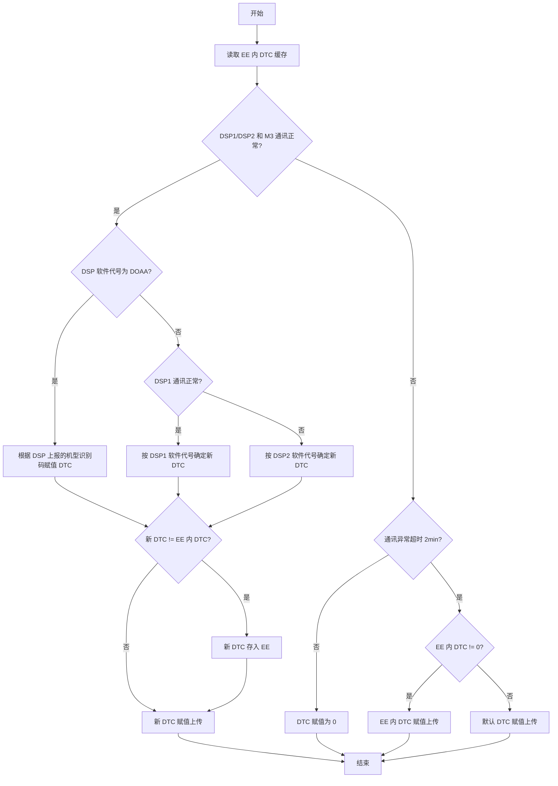

# 机型 DTC 及固件命名规范 V06 - 结构化 Markdown 版本

> 来源文档：`机型 DTC 及固件命名规范 V06`  
> 生效日期：2026-06-05  
> 结构化目标：将 PDF 中的设备层识别码（DTC）、产品分类、机型代称、寄存器上传字段、固件命名规则、DTC 识别逻辑，转换为适合 AI / SSOT / YAML / JSON 后续建模的 Markdown 文档。

---

## 0. 文档元数据

| 字段 | 内容 |
|---|---|
| 文档名称 | 机型 DTC 及固件命名规范 |
| 版本 | V06 / V1.06 |
| 制订 | 康子琪 |
| 审核 | 罗梅林 |
| 批准 | 吴良材 |
| 生效日期 | 2026-06-05 |
| 密级 | 机密文件 |
| 页数 | 22 页 |

---

## 1. 文档目的

规范古瑞瓦特逆变器及电池产品的以下信息：

- 产品全称
- 中英文缩写 / 代称
- DTC 设备识别码
- 上传服务器寄存器字段
- 固件 / 烧录档命名规则
- 逆变器和电池机型的上电 DTC 识别方案

---

## 2. 适用范围

适用于以下 Growatt 产品：

| 一级范围 | 说明 |
|---|---|
| 户用预备储能逆变器 | Battery-ready / XH / HU 等相关机型 |
| 户用光伏逆变器 | MIC / MIN / NEO 等 |
| 商用储能逆变器 | WIS / WIT / MAX-XH 等 |
| 工商业光伏逆变器 | MAX / MAC / MOD / MID 等 |
| 离网储能逆变器 | SPF / SPE 等 |
| 户用并离网储能一体机 | SPH / SPM / SPA / Future 等 |
| BDC 电池 | APX 等 |
| 高低压电池 | ARK LV / ARK HV / ARK-XH / ARO 等 |
| 纯电池 | ACE / AXE / ALP / ENSE / RISE 等 |
| SYN | SYN-XH / MCC 等 |

---

## 3. 公用寄存器字段

### 3.1 逆变器与储能机公用寄存器字段

| 序号 | 功能模块 | 功能码 | 寄存器个数 | 字段范围 |
|---:|---|---|---:|---|
| 1 | 电池 PM 数据 | 0x03 | 80 + 120 | 5000~5079, 7960~8079 |
| 2 | 电池 PM 数据 | 0x04 | 216 | 4000~4215 |
| 3 | 电池 BM 数据 | 0x03 | 2560 + 180 | 5400~7959, 8560~8739 |
| 4 | 电池 BM 数据 | 0x04 | 2560 | 5080~7639 |
| 5 | 一键升级功能 | 0x04 | 125 | 6500~6624 |
| 6 | 逆变器并网并机功能 | 0x03 | 125 | 10000~10124 |
| 7 | 福达采集器配网、证书、WiFi 参数 | 0x03 | 4689 | 20000~24688 |
| 8 | VPP 协议参数 | 0x03 | 2100 | 30000~32099 |
| 9 | VPP 协议参数 | 0x04 | 1000 | 31000~31999 |
| 10 | 一键安装诊断功能 | 0x03 | 125 | 52000~52124 |
| 11 | 事件日志功能 | 0x03 | 10099 | 32768~42866 |
| 12 | SunSpec 协议参数 | 0x03 | 2001 | 40000~42000 |

---

## 4. DTC 分类总览

### 4.1 已占用 DTC 范围汇总

截至 V06 版本，已占用的 DTC 范围如下：

```text
210
3100
3300
3500~3649
5000~5699
5800~6099
10000~10199
12000~12199
12200~12599
13000~13999
20000~21000
21100~21999
30000~30399
```

### 4.2 DTC 范围结构化表

| DTC 范围 | 产品/平台 | 说明 |
|---|---|---|
| 5000~5099 | MOD-X / MID-X / MAX / MAC-X | 户用/工商业光伏逆变器共用区间，存在多个 DTC 值 |
| 5100~5199 | MIN-XH / MINA-HU | 户用预备储能逆变器 |
| 5200~5299 | MIC-X / MIN-X / NEO | 户用光伏逆变器 / 微逆 |
| 5300~5399 | MIN-XH US | 北美 XH 系列 |
| 5400~5499 | MOD-XH / MID-XH / MOD/MID-HU / MODA | 三相储能 / 一体机相关 |
| 5500~5599 | MAX 1500V / MAX-X | 大功率工商业光伏逆变器 |
| 5600~5699 | WIT / WIS / MAX XH | 户用及商用储能逆变器 |
| 5800~5899 | WIS 210K / WIS 215K | 商用储能逆变器 |
| 5900~5999 | SYN-XH | SYN / MCC |
| 6000~6099 | MIN-XH JP | 日本 XH 系列 |
| 10000~10099 | APX | BDC 电池 |
| 10100~10199 | ACE16.1 | 纯电池 |
| 12000~12199 | ARK / ARO | 高低压电池 / BDC 电池 |
| 12200~12399 | AXE | 纯电池 |
| 12400~12599 | ALP | 纯电池 |
| 13000~13020 | ENSE | 外购纯电池 |
| 13021~13999 | RISE / MASE / ACE261 | 纯电池 |
| 20000~20599 | SPF | 离网储能逆变器 |
| 20600~20699 | SPE 美洲/日台菲版 | 离网储能逆变器 |
| 20700~20799 | SPE 澳英欧版 | 离网储能逆变器 |
| 20800~20899 | SPE 亚太南非版 / SPF HVN | 离网储能逆变器 |
| 20900~20999 | SUFFER | 扬水，未开发 |
| 21100~21199 | SPH-HU 北美/巴西 | 户用并离网储能一体机 |
| 21200~21299 | SPH-HU 南非/巴西/智利 | 户用并离网储能一体机 |
| 21300~21399 | SPM-HU | 户用并离网储能一体机 |
| 22000~22999 | Future 储能一体机 | 新增机型，默认 DTC 22000 |

---

## 5. 逆变器 DTC 明细

### 5.1 研发中心逆变器

#### 5.1.1 户用预备储能逆变器

| 分类 | 统称/代称 | DTC 范围 | 全称 | DTC | 保持寄存器上传字段 | 输入寄存器上传字段 | 固件命名示例 |
|---|---|---|---|---:|---|---|---|
| 户用预备储能逆变器 | MIN-XH | 5100~5199 | MIN 2500-6000TL-XH/XH2/XE/XA | 5100 | 0~124; 3000~3124; 3250~3374; 3375~3499 | 3000~3124; 3125~3249; 3250~3374; 3375~3499 | ALBA14.hex; ALCA14.hex; ALDA14.hex; ZABA21.bin; ZADA21.bin |
| 户用预备储能逆变器 | MINA-HU | 5100~5199 | MINA 3000-10000TL-HU | 5102 | 0~124; 3000~3124; 3250~3374; 3375~3499 | 3000~3124; 3125~3249; 3250~3374; 3375~3499 | ANAA01.hex; ZAFA01.bin |
| 户用预备储能逆变器 | MIN-XH JP | 6000~6099 | MIN 6000TL-XH-JP | 6000 | 0~124; 3000~3124; 3125~3249; 3250~3374; 3375~3499 | 3000~3124; 3125~3249; 3250~3374; 3375~3499 | UFAA14.hex; ZAEA21.bin |
| 户用预备储能逆变器 | MIN-XH US | 5300~5399 | MIN 3000-11400TL-XH US | 5300 | 0~124; 3000~3124; 3125~3249; 3250~3374; 3375~3499 | 3000~3124; 3125~3249; 3250~3374 | UEAA14.hex; ZACA21.bin |
| 户用预备储能逆变器 | MIN-XH US | 5300~5399 | MIN 3000-11400TL-XH2 US | 5301 | 0~124; 3000~3124; 3125~3249; 3250~3374; 3375~3499 | 3000~3124; 3125~3249; 3250~3374 | UFAA14.hex; ZACA21.bin |
| 户用预备储能逆变器 | MOD-XH/MID-XH | 5400~5499 | MOD 3-10KTL3-XH/BP; MID 11-30KTL3-XH; MID 8-15KTL3-XHL/JP | 5400 | 0~124; 3000~3124; 3250~3374; 3375~3499 | 3000~3124; 3125~3249; 3250~3374; 3375~3499 | DNAA14.hex; DNBA14.hex; ZBDB21.bin; ZBDC21.bin |
| 户用预备储能逆变器 | MOD/MID-HU | 5400~5499 | MOD 3-15KTL3-HU; MID 33-50KTL3-HU | 5401 | 0~124; 3000~3124; 3250~3374; 3375~3499 | 3000~3124; 3125~3249; 3250~3374; 3375~3499 | DOAA14.hex; ZBDC21.bin |
| 户用预备储能逆变器 | MODA | 5400~5499 | MODA 10-15KTL3 H | 5402 | 0~124; 3000~3124; 3250~3374; 3375~3499 | 3000~3124; 3125~3249; 3250~3374; 3375~3499 | DOAA14.hex; ZBDC21.bin |
| 户用预备储能逆变器 | MODA | 5400~5499 | MODA 10-15KTL3 HU | 5403 | 同上 | 同上 | DOAA14.hex; ZBDC21.bin |
| 户用预备储能逆变器 | MODA | 5400~5499 | MODA 4-15KTL3 HU | 5404 | 同上 | 同上 | DOAA14.hex; ZBDC21.bin |
| 户用预备储能逆变器 | WIT 25K HU/XHU | 5600~5699 | WIT 4-15K-HU; WIT 17-25K-HU | 5603 | 0~124; 125~249; 750~874; 875~999 | 0~124; 125~249; 2875~2999; 8000~8124; 8125~8249 | YEAA02yy.hex; YEAAyy02.hex; YGAA02yy.hex; YGAAyy02.hex; ZDDA21.bin |
| 户用预备储能逆变器 | WIT 25K HU/XHU | 5600~5699 | WIT 4-25K-XHU | 5605 | 0~124; 125~249; 750~874; 875~999 | 0~124; 125~249; 2875~2999; 8000~8124; 8125~8249 | YFAA02yy.hex; YFAAyy02.hex; ZDDA21.bin |

#### 5.1.2 户用光伏逆变器

| 分类 | 统称/代称 | DTC 范围 | 全称 | DTC | 保持寄存器上传字段 | 输入寄存器上传字段 | 固件命名示例 |
|---|---|---|---|---:|---|---|---|
| 户用光伏逆变器 | MIC-X/MIN-X | 5200~5299 | MIN 7-10KTL-X/X2/X2(E) | 5201 | 0~124; 3000~3124 | 3000~3124; 3125~3249; 3375~3499 | AMBA14.hex; AMAA14.hex; ZABA21.bin; ZADA21.bin |
| 户用光伏逆变器 | MIC-X/MIN-X | 5200~5299 | MIC 600-3300TL-X/X2/X2 Pro; MIN 2500-6000TL-X/X2/X2 Pro/X2 Pro.E | 5200 | 0~124; 3000~3124 | 3000~3124; 3125~3249; 3375~3499 | GHAA14.hex; AKAA14.hex; ZAAA21.bin |
| 户用光伏逆变器 | NEO | 5200~5299 | NEO 2000M-X; NEO 1600-2500M-X2 | 5202 | 0~124; 3000~3124 | 3000~3124; 3125~3249; 3375~3499 | GIAA21.bin |
| 户用光伏逆变器 | NEO | 5200~5299 | NEO 600-1000M-X; NEO 450-1000M-X US | 5203 | 0~124; 3000~3124 | 3000~3124; 3125~3249; 3375~3499 | GJAA21.bin |
| 户用光伏逆变器 | NEO | 5200~5299 | NEO 1200-1400M-X2-L | 5204 | 0~124; 3000~3124 | 3000~3124; 3125~3249; 3375~3499 | GIAA21.bin |
| 户用光伏逆变器 | MOD-X/MID-X | 5000~5099 | MID 17-25KTL3-X; MID 20-30KTL3-X2; MID 25-30KTL3-X2 Pro/X2 Pro.E; MID 33-50KTL3-X2/X2 Pro/X2 Pro.E; MID 30-40KTL3-X; MID 33-36KTL3-X(Pro.E); MID 36-60KTL3-X3 | 5001 | 0~124; 125~249 | 0~124; 125~249; 3375~3499 | DMAA14.hex; DMCA14.hex; ZBAA21.bin; ZBAB21.bin; ZBAC21.bin; ZBAD21.bin; ZBAE21.bin |
| 户用光伏逆变器 | MOD-X/MID-X | 5000~5099 | MOD 3-15KTL3-X; MOD 3-15KTL3-X2(Pro); MOD 12-20KTL3-X2; MOD 12-20KTL3-X2(E); MOD 3-33KTL3-X3 | 5002 | 0~124; 125~249 | 0~124; 125~249; 3375~3499 | DLAA14.hex; ZBAA21.bin; ZBAB21.bin; ZBAC21.bin; ZBAD21.bin; ZBAE21.bin |

#### 5.1.3 商用储能逆变器

| 分类 | 统称/代称 | DTC 范围 | 全称 | DTC | 保持寄存器上传字段 | 输入寄存器上传字段 | 固件命名示例 |
|---|---|---|---|---:|---|---|---|
| 商用储能逆变器 | WIS/WIT 100K | 5600~5699 | WIS 100K-AM; WIT 50-100K-H/HE/HU/A/AE/AU; WIT 50-100K-H/HE/HU/A/AE/AU-US; WIT 28-55K-H/HE/HU/A/AE/AU-US L2 | 5600 | 0~124; 125~249; 750~874; 875~999 | 0~124; 125~249; 2875~2999; 8000~8124; 8125~8249 | TOAA03yyyy.hex; TOAAyy04yy.hex; TOAAyyyy05.hex; ZBEA21.bin |
| 商用储能逆变器 | WIT XHU | 5600~5699 | WIT 29.9-50K-XHU | 5601 | 同上 | 同上 | YCAA02yy.hex; YCAAyy03.hex; ZDBA21.bin |
| 商用储能逆变器 | WIT XHU | 5600~5699 | WIT 12-30K-XHU L2（未开发） | 5602 | 同上 | 同上 | 未开发 |
| 商用储能逆变器 | WIS 125K | 5600~5699 | WIS 125K-AM | 5604 | 同上 | 同上 | TTAA03yyyy.hex; TTAAyy04yy.hex; TTAAyyyy05.hex; ZBGA21.bin |
| 商用储能逆变器 | WIT 125K | 5600~5699 | WIT 125K-XHU | 5606 | 同上 | 同上 | TUAA03yyyy.hex; TUAAyy03yy.hex; TUAAyyyy03.hex; ZBIA21.bin |
| 商用储能逆变器 | MAX 125K | 5600~5699 | MAX 125K-XH | 5607 | 同上 | 同上 | TVAA03yyyy.hex; TVAAyy03yy.hex; TVAAyyyy03.hex; ZBJA21.bin |
| 商用储能逆变器 | WIS 210K | 5800~5899 | WIS 210K（未开发） | 5800 | 0~124; 125~249; 750~874; 875~999 | 0~124; 125~249; 2750~2874 | TPAA03yyyy.hex; TPAAyy03yy.hex; TPAAyyyy03.hex; ZBFA21.bin |
| 商用储能逆变器 | WIS 215K | 5800~5899 | WIS 200-215K-AM-M | 5801 | 0~124; 125~249; 750~874; 875~999 | 0~124; 125~249; 2750~2874 | TRAA03yyyy.hex; TRAAyy04yy.hex; TRAAyyyy05.hex; ZBHA21.bin |

#### 5.1.4 工商业光伏逆变器

| 分类 | 统称/代称 | DTC 范围 | 全称 | DTC | 保持寄存器上传字段 | 输入寄存器上传字段 | 固件命名示例 |
|---|---|---|---|---:|---|---|---|
| 工商业光伏逆变器 | MAX | 5000~5099 | MAX 20-50KTL3-XL; MAX 50-80KTL3 LV; MAX 60-100KTL3 MV | 5000 | 0~124; 125~249 | 0~124; 125~249; 3375~3499 | TIAA03yyyy.hex; TIAAyy04yy.hex; TIAAyyyy05.hex; ZBBA21.bin; ZBBC21.bin; ZBBD21.bin |
| 工商业光伏逆变器 | MAX 1500V | 5500~5599 | MAX 175-253KTL3-X HV | 5500 | 0~124; 125~249 | 0~124; 125~249; 875~999; 3375~3499; 6625~6749 | TMAA03yyyy.hex; TMAAyy04yy.hex; TMAAyyyy05.hex; ZBCA21.bin; ZBCB21.bin; ZBCC21.bin |
| 工商业光伏逆变器 | MAX 1500V | 5500~5599 | MAX 300-350K-X | 5502 | 0~124; 125~249 | 0~124; 125~249; 875~999; 3375~3499; 6625~6749 | TSAA03yyyy.hex; TSAAyy04yy.hex; TSAAyyyy05.hex; ZBCA21.bin; ZBCB21.bin; ZBCC21.bin |
| 工商业光伏逆变器 | MAX-X | 5500~5599 | MAX 80-125KTL3-X LV; MAX 100-125KTL3-X2 LV; MAX 124-150KTL3-X MV; MAX 124-150KTL3-X2 MV; MAX 150KTL3-X LV; MAX 180KTL3-X MV | 5501 | 0~124; 125~249 | 0~124; 125~249; 875~999; 3375~3499; 6625~6749 | TNAA03yyyy.hex; TNAAyy04yy.hex; TNAAyyyy05.hex; TNAB03yyyy.hex; TNAByy04yy.hex; TNAByyyy05.hex; TQAA03yyyy.hex; TQAAyy04yy.hex; TQAAyyyy05.hex; ZBBA21.bin; ZBBC21.bin; ZBBD21.bin |
| 工商业光伏逆变器 | MAC-X | 5000~5099 | MAC 30-60KTL3-X LV; MAC 50-70KTL3-X MV; MAC 50-60KTL3-X2 LV; MAC 50-70KTL3-X2 MV; MAC 15-36KTL3-XL; MAC 30-60KTL3-XL2 | 5003 | 0~124; 125~249 | 0~124; 125~249; 3375~3499 | TKAA14.hex; TKAB14.hex; TKCA14.hex; ZBAA21.bin; ZBAB21.bin; ZBAC21.bin; ZBAD21.bin; ZBAE21.bin |

### 5.2 尚科逆变器

#### 5.2.1 离网储能逆变器 / 扬水

| 分类 | 统称/代称 | DTC 范围 | 全称 | DTC | 保持寄存器上传字段 | 输入寄存器上传字段 | 固件命名示例 |
|---|---|---|---|---:|---|---|---|
| 离网储能逆变器 | SPF | 20000~20599 | SPF 3-5K ES/US; SPF 3-5K ES Lite; SPF 6000 ES PLUS/ES-H | 20006 | 0~44; 45~89; 90~134; 135~179; 180~224 | 0~44; 45~89; 90~134; 200~244; 245~289; 290~334 | 暂无 |
| 离网储能逆变器 | SPF | 20000~20599 | SPF 3-5K ES | 20005 | 暂无 | 暂无 | 暂无 |
| 离网储能逆变器 | SPF | 20000~20599 | SPF 6K ES Lite | 20008 | 同 SPF | 同 SPF | EIAA14.hex; ZFAA21.bin |
| 离网储能逆变器 | SPF | 20800~20899 | SPF 4000TL HVN-24G2 | 20807 | / | / | EJAA14.hex; ZFBA21.bin |
| 离网储能逆变器 | SPE 亚太南非版 | 20800~20899 | SPE 3500-7000TL HVM-G2/24G2; SPE 8000-12000 ES | 20806 | 0~124; 125~249; 300~424; 425~549 | 0~124; 125~249; 250~374; 10000~10124; 10125~10249; 10250~10374; 11000~11124 | RLAA14.hex; RLAB14.hex; RMAA14.hex; RNAA14.hex; ZCIA21.bin; ZCIB21.bin; ZCJA21.bin |
| 离网储能逆变器 | SPE 澳英欧版 | 20700~20799 | SPE 8000-12000 ES; SPE 6000TL HVM-G2 | 20701 | 0~124; 125~249; 300~424; 425~549 | 同上 | RLBA14.hex; RNBA14.hex; ZCIC21.bin; ZCKA21.bin |
| 离网储能逆变器 | SPE 美洲日台菲版 | 20600~20699 | SPE 6/8/10/12K US | 20600 | 0~124; 125~249; 300~424; 425~549 | 10000~10124; 10125~10249; 10250~10374; 11000~11124 | RQBA14.hex; ZCLB21.bin |
| 离网储能逆变器 | SPE 美洲日台菲版 | 20600~20699 | SPE 6/7.5/12 US | 20602 | 同上 | 同上 | RQAA14.hex; ZCILA21.bin |
| 离网储能逆变器 | SPE 美洲日台菲版 | 20600~20699 | SPE 15KTL3 HVM | 20603 | 同上 | 同上 | RRAA14.hex; ZCMA21.bin |
| 扬水 | SUFFER | 20900~20999 | Suffer（未开发） | 20900 | 0~44; 45~89 | 0~44; 45~89 | 无 |

#### 5.2.2 户用并离网储能一体机

| 分类 | 统称/代称 | DTC 范围 | 全称 | 地区/说明 | DTC | 保持寄存器上传字段 | 输入寄存器上传字段 | 固件命名示例 |
|---|---|---|---|---|---:|---|---|---|
| 户用并离网储能一体机 | SPH-HU | 21100~21199 | SPH 8-10KTL-HU-US; SPH 8-10KTL-HU-US(B) | 北美 | 21100 | 0~124; 125~249; 10000~10124; 10125~10249; 10250~10374 | 0~124; 1000~1124; 1125~1249; 10000~10124; 10125~10249 | RJAA14.hex; ZCGA21.bin |
| 户用并离网储能一体机 | SPH-HU | 21100~21199 | SPH 8-10KTL-HU-US | 巴西裂项 | 21102 | 同上 | 同上 | RJAA14.hex; ZCGA21.bin |
| 户用并离网储能一体机 | SPH-HU | 21100~21199 | SPH 12-18KTL-HU-US | 北美古瑞标准 | 21103 | 同上 | 同上 | RKAA14.hex; ZCHA21.bin; ZRDA21.bin |
| 户用并离网储能一体机 | SPH-HU | 21200~21299 | SPH 8-10KTL-HU | 南非 | 21200 | 同上 | 同上 | RFAA14.hex; ZCDA21.bin |
| 户用并离网储能一体机 | SPH-HU | 21200~21299 | SPH 8-10KTL-HU | 巴西单相、智利 | 21202 | 同上 | 同上 | RFAA14.hex; ZCDA21.bin |
| 户用并离网储能一体机 | SPM-HU | 21300~21399 | SPM 8-10KTL-HU(AU) | 澳版 | 21300 | 同上 | 同上 | RGAA14.hex; ZCEA21.bin; ZRBA21.bin |
| 户用并离网储能一体机 | SPM-HU | 21300~21399 | SPM 6-10KTL-HU(EU) | 欧版 | 21302 | 同上 | 同上 | RGAA14.hex; ZCEA21.bin; ZRBA21.bin |
| 户用并离网储能一体机 | SPM-HU | 21300~21399 | SPM 8-10KTL-HU(UK) | 英版 | 21303 | 同上 | 同上 | RGAA14.hex; ZCEA21.bin; ZRBA21.bin |
| 户用并离网储能一体机 | SPM-HU | 21300~21399 | SPM 3000-6000TL-HU | 亚太通用 | 21304 | 同上 | 同上 | RIAA14.hex; ZCFA21.bin; ZRCA21.bin |
| 户用并离网储能一体机 | SPM-HU | 21300~21399 | SPM 8-10KTL-HU(CL) | 智利 | 21310 | 同上 | 同上 | RGAA14.hex; ZCEA21.bin; ZRBA21.bin |
| 户用并离网储能一体机 | SPM-HU | 21300~21399 | SPM 3000-6000TL-HU(BR) | 巴西 | 21305 | 同上 | 同上 | RIAA14.hex; ZCFA21.bin; ZRCA21.bin |
| 户用并离网储能一体机 | SPM-HU | 21300~21399 | SPM 3000-6000TL-HU2 | 南非/亚太 | 21306 | 同上 | 同上 | ROAA14.hex; ZCOA21.bin; ZRFA21.bin |
| 户用并离网储能一体机 | SPM-HU | 21300~21399 | SPM 8-10KTL-HU2 | 南非/亚太 | 21307 | 同上 | 同上 | RPAA14.hex; ZCNA21.bin; ZREA21.bin |
| 户用并离网储能一体机 | SPM-HU | 21300~21399 | SPM 3000-6000TL-HU(IT) | 意大利 | 21308 | 同上 | 同上 | RIAA14.hex; ZCFA21.bin; ZRCA21.bin |
| 户用并离网储能一体机 | SPM-HU | 21300~21399 | SPM 2500-6000TL-HU(EU) | 英国、欧洲、西班牙 | 21309 | 同上 | 同上 | RIAA14.hex; ZCFA21.bin; ZRCA21.bin |
| 户用并离网储能一体机 | Future 储能一体机 | 22000~22999 | Future 4K8L 24-A | 默认 | 22000 | 0~124; 125~249; 300~424; 425~549 | 0~124; 125~249; 250~374; 10000~10124; 10125~10249; 10250~10374; 11000~11124 | 暂无 |
| 户用并离网储能一体机 | SPH/SPA TL | 3500~3599 | SPH 3000-6000TL BL | - | 3501 | 0~124; 1000~1124; 1125~1249 | 0~124; 1000~1124; 1125~1249 | RBAAyy14.hex; RBAA14yy.hex; RBBA14yy.hex; RBBAyy14.hex; ZCBA21.bin |
| 户用并离网储能一体机 | SPH/SPA TL | 3500~3599 | SPH 3000-6000 TL BL-UP | - | 3502 | 同上 | 同上 | RBAAyy14.hex; RBAA14yy.hex; RBBA14yy.hex; RBBAyy14.hex; ZCBC21.bin |
| 户用并离网储能一体机 | SPH/SPA TL | 3500~3599 | SPH 6000 TL US | - | 3550 | 同上 | 同上 | RCAAyy14.hex; RCAA14yy.hex; ZCBB21.bin |
| 户用并离网储能一体机 | SPH/SPA TL | 3700~3799 | SPA 1000-3000TL BL | - | 3701 | 0~124; 1000~1124; 1125~1249 | 1000~1124; 2000~2124; 1125~1249 | RHAAyy14.hex; RHAA14yy.hex; ZCAA21.bin |
| 户用并离网储能一体机 | SPH/SPA TL | 3700~3799 | SPA 3000TL BL-UP | - | 3735 | 同上 | 同上 | RBAAyy14.hex; RBAA14yy.hex; RBBA14yy.hex; RBBAyy14.hex; ZCBC21.bin |
| 户用并离网储能一体机 | SPH TL-HU | 3500~3599 | SPH 3000-6000TL HU | - | 3503 | 0~124; 1000~1124; 1125~1249 | 0~124; 1000~1124; 1125~1249 | REAA14yy.hex; REAAyy14.hex; ZCBD21.bin |
| 户用并离网储能一体机 | SPH TL-HU | 3500~3599 | SPH 3000-6000TL HUB | - | 3504 | 同上 | 同上 | REAA14yy.hex; REAAyy14.hex; ZCBD21.bin |
| 户用并离网储能一体机 | SPA TL-AU | 3700~3799 | SPA 3000-6000TL AU | - | 3715 | 0~124; 1000~1124; 1125~1249 | 1000~1124; 2000~2124; 1125~1249 | REBA14yy.hex; REBAyy14.hex; ZCBD21.bin |
| 户用并离网储能一体机 | SPA TL-AU | 3700~3799 | SPA 3000-6000TL AUB | - | 3716 | 同上 | 同上 | REBA14yy.hex; REBAyy14.hex; ZCBD21.bin |
| 户用并离网储能一体机 | SPH/SPA TL3-UP | 3700~3799 | SPA 4000-10000TL3 BH; SPA 4000-10000TL3 BH-UP | - | 3725 | 0~124; 1000~1124; 1125~1249 | 1000~1124; 2000~2124; 1125~1249 | YBAA14yy.hex; YBAAyy14.hex; ZDAA21.bin; ZDAB21.bin |
| 户用并离网储能一体机 | SPH/SPA TL3-UP | 3600~3699 | SPH 4000-10000TL3 BH; SPH 4000-10000TL3 BH-UP | - | 3601 | 0~124; 1000~1124; 1125~1249 | 0~124; 1000~1124; 1125~1249 | YBAA14yy.hex; YBAAyy14.hex; ZDAA21.bin; ZDAB21.bin |
| 户用并离网储能一体机 | SPH TL3-HU | 3600~3699 | SPH 12-30KTL3-HU（未开发） | - | 3610 | 0~124; 1000~1124; 1125~1249 | 0~124; 1000~1124; 1125~1249 | 未开发 |

---

## 6. 电池 DTC 明细

| 分类 | 代称 | DTC 范围 | 英文全称 | DTC | 保持寄存器范围 | 输入寄存器范围 | 固件命名示例 |
|---|---|---|---|---:|---|---|---|
| BDC 电池 | APX 5.0 | 10000~10099 | APX 5.0-30.0P-B1 | 10001 | 3085~3124; 10000~10039; ...; 12520~12559 | 3165~3264; 10000~10039; ...; 12520~12559 | PM: VDAA14.hex, ZECA21.bin; BM: WAAA14.hex, QABA21.bin |
| BDC 电池 | APX-S2 | 10000~10099 | APX 5.0-30.0P-S2 | 10040 | 3085~3124; 10000~10039; ...; 12520~12559 | 3165~3264; 10000~10039; ...; 12520~12559 | CM: VGAA14.hex, ZEJA21.bin; BM: WDAA14.hex, QAEA21.bin |
| BDC 电池 | APX 10.0 | 10000~10099 | APX 71.6-114.6P-S1; APX 129.0-200.7H-S1 | 10020 | 3085~3124; 10000~10039; ...; 12520~12559 | 3165~3264; 10000~10039; ...; 12520~12559; 16000~16059; 19780~19839 | PM: VEAA14.hex, ZEGA21.bin; BM: WBAA14.hex, QACA21.bin; CM-M3: ZEDA21.bin; CM-BCU: QBBA21.bin |
| BDC 电池 | ARK-XH | 12000~12199 | ARK 5.1-25.6XH-A1 | 12061 | / | / | DSP: VCAA14.hex; M3: ZEBA21.bin; BMS: QBAB21.bin |
| BDC 电池 | ARO | 12000~12199 | ARO 6.6-19.8-C1-US | 12081 | / | / | VBAA14.hex |
| 高低压电池 | ARK LV | 12000~12199 | ARK 2.5-25.6L-A1 | 12001 | / | / | QAAC21.bin |
| 高低压电池 | ARK HV | 12000~12199 | ARK 5.1-25.6H-A1 | 12041 | / | / | BCU: QBAA21.bin; M3: ZEAA21.bin |
| 纯电池 | ACE16.1 | 10100~10199 | ACE 112-225H | 10101 | 3085~3124; 10000~10039; ...; 12520~12559; 19900~19939 | 3165~3264; 10000~10039; ...; 12520~12559; 16000~16059; 19780~19839; 19900~19919 | CM-M3: ZEFA21.bin; CM-BCU: QBCA21.bin; BM-BMS: QADA21.bin |
| 纯电池 | AXE 5.0L | 12200~12399 | AXE 5.0-50.0L-C1（未使用） | 12201 | / | / | M3: ZEHA21.bin; BCU: QBDA21.bin |
| 纯电池 | AXE 5.0H | 12200~12399 | AXE 5.0-50.0H-C1 | 12221 | / | / | M3: ZEHA21.bin; BCU: QBDA21.bin |
| 纯电池 | AXE 5.0H | 12200~12399 | AXE 1000100-P1（未使用） | 12222 | / | / | M3: ZEHA21.bin; BCU: QBDA21.bin |
| 纯电池 | AXE 80-261H | 12200~12399 | AXE 80-261H | 12223 | / | / | M3: ZEHC21.bin; BCU: QBDC21.bin |
| 纯电池 | ALP 5.0L | 12400~12599 | ALP 5.0-40.0L | 12401 | / | / | QAAC21.bin |
| 纯电池 | ALP 5.0L | 12400~12599 | ALP 5.0L-B2 | 12401 | / | / | QAAE21.bin |
| 纯电池 | ENSE（外购） | 13000~13020 | ENSE 215H-2H; ENSE 215H-2H-H1 | 13001 | 3085~3124; 10000~10039; ...; 12520~12559; 19900~19939 | 3165~3264; 10000~10039; ...; 12520~12559; 16000~16059; 19780~19839; 19900~19919 | M3: ZEFA21.bin; BCU: QBCA21.bin |
| 纯电池 | ENSE（外购） | 13000~13020 | ENSE 261H-2H | 13002 | 同上 | 同上 | M3: ZEFA21.bin; BCU: QBCA21.bin |
| 纯电池 | RISE/MASE/ACE261 | 13021~13999 | RISE 261H-XH | 13021 | 3085~3124; 10000~10039; ...; 12520~12559; 19900~19939 | 3165~3264; 10000~10039; ...; 12520~12559; 16000~16059; 19780~19839; 19900~19919 | CM-M3: ZEHB21.bin; CM-BCU: QBDB21.bin; BM-BMS: QDBB21.bin |

---

## 7. SYN DTC 明细

| 分类 | 统称/代称 | DTC 范围 | 全称 | DTC | 保持寄存器上传字段 | 输入寄存器上传字段 | 固件命名示例 |
|---|---|---|---|---:|---|---|---|
| SYN | SYN-XH | 5900~5999 | SYN 200-XH-US | 5900 | 0~124; 125~249 | 0~124 | ZQBA21.bin |
| SYN | SYN-XH | 5900~5999 | SYN 50-XH-1 | 5901 | 0~124; 125~249 | 0~124 | ZQCA21.bin |
| SYN | SYN-XH | 5900~5999 | SYN 50-XH-3; SYN 100-XH-3 | 5902 | 0~124; 125~249 | 0~124 | ZQCA21.bin |
| SYN | SYN-XH | 5900~5999 | SYN 200U-2 | 5903 | 0~124; 125~249 | 0~124 | ZQDA21.bin |
| SYN | SYN-XH | 5900~5999 | MCC 11U-US; MCC 12U-US | 5904 | 0~124; 125~249 | 0~124 | 暂无 |

---

## 8. 固件命名规则

### 8.1 Bin 文件命名规则

Bin 文件存在两种命名形式。

#### 8.1.1 单芯片 / 常规 Bin 文件

```text
格式：4 位字母代号 + 2 位数字版本 + .bin
示例：ZDAA01.bin
含义：
- ZDAA：设备软件代号
- 01：软件版本
```

适用范围：

- 一般 M3 芯片
- 电池 M3 芯片

#### 8.1.2 ATS 双芯片 Bin 文件

```text
格式：4 位字母代号 + 2 位数字版本 + 2 个 yy + .bin
示例：MBAA01yy.bin / MBAAyy02.bin
```

含义：

| 示例 | 含义 |
|---|---|
| MBAA01yy.bin | 第一个 ATS 芯片版本为 01 |
| MBAAyy02.bin | 第二个 ATS 芯片版本为 02 |

说明：

- `yy` 为占位符。
- 实际使用中，两个 ATS bin 文件一般不会在同一固件包中同时升级。
- 通常是 `1 个 bin 文件 + 1 个 hex 文件` 搭配使用。
- ATS 芯片仅在商用储能机中使用。

### 8.2 Hex / out / jed 文件命名规则

#### 8.2.1 单 DSP 芯片升级

```text
格式：4 位字母代号 + 2 位数字版本 + .hex
示例：DNAA01.hex
```

#### 8.2.2 双 DSP 芯片升级

```text
格式：4 位字母代号 + 2 位数字版本 + 2 个 yy + .hex
示例：YBAA01yy.hex / YBAAyy02.hex
```

| 示例 | 含义 |
|---|---|
| YBAA01yy.hex | 第一个 DSP 芯片版本为 01 |
| YBAAyy02.hex | 第二个 DSP 芯片版本为 02 |

#### 8.2.3 双 DSP + CPLD 芯片升级

```text
格式：4 位字母代号 + 2 位数字版本 + 4 个 yy + .hex
示例：TNAA01yyyy.hex / TNAAyy02yy.hex / TNAAyyyy03.hex
```

| 示例 | 含义 |
|---|---|
| TNAA01yyyy.hex | 第一个芯片版本为 01 |
| TNAAyy02yy.hex | 第二个芯片版本为 02 |
| TNAAyyyy03.hex | 第三个芯片版本为 03 |

#### 8.2.4 out / jed 文件

```text
规则：out 文件、jed 文件命名与搭配的 hex 文件一致。
```

| Hex 示例 | 对应文件 |
|---|---|
| YBAAyy01.hex | YBAAyy01.out |
| TNAAyyyy03.hex | TNAAyyyy03.jed |

---

## 9. 软件 DCC 受控资料格式说明

软件与相关资料在《物料承认申请单》中归档后，受控到 DCC 路径下。

### 9.1 Hex 文件单独上传

#### 9.1.1 芯片软件代号独立

- 《软件承认单》文档名称与格式不做强制要求。
- 可保持原命名与格式习惯。
- 如果文档名称涉及软件版本，可更新为规范命名。
- 其他资料保持原 ECN 流程归档。

#### 9.1.2 多芯片共用软件代号

适用情况：

- DSP1 + DSP2
- DSP1 + DSP2 + CPLD

规则：

- 《软件承认单》文档名称与格式不做强制要求。
- 可保持原命名与格式习惯。
- 如文档名称涉及软件版本，可更新为规范命名。
- 其他资料保持原 ECN 流程归档。

### 9.2 Bin 文件单独上传

#### 9.2.1 芯片软件代号独立

- 《软件承认单》文档名称与格式不做强制要求。
- 可保持原命名与格式习惯。
- 若文档名称涉及软件版本，可更新为规范命名。
- 其他资料保持原 ECN 流程要求归档。

#### 9.2.2 ATS 芯片共用软件代号

- 《软件承认单》文档名称与格式不做强制要求。
- 可保持原命名与格式习惯。
- 若文档名称涉及软件版本，可更新为规范命名。
- 其他资料保持原 ECN 流程要求归档。

### 9.3 压缩包文件上传

- 压缩包文件以料号形式命名。
- 压缩包内文件格式参考烧录文件单独上传后的情况。
- 《软件承认单》文档名称与格式不做强制要求。
- 可保持原命名与格式习惯。
- 若文档名称涉及软件版本，可更新为规范命名。
- 其他资料保持原 ECN 流程要求归档。

---

## 10. 机型 DTC 识别方案

### 10.1 总体原则

电池机型均通过宏定义方式，在上电后即可获取固定 DTC 值。

以下类型的逆变器 DTC 识别逻辑遵循本规范：

- 户用预备储能逆变器
- 户用光伏逆变器
- 工商业光伏逆变器
- 商用储能逆变器

### 10.2 DTC 默认值与识别规则

| 序号 | 规则 |
|---:|---|
| 1 | DTC 默认值为 0，识别到机型后赋值正确的 DTC。 |
| 2 | M3 判断和 DSP 的通讯状态。通讯正常时，根据 DSP 软件代号、DSP 上报的机型识别码确定对外展示的 DTC。 |
| 3 | DTC 识别后存入 EE；每次上电从 EE 读取 DTC 缓存，并与新确认的 DTC 比较。 |
| 4 | 内部通讯异常超时，且 EE 中存在有效 DTC，则使用 EE 中的 DTC；否则使用默认 DTC。 |
| 5 | 当软件代号识别出的 DTC 与 EE 中的 DTC 不一致时，用新识别的 DTC 更新 EE 中的 DTC。 |
| 6 | DTC = 0 时，不应答 DTC 寄存器读取操作。 |
| 7 | DTC 只允许从 0 变化为非 0 值，且只能变化一次。 |
| 8 | DTC 识别优先级：DSP 软件代号 / 机型识别码 > EE 内 DTC > 默认 DTC。 |

### 10.3 MOD/MID-HU、MODA 机型特殊识别逻辑

MOD/MID-HU、MODA 机型由 DSP 根据 IO 信号确定机型识别码，再上报给 M3。M3 接收到机型识别码后，确定对外展示的 DTC。

| 参数名称 | 内部协议位置 | 字节数量 | 说明 |
|---|---|---:|---|
| bHardwareTypeCode | 快速帧第 0 帧第 37 字节 | 1 | 机型硬件识别码，默认值为 0。具体定义根据 DSP 软件代号区分。当前除 DSP 软件代号 `DOAA` 对应机型外，其他机型暂不使用。 |

#### DOAA 软件代号的机型识别码示例

| 机型 | bHardwareTypeCode 上传值 |
|---|---:|
| MODA 10KTL3 H | 27 |
| MODA 15KTL3 H | 23 |
| MODA 10KTL3 HU | 7 |
| MODA 15KTL3 HU | 15 |

### 10.4 其他机型识别逻辑

| 场景 | DTC 确定方式 |
|---|---|
| DSP1 与 DSP2 均通讯正常 | 使用 DSP1 软件代号确定 DTC |
| 只有一个 DSP 通讯正常 | 使用通讯正常的 DSP 软件代号确定 DTC |
| DSP1 与 DSP2 均通讯异常 | 使用 DTC 默认值；若 EE 有有效 DTC，则使用 EE DTC |
| DSP 软件代号为 DOAA | 根据 DSP 上报的机型识别码赋值 DTC |

### 10.5 DTC 识别优先级

```text
高优先级：DSP 软件代号 / 机型识别码
中优先级：EE 读取值
低优先级：默认值 0
```

### 10.6 DTC 识别流程 Mermaid



---

## 11. 面向 AI / SSOT 的结构化建模建议

### 11.1 建议拆分为 5 类主数据对象

```text
1. device_family
2. device_model_dtc
3. register_upload_profile
4. firmware_naming_rule
5. dtc_identification_rule
```

### 11.2 建议的 YAML / JSON 主键

每一条 DTC 记录建议使用以下字段：

```yaml
- dtc: 5404
  dtc_range: "5400~5499"
  device_layer: "端"
  device_type: "inverter"
  product_category_cn: "户用预备储能逆变器"
  product_category_en: "residential_battery_ready_inverter"
  owner_org: "研发中心逆变器"
  alias: "MODA"
  model_full_name: "MODA 4-15KTL3 HU"
  region: null
  lifecycle_status: "active"
  holding_register_upload_fields:
    - "0~124"
    - "3000~3124"
    - "3250~3374"
    - "3375~3499"
  input_register_upload_fields:
    - "3000~3124"
    - "3125~3249"
    - "3250~3374"
    - "3375~3499"
  firmware_examples:
    dsp_hex:
      - "DOAA14.hex"
    m3_bin:
      - "ZBDC21.bin"
  dtc_identification:
    method: "DSP software code + hardware type code"
    special_rule: "DOAA uses bHardwareTypeCode"
```

### 11.3 字段命名建议

| 业务概念 | 建议字段名 | 说明 |
|---|---|---|
| DTC | `dtc` | int |
| DTC 范围 | `dtc_range` | string，保留原始范围 |
| 设备层级 | `device_layer` | 用/云/边/端 中的“端” |
| 设备类型 | `device_type` | inverter / battery / syn |
| 产品分类中文 | `product_category_cn` | 原文分类 |
| 产品分类英文 | `product_category_en` | AI / API 友好分类 |
| 统称/代称 | `alias` | 如 MODA、SPM-HU、APX 5.0 |
| 全称 | `model_full_name` | 原始机型名称 |
| 地区/版本 | `region` | AU / EU / US / BR / JP 等 |
| 生命周期状态 | `lifecycle_status` | active / unused / undeveloped / deprecated |
| 保持寄存器字段 | `holding_register_upload_fields` | array |
| 输入寄存器字段 | `input_register_upload_fields` | array |
| 固件示例 | `firmware_examples` | object |
| DTC 识别方式 | `dtc_identification` | object |

### 11.4 后续数据治理注意点

| 问题 | 说明 | 建议 |
|---|---|---|
| 一个 DTC 对应多个机型 | 如多个功率段、区域版本共用 DTC | 使用 `model_full_name` 数组或拆多行并共享 DTC |
| 一个 DTC 范围跨多个产品线 | 如 5000~5099 同时出现 MOD/MID/MAX/MAC | DTC 范围不能作为唯一分类依据，必须用 `dtc + alias + product_category` 联合判断 |
| 固件命名有芯片角色差异 | DSP / M3 / BCU / BMS / CPLD / ATS | 固件字段必须结构化，不建议只存字符串 |
| 寄存器范围有省略号 | 电池部分出现 `...` | 后续 YAML/JSON 前需要补齐完整展开范围或保留 `raw_text` |
| 未开发/未使用/暂无 | 表示生命周期或资料状态 | 建议转换为枚举字段 |
| DOAA 特殊规则 | MODA / MOD-HU 依赖硬件识别码 | 需要单独建 rule，不应仅靠固件代号判断 |

---

## 12. 当前 Markdown 转换说明

本文件是从 PDF 表格结构化转换的 Markdown 初版，适合作为后续 YAML / JSON / 数据库表结构的中间层。

建议下一步输出：

1. `device_model_dtc.yaml`
2. `device_model_dtc.json`
3. `register_profile.yaml`
4. `firmware_rule.yaml`
5. `dtc_identification_rule.yaml`
6. Excel / CSV 版本，用于数据校验和导入飞书多维表格

