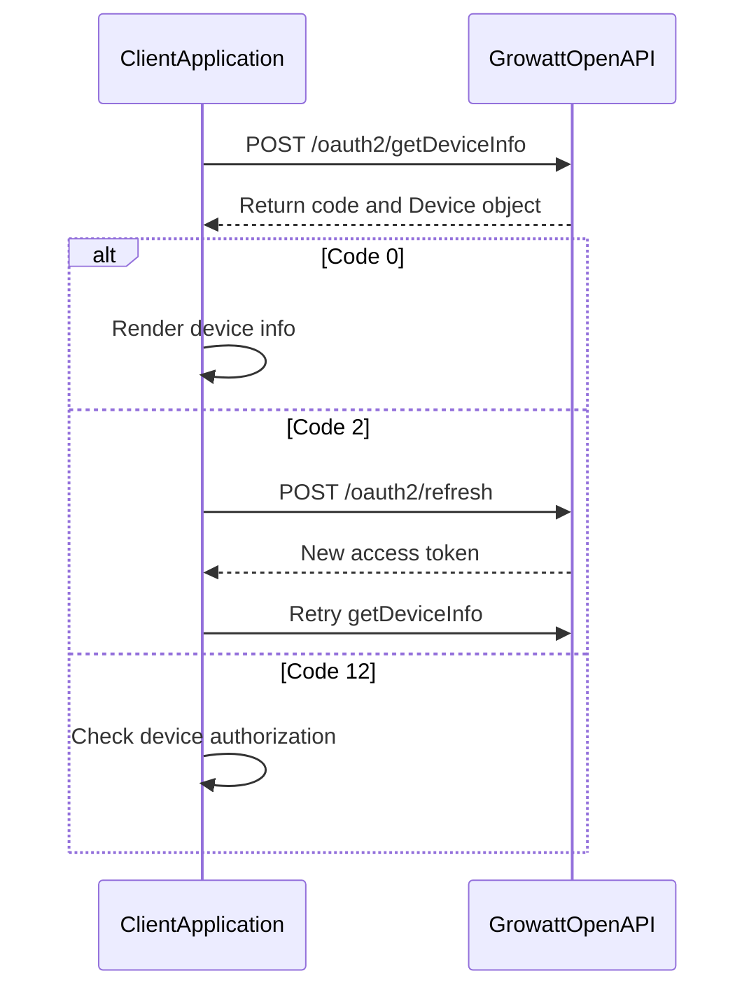

# Device

`Device` 对象代表一台已授权给你应用的 Growatt 能源设备（逆变器、电池或数据采集器）。

设备是 Growatt Open API 的核心资源。通过设备接口，你可以查询设备身份与能力、读取遥测数据、下发控制参数，以及接收推送消息。

---

## 对象属性

### 核心标识

| 属性 | 类型 | 约束 | 描述 | 示例 |
|------|------|------|------|------|
| `deviceSn` | string | **required** | 设备唯一序列号（SN） | `"DEVICE_SN_1"` |
| `deviceTypeName` | string | **required** | 设备大类型名称。Possible enum values: `min`, `max`, `spa`, `sph`, `tlx` | `"min"` |
| `model` | string | **required** | 设备型号标识 | `"BDCBAT"` |
| `dtc` | integer | **required** | 设备类型数字编码 | `5100` |
| `authFlag` | boolean | **required** | 当前 token 是否已授权该设备 | `true` |

### 硬件与固件

| 属性 | 类型 | 约束 | 描述 | 示例 |
|------|------|------|------|------|
| `nominalPower` | integer | **required** | 逆变器额定功率，单位 W | `6000` |
| `communicationVersion` | string | nullable | 固件通讯版本 | `"ZABA-0021"` |
| `unifiedAPIver` | string | nullable | 统一 API 版本；设备未上报时为 `null` | `null` |
| `deviceVersion` | string | nullable | 设备固件版本；设备未上报时为 `null` | `null` |
| `datalogSn` | string | **required** | 数据采集器序列号 | `"DATALOG_SN_1"` |
| `datalogDeviceTypeName` | string | **required** | 数据采集器类型名称 | `"ShineWiFi-X"` |
| `datalogVersion` | string | nullable | 数据采集器固件版本；未上报时为 `null` | `"7.6.1.9"` |

### 电池配置

| 属性 | 类型 | 约束 | 描述 | 示例 |
|------|------|------|------|------|
| `existBattery` | boolean | **required** | 设备是否配置电池 | `true` |
| `batterySn` | string | nullable | 电池序列号；无电池时为 `null` | `"BATTERY_SN_1"` |
| `batteryModel` | string | nullable | 电池型号 | `"ARK 5.12-25.6XH-A1"` |
| `batteryCapacity` | integer | nullable | 电池额定容量，单位 Wh | `5000` |
| `batteryNominalPower` | integer | nullable | 电池额定功率，单位 W | `2500` |
| `dischargeCutOffSOC` | integer | nullable | 电池放电截止 SOC（百分比） | `20` |
| `backupCutOffSOC` | integer | nullable | 离网（备用）放电截止 SOC（百分比） | `10` |
| `batteryList` | array | nullable | 电池列表；多电池场景返回 | `[{...}]` |

**`batteryList[]` 子对象**

| 属性 | 类型 | 约束 | 描述 | 示例 |
|------|------|------|------|------|
| `batterySn` | string | **required** | 电池序列号 | `"BATTERY_SN_1"` |
| `batteryModel` | string | **required** | 电池型号 | `"ARK 5.12-25.6XH-A1"` |
| `batteryCapacity` | integer | **required** | 电池额定容量，单位 Wh | `5000` |
| `batteryNominalPower` | integer | **required** | 电池额定功率，单位 W | `2500` |

### 站点与位置

| 属性 | 类型 | 约束 | 描述 | 示例 |
|------|------|------|------|------|
| `siteName` | string | **required** | 设备所属站点（电站）名称 | `"SITE_NAME_1"` |
| `latitude` | string | **required** | 站点纬度（十进制度） | `"22.500753663248"` |
| `longitude` | string | **required** | 站点经度（十进制度） | `"113.89838917200"` |
| `timezone` | string | **required** | 站点时区（UTC 偏移小时数） | `"8.0"` |

---

## 获取设备信息

`POST /oauth2/getDeviceInfo`

获取单台设备的完整信息。仅返回当前 token 已授权的设备；未授权设备返回 `DEVICE_SN_DOES_NOT_HAVE_PERMISSION`。

### 请求参数

| 参数 | 位置 | 类型 | 约束 | 描述 | 示例 |
|------|------|------|------|------|------|
| `Authorization` | header | string | **required** | Bearer access token | `Bearer ACCESS_TOKEN` |
| `deviceSn` | body | string | **required** | 设备唯一序列号 | `"DEVICE_SN_1"` |

### 返回说明

成功时返回 `code=0` 及完整 `Device` 对象。失败时返回对应错误码，详见[错误参考](#错误码)。

### 请求示例

```bash
curl https://openapi.growatt.com/oauth2/getDeviceInfo \
  -H "Authorization: Bearer ACCESS_TOKEN" \
  -H "Content-Type: application/json" \
  -d '{
    "deviceSn": "DEVICE_SN_1"
  }'
```

```json
{
  "deviceSn": "DEVICE_SN_1"
}
```

### 响应示例

**成功（`code=0`）**

```json
{
  "code": 0,
  "data": {
    "deviceSn": "DEVICE_SN_1",
    "deviceTypeName": "min",
    "model": "BDCBAT",
    "nominalPower": 6000,
    "datalogSn": "DATALOG_SN_1",
    "datalogDeviceTypeName": "ShineWiFi-X",
    "dtc": 5100,
    "communicationVersion": "ZABA-0021",
    "unifiedAPIver": null,
    "deviceVersion": null,
    "datalogVersion": "7.6.1.9",
    "existBattery": true,
    "batterySn": "BATTERY_SN_1",
    "batteryModel": "ARK 5.12-25.6XH-A1",
    "batteryCapacity": 5000,
    "batteryNominalPower": 2500,
    "authFlag": true,
    "siteName": "SITE_NAME_1",
    "latitude": "22.500753663248",
    "longitude": "113.89838917200",
    "timezone": "8.0",
    "dischargeCutOffSOC": 20,
    "backupCutOffSOC": 10,
    "batteryList": [
      {
        "batterySn": "BATTERY_SN_1",
        "batteryModel": "ARK 5.12-25.6XH-A1",
        "batteryCapacity": 5000,
        "batteryNominalPower": 2500
      }
    ]
  },
  "message": "SUCCESSFUL_OPERATION"
}
```

**Token 失效（`code=2`）**

```json
{
  "code": 2,
  "message": "TOKEN_IS_INVALID"
}
```

**设备未授权（`code=12`）**

```json
{
  "code": 12,
  "message": "DEVICE_SN_DOES_NOT_HAVE_PERMISSION"
}
```

### 错误码

| `code` | `message` | 场景 | 处理建议 |
|--------|-----------|------|----------|
| `0` | `SUCCESSFUL_OPERATION` | 查询成功 | 正常处理 `data` |
| `2` | `TOKEN_IS_INVALID` | access token 无效或过期 | 刷新 token 后重试 |
| `12` | `DEVICE_SN_DOES_NOT_HAVE_PERMISSION` | 设备未授权给当前 token | 检查设备授权列表 |
| `10001` | `PARAMETER_ERROR` | 请求参数缺失或格式错误 | 校验 `deviceSn` 是否传入 |

> 完整错误码表见 [Global Parameters - 响应码](./10_global_params.md#响应码)。

---

## 设备信息查询流程



---

## 相关资源

- [Device Authorization](./04_api_device_auth.md) - 管理设备绑定与授权
- [Device Data](./08_api_device_data.md) - 查询设备遥测数据
- [Device Dispatch](./05_api_device_dispatch.md) - 下发设备控制参数
- [ESS Terminology](./12_ess_terminology.md) - 储能系统术语表
