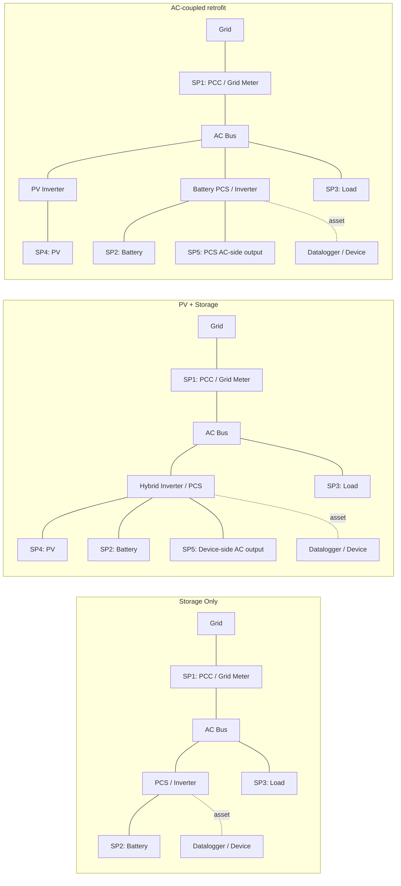
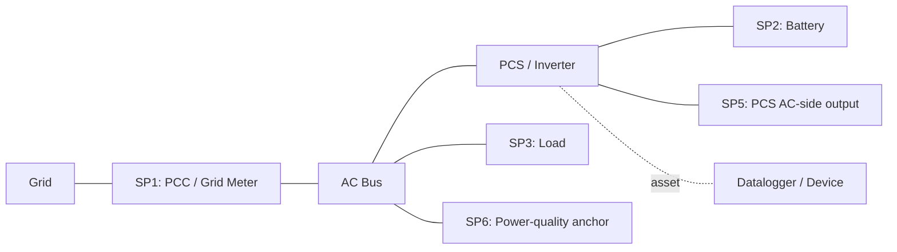
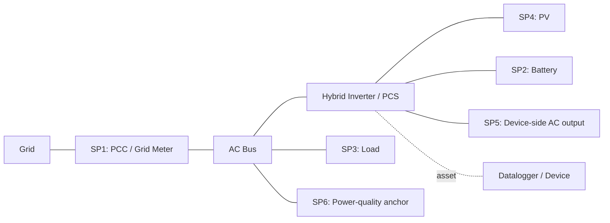
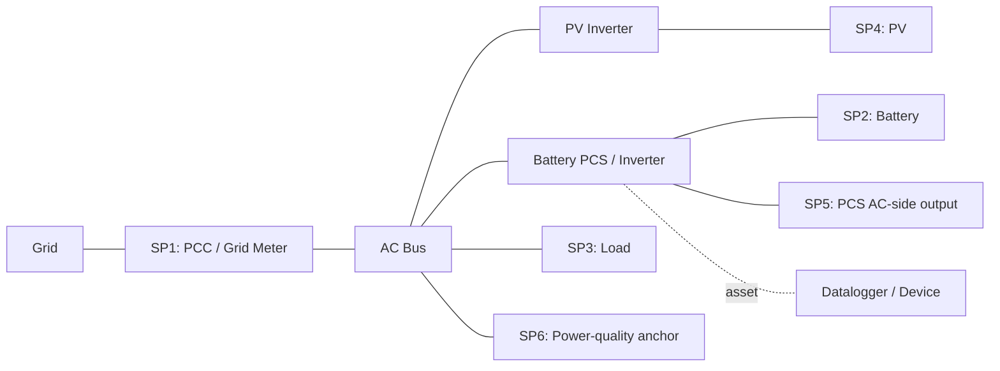

# Preliminary Growatt ESS Semantic Model Review

Status: Preliminary  
Audience: internal review only  
Contract status: not a public semantic contract

## Review Goal / Guardrails

本文档用于给 Growatt ESS 相关接口建立一套内部语义模型草案，目标是把当前公开 API 中已经出现的设备信息字段、运行时采样点字段，以及典型储能拓扑之间的关系先整理清楚。

本稿只做 topology 和 semantic layer review，不改任何公开接口，不改任何 vendor JSON key，不改任何 endpoint 名称，也不把本稿直接提升为对外 semantic contract。

本稿固定覆盖 3 个 canonical models：

- `Storage Only`
- `PV + Storage`
- `AC-coupled retrofit`

本稿中的字段引用只来自当前已发布的：

- `07_api_device_info.md`
- `08_api_device_data.md`
- `09_api_device_push.md`

## Canonical Model Set

这 3 个模型在本稿中是 canonical topology references，而不是“当前 API 已经能自动判型”的能力说明。

| Model | 中文语义 | 核心结构 | 本稿中的判读重点 |
| :--- | :--- | :--- | :--- |
| `Storage Only` | 纯储能系统 | 无 PV 支路，Battery 通过 PCS / Inverter 接入 AC bus | 重点看 PCC、电池支路、负载支路 |
| `PV + Storage` | 光储一体 / Hybrid | PV 与 Battery 共侧接入同一套 hybrid inverter / PCS | 重点看 PV、电池、PCC、负载以及 device-side AC output |
| `AC-coupled retrofit` | AC 耦合改造 | PV inverter 与 battery PCS 在 AC bus 上分支并联 | 重点看 AC bus 上的两条独立支路，以及 PCC 主锚点 |

## Semantic Node Vocabulary

先统一节点词表，避免每张图各说各话。

| Node | 中文说明 | 语义角色 | 关联层 |
| :--- | :--- | :--- | :--- |
| `Grid` | 电网 | 公共电网侧 | Telemetry |
| `PCC / Grid Meter` | 并网点 / 电网计量点 | 站点级 import / export 锚点 | Telemetry |
| `AC Bus` | 交流母线 | 站点内部 AC 汇流层 | Semantic only |
| `PCS / Inverter` | 储能变流器 / 逆变器 | Battery 与 AC 侧的功率变换节点 | Asset + Telemetry |
| `PV` | 光伏阵列 | DC 发电源 | Semantic only |
| `PV Inverter` | 光伏逆变器 | PV 到 AC bus 的独立变换支路 | Asset + Semantic |
| `Battery` | 电池簇 / 电池系统 | 储能资产 | Asset + Telemetry |
| `Load` | 站点负载 | 主负载支路 | Telemetry |
| `Backup Load (optional)` | 备载 / EPS 负载 | 可选备电支路 | Provisional |
| `Datalogger / Device` | 采集器 / 设备对象 | API 设备对象与采集对象锚点 | Asset |

## Field Layers

### Asset layer

`Asset layer` 用于回答“这个 device 是什么设备、是否带电池、已知哪些额定属性”，主要来自 `07_api_device_info.md`。

| 字段 | 含义 | 在 semantic model 中的用途 |
| :--- | :--- | :--- |
| `deviceSn` | 设备 SN | 设备对象主键 |
| `deviceTypeName` | 设备类型名 | 设备类别辅助线索 |
| `model` | 设备型号 | 拓扑判型辅助线索，但不是标准化 topology enum |
| `datalogSn` | 采集器序列号 | `Datalogger / Device` 侧锚点 |
| `datalogDeviceTypeName` | 采集器类型 | 设备采集链路辅助信息 |
| `existBattery` | 是否带电池 | 电池分支存在性信号 |
| `batteryCapacity` | 电池额定容量 | Battery asset 属性 |
| `batteryNominalPower` | 电池额定功率 | Battery asset 属性 |
| `batteryList[]` | 电池列表 | 多电池簇展开入口 |

### Telemetry layer

`Telemetry layer` 用于回答“当前站点的采样点在哪里、每个采样点有什么稳定字段”，主要来自 `08_api_device_data.md` 与 `09_api_device_push.md`。

| 采样点类别 | 核心字段 | 语义说明 |
| :--- | :--- | :--- |
| PCC / 电网点 | `meterPower`, `etoUserToday`, `etoUserTotal`, `etoGridToday`, `etoGridTotal` | 站点级 grid import / export 主锚点 |
| 电池点 | `batPower`, `batteryList[].soc`, `batteryList[].soh`, `batteryList[].chargePower`, `batteryList[].dischargePower` | Battery branch 的功率、状态与能量锚点 |
| 负载点 | `payLoadPower` | 站点主负载锚点 |
| PV 点 | `ppv`, `epvTotal` | PV branch 锚点 |
| 运行状态点 | `status`, `batteryStatus`, `priority` | 拓扑不变前提下的运行模式锚点 |
| 电能质量点 | `fac`, `reactivePower` | 站点频率与无功采样点 |
| Device-side AC output | `pac` | 设备侧 AC 输出功率，不能默认等价于全站总功率 |

## Unified Sampling Point Labels

3 个细图统一使用以下采样点标签：

| Sampling Point | 位置 | 主字段 |
| :--- | :--- | :--- |
| `SP1` | `PCC / Grid Meter` | `meterPower`, `etoUserToday/Total`, `etoGridToday/Total` |
| `SP2` | `Battery branch` | `batPower`, `batteryList[].soc`, `batteryList[].soh`, `batteryList[].chargePower`, `batteryList[].dischargePower` |
| `SP3` | `Load branch` | `payLoadPower` |
| `SP4` | `PV branch` | `ppv`, `epvTotal` |
| `SP5` | `PCS / Inverter AC-side output` | `pac` |
| `SP6` | `Power-quality anchor` | `fac`, `reactivePower` |

## Model Comparison Matrix

| Model | PCC 主锚点 | PV 支路 | 电池支路 | 负载位置 | 是否需要独立 `PV Inverter` | 主要字段锚点 |
| :--- | :--- | :--- | :--- | :--- | :--- | :--- |
| `Storage Only` | `SP1` | 无 | 有，接入 `PCS / Inverter` | `AC Bus` 下游 | 否 | `meterPower`, `batPower`, `payLoadPower` |
| `PV + Storage` | `SP1` | 有，和 Battery 共侧 | 有，和 PV 共侧 | `AC Bus` 下游 | 否，通常由同一套 hybrid inverter / PCS 处理 | `ppv`, `batPower`, `meterPower`, `payLoadPower`, `pac` |
| `AC-coupled retrofit` | `SP1` | 有，AC bus 上独立支路 | 有，AC bus 上独立支路 | `AC Bus` 下游 | 是 | `ppv`, `batPower`, `meterPower`, `payLoadPower`, `pac` |

## Mermaid Overview

## Per-model Deep Dive

### 1. `Storage Only`

语义定义：这是无 PV branch 的储能系统。Battery 通过 `PCS / Inverter` 接入 `AC Bus`，站点与电网的交互统一由 `SP1` 作为主锚点。

#### 采样点映射

| 采样点 | 语义位置 | 主要字段 | 说明 |
| :--- | :--- | :--- | :--- |
| `SP1` | PCC / 电网点 | `meterPower`, `etoUserToday/Total`, `etoGridToday/Total` | 站点级 import / export 主锚点 |
| `SP2` | 电池支路 | `batPower`, `batteryList[].soc`, `batteryList[].soh`, `batteryList[].chargePower`, `batteryList[].dischargePower` | Battery charge / discharge 主锚点 |
| `SP3` | 负载支路 | `payLoadPower` | 站点主负载锚点 |
| `SP4` | PV 支路 | N/A | `Storage Only` 不引入 PV semantic branch；不能用 `ppv = 0` 来倒推模型 |
| `SP5` | PCS AC-side output | `pac` | 可以记录 device-side AC output，但不作为本模型的第一判型字段 |
| `SP6` | 电能质量点 | `fac`, `reactivePower` | 站点频率与无功观测点 |

#### 关系解释

- `Storage Only` 的主判读不依赖 `ppv` 或 `epvTotal`。
- `meterPower` 反映站点与电网之间的净交换；`batPower` 反映 Battery branch 的瞬时功率；`payLoadPower` 反映主负载。
- `pac` 只应解释为 `PCS / Inverter` 的 AC-side output，不应自动提升为全站总功率。

#### Asset layer 关注点

- `existBattery = true`、`batteryCapacity`、`batteryNominalPower`、`batteryList[]` 是 Battery asset 的直接证据。
- 当前 `07_api_device_info` 没有显式的 “Storage Only topology” 枚举，因此该模型仍是 semantic reference，不是 API 自带的 machine-readable topology label。

### 2. `PV + Storage`

语义定义：PV 与 Battery 共侧挂在同一套 `Hybrid Inverter / PCS` 上，由同一设备完成 PV / Battery / AC-side 的耦合。

#### 采样点映射

| 采样点 | 语义位置 | 主要字段 | 说明 |
| :--- | :--- | :--- | :--- |
| `SP1` | PCC / 电网点 | `meterPower`, `etoUserToday/Total`, `etoGridToday/Total` | 站点级 grid import / export 锚点 |
| `SP2` | 电池支路 | `batPower`, `batteryList[].soc`, `batteryList[].soh`, `batteryList[].chargePower`, `batteryList[].dischargePower` | Battery branch 主锚点 |
| `SP3` | 负载支路 | `payLoadPower` | 主负载锚点 |
| `SP4` | PV 支路 | `ppv`, `epvTotal` | PV 发电主锚点 |
| `SP5` | Hybrid inverter AC-side output | `pac` | 设备侧 AC output，可用于解释 hybrid 设备和 AC bus 的关系 |
| `SP6` | 电能质量点 | `fac`, `reactivePower` | 站点频率与无功观测点 |

#### 关系解释

- 该模型的核心是 `SP4` 与 `SP2` 同时挂在同一套 `Hybrid Inverter / PCS` 上，而不是两套独立 AC 支路。
- `ppv` 表示 PV branch；`batPower` 表示 Battery branch；`meterPower` 表示站点与 Grid 的净交换。
- `payLoadPower` 仍然是站点主负载锚点，不等价于某一个 inverter 端口功率。
- `pac` 可用来解释设备侧 AC 输出，但不应被解释为“站点总功率”。

#### Asset layer 关注点

- `existBattery` 与 `battery*` 字段能确认 battery asset 的存在。
- 当前公开 `07_api_device_info` 不提供显式的 “hybrid topology” 字段，因此 `PV + Storage` 仍需结合型号语义或外部设备 catalog 解释，不能仅靠 `07` 自动判型。

### 3. `AC-coupled retrofit`

语义定义：PV inverter 与 battery PCS 在 `AC Bus` 上是两条独立支路。PV 与 Battery 不共用同一套 DC-coupled hybrid path。

#### 采样点映射

| 采样点 | 语义位置 | 主要字段 | 说明 |
| :--- | :--- | :--- | :--- |
| `SP1` | PCC / 电网点 | `meterPower`, `etoUserToday/Total`, `etoGridToday/Total` | 站点级主锚点，必须保留 |
| `SP2` | 电池支路 | `batPower`, `batteryList[].soc`, `batteryList[].soh`, `batteryList[].chargePower`, `batteryList[].dischargePower` | Battery PCS 所属的储能支路锚点 |
| `SP3` | 负载支路 | `payLoadPower` | 主负载锚点 |
| `SP4` | PV 支路 | `ppv`, `epvTotal` | 独立 PV inverter 所属支路锚点 |
| `SP5` | PCS AC-side output | `pac` | 仅解释 battery PCS / inverter 的 AC-side output，不提升为全站总功率 |
| `SP6` | 电能质量点 | `fac`, `reactivePower` | 站点频率与无功观测点 |

#### 关系解释

- 该模型的核心不是 “有 PV + 有电池”，而是 “PV branch 与 Battery branch 在 AC bus 上独立并联”。
- `ppv` 对应 PV branch；`batPower` 对应 Battery branch；`meterPower` 继续是 PCC 主锚点。
- `pac` 只能解释为 `PCS / Inverter` 这条储能支路的 AC-side output，不能提升成站点总功率。
- 如果未来需要区分 AC-coupled retrofit 与其他含 PV 的模型，必须依赖 topology metadata、model catalog 或设备族映射，而不是某一时刻的 telemetry 值。

#### Asset layer 关注点

- `07_api_device_info` 可以表达 Battery asset 与 datalogger asset，但没有 “独立 PV inverter presence” 的标准化字段。
- 因此 `AC-coupled retrofit` 在当前 API 中仍属于 semantic interpretation layer，而不是 API-native topology flag。

## Device Classification Rule

当前公开字段不足以把 3 个模型机器可判定地完全分开，因此必须明确以下规则：

- 禁止用某一时刻 `ppv = 0` 来判定系统不是 `PV + Storage` 或不是 `AC-coupled retrofit`。
- 禁止用某一时刻 `batPower = 0` 来判定系统不是储能系统。
- 模型是 topology semantics，不是瞬时运行状态。
- `status`、`batteryStatus`、`priority` 只能作为运行状态锚点，不能直接作为 topology class label。
- 当前 `07_api_device_info` 能确认 battery asset，但不能单靠它完整地区分 `Storage Only`、`PV + Storage`、`AC-coupled retrofit`。

## Open Issues / Preliminary Unresolved / Provisional Fields

以下字段在当前公开文档中存在，但尚不适合在本稿中被提升为 canonical semantic anchors：

| 字段 | 当前处理 | 原因 |
| :--- | :--- | :--- |
| `backupPower` | Provisional | 可视为 backup / EPS 支路候选，但当前文档未给出稳定 topology 定义 |
| `pexPower` | Provisional | 当前公开文档未给出足够稳定的语义定义 |
| `genPower` | Provisional | 当前公开文档未给出足够稳定的语义定义 |
| `smartLoadPower` | Provisional | 当前公开文档未给出足够稳定的采样点定义 |

额外说明：

- `backupPower` 仅可作为可选 `Backup Load (optional)` 语义候选，不作为 3 个主模型的判别点。
- 这些字段目前应标记为 observed but not canonically normalized。
- 如后续要把这份 Preliminary review 发展成对外 semantic model，需要先补齐字段定义、设备 catalog、以及 topology metadata 的来源。
