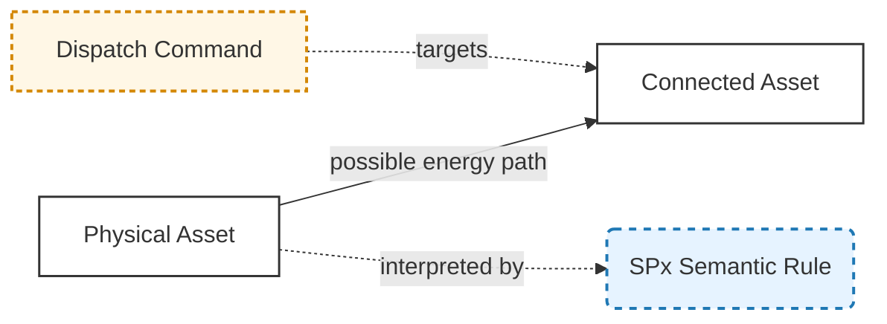
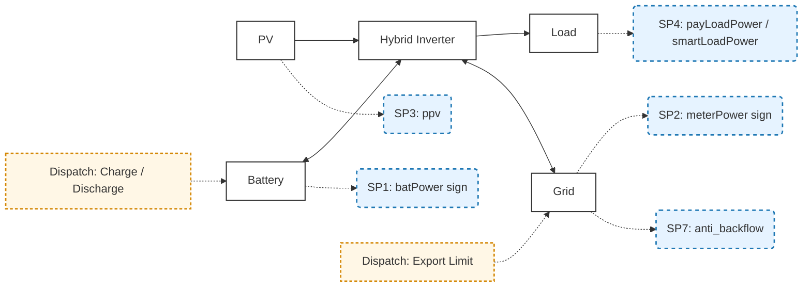
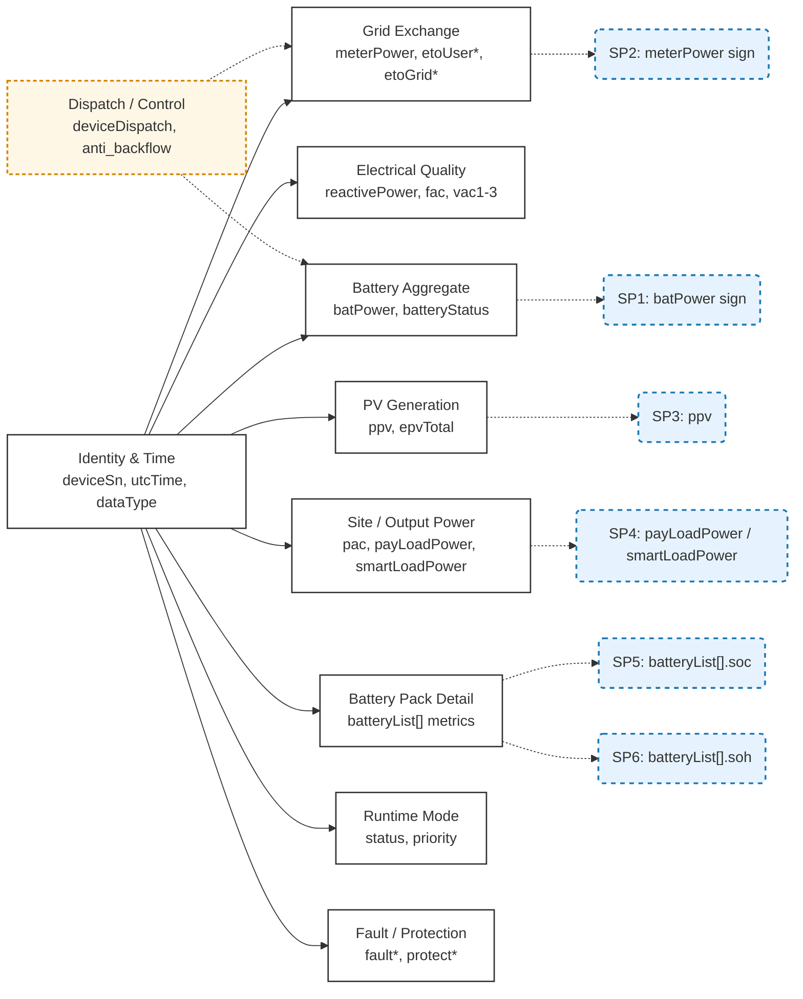
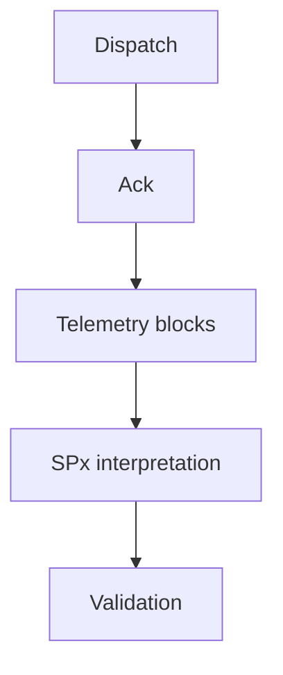
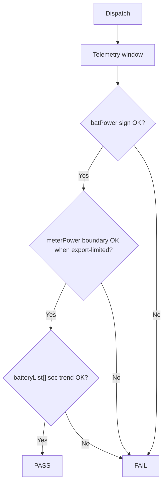

# Growatt ESS Semantic Model and Dispatch Specification

**Version**: v1.0
**Status**: Public Standard
**Scope**: Growatt Unified OpenAPI / EMS VPP-relevant runtime telemetry semantics and dispatch validation
**Audience**: Integrators, solution architects, validation teams, and implementation teams

---

# 1. Overview

This specification defines the public runtime semantic model for VPP-relevant fields that binds:

* **Topology (energy flow paths)**
* **Telemetry (public runtime payload fields)**
* **Semantic interpretation (SPx)**
* **Dispatch commands**
* **Validation criteria**

The telemetry scope in this appendix focuses on the VPP-relevant subset of the currently published payloads in:

* `08_api_device_data.md`
* `09_api_device_push.md`

Static capability metadata from `07_api_device_info.md` remains outside this runtime telemetry catalog.

---

# 2. Core Principles

## 2.1 Layer Separation

| Layer      | Description                           |
| ---------- | ------------------------------------- |
| Topology   | Physical energy paths                 |
| Telemetry  | VPP-relevant public runtime payload fields |
| Semantic   | Interpretation rules for core signals |
| Dispatch   | Control commands and limits           |
| Validation | Pass/Fail logic                       |

---

## 2.2 Key Rule

> Energy arrows represent possible power paths, not real-time direction.
> Actual direction is determined by runtime telemetry values interpreted via SPx.

---

# 3. Visual Standard (Mermaid SSOT)



---

# 4. Topology + Semantic + Dispatch Model



---

# 5. Semantic System (SPx)

## 5.1 Definition

| SPx | Name               | Field                                  | Target       |
| --- | ------------------ | -------------------------------------- | ------------ |
| SP1 | Battery Power Sign | `batPower`                             | Battery      |
| SP2 | Grid Exchange Sign | `meterPower`                           | Grid         |
| SP3 | PV Power           | `ppv`                                  | PV           |
| SP4 | Load Power         | `payLoadPower`, `smartLoadPower`       | Load         |
| SP5 | SOC                | `batteryList[].soc`                    | Battery Pack |
| SP6 | SOH                | `batteryList[].soh`                    | Battery Pack |
| SP7 | Export Limit       | `anti_backflow` (control parameter)    | Grid         |

---

## 5.2 Sign Convention

### SP1 - Battery Power

| Value | Meaning     |
| ----- | ----------- |
| >0    | Charging    |
| <0    | Discharging |

---

### SP2 - Grid Exchange

| Value | Meaning     |
| ----- | ----------- |
| >0    | Grid import |
| <0    | Grid export |

---

### SP3 / SP4

| Field | Rule |
| ----- | ---- |
| `ppv` | >= 0 |
| `payLoadPower` | >= 0 |
| `smartLoadPower` | >= 0 when reported |

---

### SP5 / SP6

| Field | Rule |
| ----- | ---- |
| `batteryList[].soc` | `[0,100]` |
| `batteryList[].soh` | `[0,100]` |

---

### SP7

`anti_backflow` remains a dispatch/control semantic and is not treated as runtime telemetry in this appendix.

---

# 6. Runtime Telemetry Model

## 6.1 Core Semantic Signal Mapping

| Public Signal | Field | Rule | Unit | Payloads |
| ------------- | ----- | ---- | ---- | -------- |
| Battery Power | `batPower` | >0 charge, <0 discharge | `W` | Query, Push |
| Grid Exchange | `meterPower` | >0 import, <0 export | `W` | Query, Push |
| PV Power | `ppv` | >= 0 | `W` | Query, Push |
| Load Power | `payLoadPower` | Calculated site load | `W` | Query, Push |
| Smart-load Power | `smartLoadPower` | Auxiliary load channel when present | `W` | Query, Push |
| Battery SOC | `batteryList[].soc` | Per-pack SOC | `%` | Query, Push |
| Battery SOH | `batteryList[].soh` | Per-pack SOH | `%` | Query, Push |
| Export Limit | `anti_backflow` | Control-only grid export constraint | Control parameter | Dispatch |

---

## 6.2 Telemetry Block Relationship



---

## 6.3 Unit Normalization

| Category | Fields | Unit |
| -------- | ------ | ---- |
| Power | `meterPower`, `batPower`, `ppv`, `pac`, `payLoadPower`, `smartLoadPower`, `batteryList[].chargePower`, `batteryList[].dischargePower` | `W` |
| Energy | `etoUserToday`, `etoUserTotal`, `etoGridToday`, `etoGridTotal`, `epvTotal`, `batteryList[].echargeToday`, `batteryList[].echargeTotal`, `batteryList[].edischargeToday`, `batteryList[].edischargeTotal` | `kWh` |
| Voltage | `vac1`, `vac2`, `vac3`, `batteryList[].vbat` | `V` |
| Frequency | `fac` | `Hz` |
| Percentage | `batteryList[].soc`, `batteryList[].soh` | `%` |
| Current | `batteryList[].ibat` | `A` |
| Code / Enum | `status`, `priority`, `batteryStatus`, `batteryList[].status`, `faultCode`, `faultSubCode`, `protectCode`, `protectSubCode`, `dataType` | Code / enum |

`reactivePower` keeps its vendor payload form and public sign note; this appendix does not redefine its unit beyond the currently published documentation.

---

## 6.4 Telemetry Block Catalog

### Identity & Time

| Field | Payloads | Description |
| ----- | -------- | ----------- |
| `deviceSn` | Query, Push | Device serial number |
| `utcTime` | Query, Push | UTC timestamp in `yyyy-MM-dd HH:mm:ss` format |
| `dataType` | Push | Push envelope discriminator with fixed public value `dfcData` |

### Grid Exchange

| Field | Payloads | Description |
| ----- | -------- | ----------- |
| `meterPower` | Query, Push | Grid meter power. Positive means grid import and negative means grid export |
| `etoUserToday` | Query, Push | Grid import energy today |
| `etoUserTotal` | Query, Push | Total grid import energy |
| `etoGridToday` | Query, Push | Grid export energy today |
| `etoGridTotal` | Query, Push | Total grid export energy |

### Electrical Quality

| Field | Payloads | Description |
| ----- | -------- | ----------- |
| `reactivePower` | Query, Push | Reactive power value with the published capacitive/inductive sign note |
| `fac` | Query, Push | Grid frequency |
| `vac1` | Query, Push | Line voltage 1 |
| `vac2` | Query, Push | Line voltage 2 |
| `vac3` | Query, Push | Line voltage 3 |

### PV Generation

| Field | Payloads | Description |
| ----- | -------- | ----------- |
| `ppv` | Query, Push | PV power |
| `epvTotal` | Query, Push | Total PV generation |

### Site / Output Power

| Field | Payloads | Description |
| ----- | -------- | ----------- |
| `pac` | Query, Push | AC output power |
| `payLoadPower` | Query, Push | Calculated total load power |
| `smartLoadPower` | Query, Push | Dedicated smart-load power when the device reports a smart-load channel |

### Battery Aggregate

| Field | Payloads | Description |
| ----- | -------- | ----------- |
| `batPower` | Query, Push | Aggregate battery charge/discharge power. Positive means charging and negative means discharging |
| `batteryStatus` | Query, Push | Overall battery status code |

### Battery Pack Detail

| Field | Payloads | Description |
| ----- | -------- | ----------- |
| `batteryList[].index` | Query, Push | Battery pack index starting from 1 |
| `batteryList[].soc` | Query, Push | Per-pack battery state of charge |
| `batteryList[].chargePower` | Query, Push | Per-pack charging power |
| `batteryList[].dischargePower` | Query, Push | Per-pack discharging power |
| `batteryList[].ibat` | Query, Push | Battery current on the low-voltage side |
| `batteryList[].vbat` | Query, Push | Battery voltage on the low-voltage side |
| `batteryList[].soh` | Query, Push | Per-pack battery state of health |
| `batteryList[].status` | Query, Push | Per-pack status code when present |
| `batteryList[].echargeToday` | Query, Push | Charged energy today |
| `batteryList[].echargeTotal` | Query, Push | Total charged energy |
| `batteryList[].edischargeToday` | Query, Push | Discharged energy today |
| `batteryList[].edischargeTotal` | Query, Push | Total discharged energy |

### Runtime Mode

| Field | Payloads | Description |
| ----- | -------- | ----------- |
| `status` | Query, Push | Device runtime status code |
| `priority` | Query, Push | Operating priority code |

### Fault / Protection

| Field | Payloads | Description |
| ----- | -------- | ----------- |
| `faultCode` | Query, Push | Fault main code |
| `faultSubCode` | Query, Push | Fault sub-code |
| `protectCode` | Query, Push | Protection main code |
| `protectSubCode` | Query, Push | Protection sub-code |

---

# 7. Dispatch Model

## 7.1 Types

| Dispatch | Target |
| -------- | ------ |
| Charge | Battery |
| Discharge | Battery |
| Export Limit | Grid |
| Mode | Inverter |

---

## 7.2 Mapping

| Dispatch | Observed Runtime Fields | Control Fields |
| -------- | ----------------------- | -------------- |
| Charge | `batPower`, `batteryList[].soc` | `time_slot_charge_discharge`, `duration_and_power_charge_discharge` |
| Discharge | `batPower`, `batteryList[].soc` | `time_slot_charge_discharge`, `duration_and_power_charge_discharge` |
| Export Limit | `meterPower`, `etoGridToday`, `etoGridTotal` | `anti_backflow` |
| Mode | `status`, `priority`, power blocks | Implementation-specific set types |

---

# 8. Telemetry Applicability Matrix

## 8.1 Topology Coverage

| Block | PV Only | Hybrid | AC Couple | Battery Only |
| ----- | ------- | ------ | --------- | ------------ |
| Identity & Time | ✓ | ✓ | ✓ | ✓ |
| Grid Exchange | ✓ | ✓ | ✓ | ✓ |
| Electrical Quality | ✓ | ✓ | ✓ | ✓ |
| PV Generation | ✓ | ✓ | ✓ | ✗ |
| Site / Output Power | ✓ | ✓ | ✓ | ✓ |
| Battery Aggregate | ✗ | ✓ | ✓ | ✓ |
| Battery Pack Detail | ✗ | ✓ | ✓ | ✓ |
| Runtime Mode | ✓ | ✓ | ✓ | ✓ |
| Fault / Protection | ✓ | ✓ | ✓ | ✓ |

---

## 8.2 Notes

* `smartLoadPower` is optional and appears only when the published payload reports a dedicated smart-load channel.
* PV-only systems do not expose battery aggregate or battery pack telemetry.
* Battery-only systems do not expose PV generation fields.

---

# 9. Dispatch Validation Framework

## 9.1 Validation Layers

| Layer | Check |
| ----- | ----- |
| Command | accepted |
| Telemetry | changed |
| Semantic | correct sign / boundary |
| Behavior | consistent over the observation window |

---

# 10. Validation Rules

## 10.1 Charge

**Expected**

* `batPower` > 0
* `batteryList[].soc` is non-decreasing over the observation window

**Pass**

```text
batPower remains positive and batteryList[].soc does not trend downward
```

---

## 10.2 Discharge

**Expected**

* `batPower` < 0
* `batteryList[].soc` is non-increasing over the observation window

---

## 10.3 Export Limit

**Expected**

* `meterPower` stays within the configured export boundary in the export direction
* In export-limited mode, `meterPower` does not become more negative than the configured export limit

---

# 11. Acceptance Criteria

## 11.1 General

| Item | Requirement |
| ---- | ----------- |
| Ack | < 5s |
| First response | <= 1 cycle |
| Stable window | 2-5 cycles |

---

## 11.2 Tolerance

| Metric | Value |
| ------ | ----- |
| Power tolerance | +/-3% |
| Stabilization | 30-120s |

---

## 11.3 Result

| Result | Condition |
| ------ | --------- |
| Pass | all required layers satisfied |
| Fail | mismatch |
| Pending | insufficient data |

---

# 12. Failure Codes

| Code | Meaning |
| ---- | ------- |
| V001 | No ack |
| V002 | No telemetry |
| V003 | Wrong sign |
| V004 | Unstable |
| V005 | Limit not enforced |
| V006 | Insufficient window |
| V007 | Conflicting conditions |

---

# 13. Validation Flow



---

# 14. Dispatch Validation Logic



---

# 15. Executive Summary

## Chinese

本规范将运行时拓扑、语义、调度与遥测统一到同一套公开模型中。
核心语义信号只覆盖真正影响方向判断和控制闭环的字段；其余公开 telemetry 则按块完整归档，确保每一块有哪些数据都能直接查到。

---

## English

This specification unifies runtime topology, semantics, dispatch, and telemetry into one public model.
Core semantic signals cover only the fields that drive direction and control logic, while the remaining public telemetry is fully cataloged by block so each data area is explicit.

---
