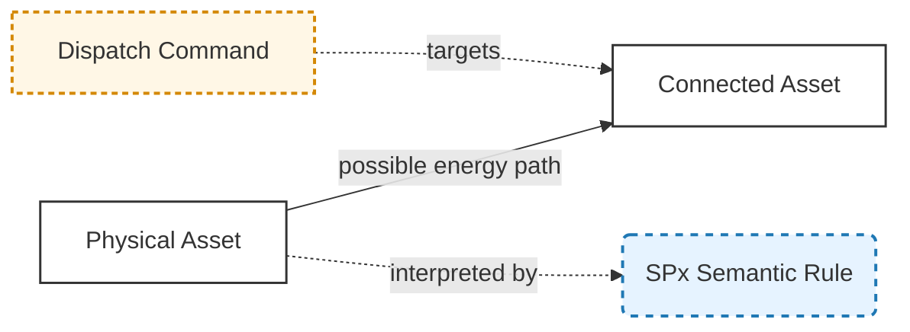
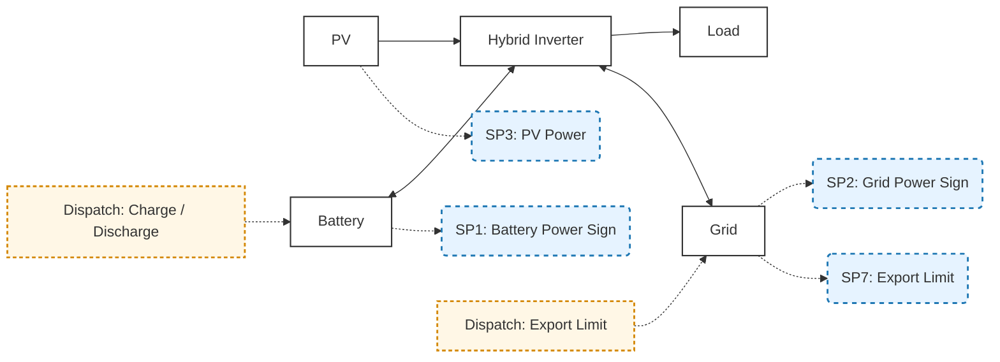
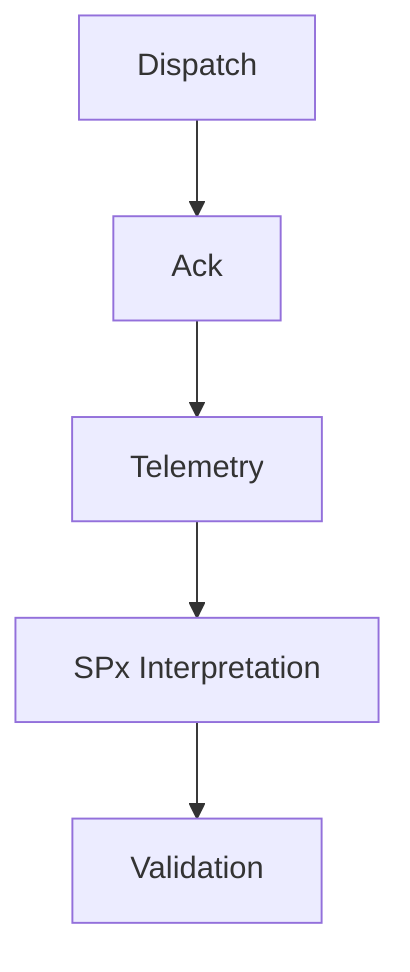
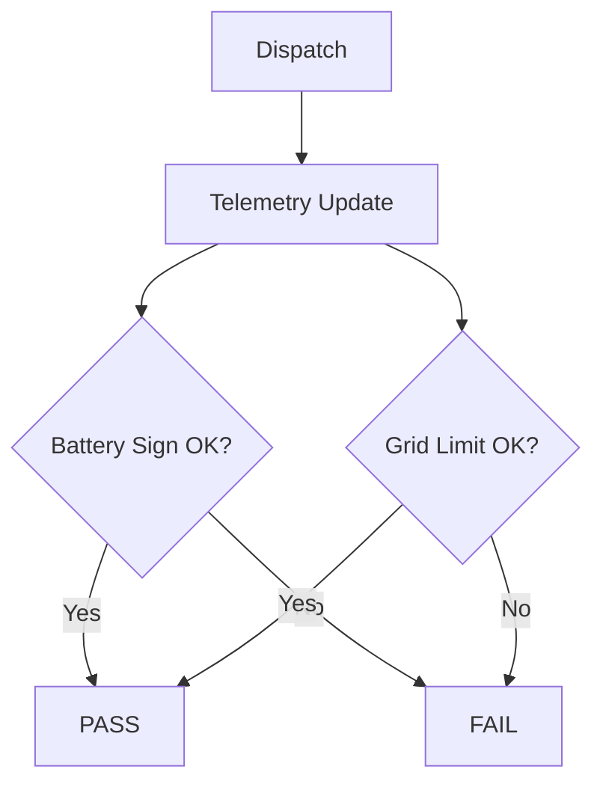

# Growatt ESS Semantic Model and Dispatch Specification

**Version**: v1.0
**Status**: Public Standard
**Scope**: Growatt Unified OpenAPI / EMS / ESS semantic modeling and dispatch validation
**Audience**: Integrators, solution architects, validation teams, and implementation teams

---

# 1. Overview

This specification defines a **unified semantic model and validation framework** that binds:

* **Topology (energy flow paths)**
* **Telemetry (API fields)**
* **Semantic interpretation (SPx)**
* **Dispatch commands**
* **Validation criteria**

---

# 2. Core Principles

## 2.1 Layer Separation

| Layer      | Description                |
| ---------- | -------------------------- |
| Topology   | Physical energy paths      |
| Semantic   | Interpretation rules (SPx) |
| Telemetry  | API data fields            |
| Dispatch   | Control commands           |
| Validation | Pass/Fail logic            |

---

## 2.2 Key Rule

> Energy arrows represent **possible power paths**, not real-time direction.
> Actual direction is determined by telemetry values interpreted via SPx.

---

# 3. Visual Standard (Mermaid SSOT)



---

# 4. Topology + Semantic + Dispatch Model



---

# 5. Semantic System (SPx)

## 5.1 Definition

| SPx | Name               | Target  |
| --- | ------------------ | ------- |
| SP1 | Battery Power Sign | Battery |
| SP2 | Grid Power Sign    | Grid    |
| SP3 | PV Power           | PV      |
| SP4 | Load Power         | Load    |
| SP5 | SOC                | Battery |
| SP6 | SOH                | Battery |
| SP7 | Export Limit       | Grid    |

---

## 5.2 Sign Convention

### SP1 — Battery Power

| Value | Meaning     |
| ----- | ----------- |
| >0    | Charging    |
| <0    | Discharging |

---

### SP2 — Grid Power

| Value | Meaning |
| ----- | ------- |
| >0    | Export  |
| <0    | Import  |

---

### SP3 / SP4

| Field | Rule |
| ----- | ---- |
| PV    | >= 0 |
| Load  | >= 0 |

---

# 6. Telemetry Mapping

## 6.1 Field Mapping

| Public Term   | API Field                | SPx | Unit |
| ------------- | ------------------------ | --- | ---- |
| Battery Power | batteryPower             | SP1 | kW   |
| Grid Power    | gridPower                | SP2 | kW   |
| PV Power      | pvPower                  | SP3 | kW   |
| Load Power    | loadPower / payLoadPower | SP4 | kW   |
| SOC           | soc                      | SP5 | %    |
| SOH           | soh                      | SP6 | %    |
| Export Limit  | anti_backflow            | SP7 | kW/% |

---

## 6.2 Vendor Key Rule

> API keys remain unchanged; documentation uses standardized terminology.

---

# 7. Dispatch Model

## 7.1 Types

| Dispatch     | Target   |
| ------------ | -------- |
| Charge       | Battery  |
| Discharge    | Battery  |
| Export Limit | Grid     |
| Mode         | Inverter |

---

## 7.2 Mapping

| Dispatch     | Observed Fields   |
| ------------ | ----------------- |
| Charge       | batteryPower, soc |
| Discharge    | batteryPower, soc |
| Export Limit | gridPower         |
| Mode         | multi-field       |

---

# 8. Telemetry Applicability Matrix

## 8.1 Topology Coverage

| Field        | PV Only | Hybrid | AC Couple | Battery Only |
| ------------ | ------- | ------ | --------- | ------------ |
| pvPower      | ✓       | ✓      | ✓         | ✗            |
| batteryPower | ✗       | ✓      | ✓         | ✓            |
| gridPower    | ✓       | ✓      | ✓         | ✓            |
| loadPower    | ✓       | ✓      | ✓         | ✓            |
| soc          | ✗       | ✓      | ✓         | ✓            |
| soh          | ✗       | ✓      | ✓         | ✓            |

---

## 8.2 Notes

* AC Couple: battery and PV independent
* PV Only: no battery semantics
* Battery Only: no PV field

---

# 9. Dispatch Validation Framework

---

## 9.1 Validation Layers

| Layer     | Check        |
| --------- | ------------ |
| Command   | accepted     |
| Telemetry | changed      |
| Semantic  | correct sign |
| Behavior  | consistent   |

---

# 10. Validation Rules

---

## 10.1 Charge

**Expected**

* batteryPower > 0
* SOC increasing

**Pass**

```text
batteryPower remains positive + SOC non-decreasing
```

---

## 10.2 Discharge

**Expected**

* batteryPower < 0
* SOC decreasing

---

## 10.3 Export Limit

**Expected**

* gridPower ≤ limit

---

# 11. Acceptance Criteria

---

## 11.1 General

| Item           | Requirement |
| -------------- | ----------- |
| Ack            | < 5s        |
| First response | ≤ 1 cycle   |
| Stable window  | 2–5 cycles  |

---

## 11.2 Tolerance

| Metric          | Value   |
| --------------- | ------- |
| Power tolerance | ±3%     |
| Stabilization   | 30–120s |

---

## 11.3 Result

| Result  | Condition            |
| ------- | -------------------- |
| Pass    | all layers satisfied |
| Fail    | mismatch             |
| Pending | insufficient data    |

---

# 12. Failure Codes

| Code | Meaning                |
| ---- | ---------------------- |
| V001 | No ack                 |
| V002 | No telemetry           |
| V003 | Wrong sign             |
| V004 | Unstable               |
| V005 | Limit not enforced     |
| V006 | Insufficient window    |
| V007 | Conflicting conditions |

---

# 13. Validation Flow



---

# 14. Dispatch Validation Logic



---

# 15. Executive Summary

## 中文

本规范将拓扑、语义、调度与遥测统一建模。
调度成功必须同时满足：命令确认、遥测变化、符号正确、行为一致。

---

## English

This specification unifies topology, semantics, dispatch, and telemetry.
A dispatch is valid only when command acceptance, telemetry response, sign correctness, and behavioral consistency are all satisfied.

---
