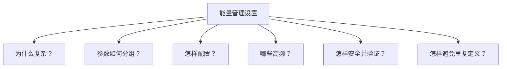

# ShineTools 能量管理设置导航

> **从问题进入，不从文件进入。每个 Handbook 页面只强调并解决一个问题。**

## 我想解决什么？

| 问题 | 直接进入 |
|---|---|
| 先看完整阅读地图 | [Handbook 导航](./product-handbook.md) |
| 用户为什么觉得复杂？ | [01 用户与问题](./handbook/01-problem-and-users.md) |
| 参数应该怎样分组？ | [02 参数分组](./handbook/02-parameter-grouping.md) |
| 应该按什么顺序配置？ | [03 配置流程](./handbook/03-configuration-flow.md) |
| 哪些设置高频？ | [04 高频与优先级](./handbook/04-frequency-and-priority.md) |
| 怎样安全写入并证明生效？ | [05 安全与验证](./handbook/05-safety-and-validation.md) |
| 怎样保持一份设置事实？ | [06 Setting Contract](./handbook/06-setting-contract.md) |

## 产品结论速览

- **六组参数：** Site Context、Measurement、Energy Strategy、Grid & Export、Battery & Reserve、Scenario Extensions。
- **一条配置链路：** 识别上下文 → 验证测量 → 选择目标 → 配置策略与边界 → 审阅变更 → 写入 → 回读验证。
- **四类频率：** 站点覆盖、任务频率、修改频率、问题频率。
- **一份事实源：** Quick Setup、详细设置和诊断都引用同一 Setting Contract。
- **一个完成标准：** 设备回读一致，并且目标能源行为验证通过。

## 证据与来源

Handbook 是产品判断；以下页面用于追踪事实和迁移证据：

### 当前功能证据

- [Quick Site Setup](./modules/01-quick-site-setup.md)
- [直连设置（ShineTools 平台）](./modules/02-direct-settings-platform.md)

### 方法与审计

- [文档约定](./00-document-conventions.md)
- [来源映射](./01-source-map.md)
- [全量覆盖审计](./02-coverage-audit.md)
- [部署与访问管理](./03-deployment-and-access.md)

### 历史与治理

- [quick Setting 参考版](./modules/03-reference-quick-setting.md)
- [直连模式参考版](./modules/04-reference-direct-mode.md)
- [标题、批注与旧版残留](./modules/05-layout-annotations-and-legacy-artifacts.md)

### 原始来源大纲

- [市场端 MOD XH](./sources/market-mod-xh-outline.md)
- [市场端 MIN-XH](./sources/market-min-xh-outline.md)
- [研发端](./sources/rd-outline.md)
