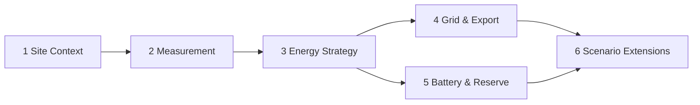

# 02 复杂能管参数应该如何分组？

[上一页：用户与问题](./01-problem-and-users.md) · [Handbook 导航](../product-handbook.md) · [下一页：配置流程](./03-configuration-flow.md)

> **这一页只回答一个问题：参数应该怎样分组，用户才不需要理解旧页面和寄存器？**

## 一句话答案

按用户决策分成六组：先建立上下文和测量，再选择能源策略，然后配置并网交互、电池边界和条件场景。

## 六组目标架构

| 组 | 回答的问题 | 主要内容 |
|---|---|---|
| 1. Site Context | 当前设备和站点允许什么？ | Device、Work Status、Country、Topology |
| 2. Measurement | 控制依据来自哪里？ | Power Sensor、Meter / CT、Phase level |
| 3. Energy Strategy | 系统应该怎样运行？ | TOU、Backup、Peak Shaving |
| 4. Grid & Export | 怎样与电网交互？ | Export Enable、Target、Failure Fallback |
| 5. Battery & Reserve | 电池可以怎样充放？ | 功率、SOC、从网充电、Reserve |
| 6. Scenario Extensions | 特定拓扑还需要什么？ | Off-Grid、AC-Couple、Parallel、Generator |

## 1. Site Context

这一组以只读和引用为主，用来解释后续参数为什么出现。

| 内容 | 产品处理 | 归属 |
|---|---|---|
| Device / Firmware / Protocol | 自动识别并显示置信度 | 设备域 |
| Work Status | 显示实时状态和数据时间 | 状态域 |
| Country & Regulation | 首次配置确认，变更需要强提示 | 合规域 |
| Installation Topology | 显示 Retrofit、Parallel、Off-Grid 能力 | 拓扑域 |

## 2. Measurement

测量是闭环控制的基础，应在 Export Limitation 和 Peak Shaving 之前确认。

- Power Sensor：Disable / Meter / CT。
- Meter / CT：在线状态、方向、相序和数据新鲜度。
- Phase level：总相或分相控制，受设备与法规约束。

## 3. Energy Strategy

| 模式 | 用户目标 | 选择后重点展示 |
|---|---|---|
| TOU | 按时段充放电 | 时段、每段目标、冲突检查 |
| Backup | 保留备电 | Reserve SOC、从网充电、离网能力 |
| Peak Shaving | 限制站点峰值 | 峰值目标、测量、功率边界 |

模式是否严格互斥仍需产品与固件确认；页面不能提前假设。

## 4. Grid & Export

| 层级 | 参数 |
|---|---|
| 基础 | Export Enable、Target / Power Ratio |
| 场景 | Phase level |
| 高级 | Default Power after Failure、Failure Time |

启用出口限制时，产品必须同时检查 Measurement；否则开关成功也不代表控制闭环成立。

## 5. Battery & Reserve

电池参数应作为一个整体配置卡片：

- 最大充电 / 放电功率
- Charging Stop SOC
- Discharge Stop SOC
- 并网 / 离网 Discharge Stop SOC
- Charge From Grid 开关、最大功率和停止 SOC

把这些字段分散到多个页面，会让用户无法理解最终生效边界。

## 6. Scenario Extensions

| 场景 | 内容 | 展示条件 |
|---|---|---|
| Off-Grid | Enable、频率、电压、离网 SOC | 设备、法规和硬件均支持 |
| AC-Couple | Enable / topology | 检测或确认支持 |
| Parallel | 数量、COM Address、协调 | 并机拓扑 |
| Generator / Smart Load | 扩展能量能力 | 支持相关机型 |

场景设置可能重要，但不应占据所有用户的基础首页。

## 分组规则

1. 按业务语义分组，不按寄存器地址分组。
2. 每个设置只有一个事实归属。
3. Quick Setup 可以引用跨组设置，但不能复制定义。
4. 模式选择决定参数可见性。
5. 基础、场景、高级和专家参数逐层展开。
6. Context 负责解释适用性，不与能管设置争夺所有权。

## 本页形成的产品决策

- 用户导航采用六组结构。
- Work Status 属于只读上下文，不包装成可写设置。
- Country 和 Topology 由相邻领域拥有，能管流程只引用或跳转。
- Failure Fallback 下沉到高级层。
- 原始寄存器不进入普通能管导航。

## 下一步

分组确定后，下一页只解决：[用户应该按什么顺序完成配置？](./03-configuration-flow.md)

## 证据

- [Quick Site Setup 功能结构](../modules/01-quick-site-setup.md#功能结构)
- [直连设置建议导航](../modules/02-direct-settings-platform.md#建议的目标导航)
