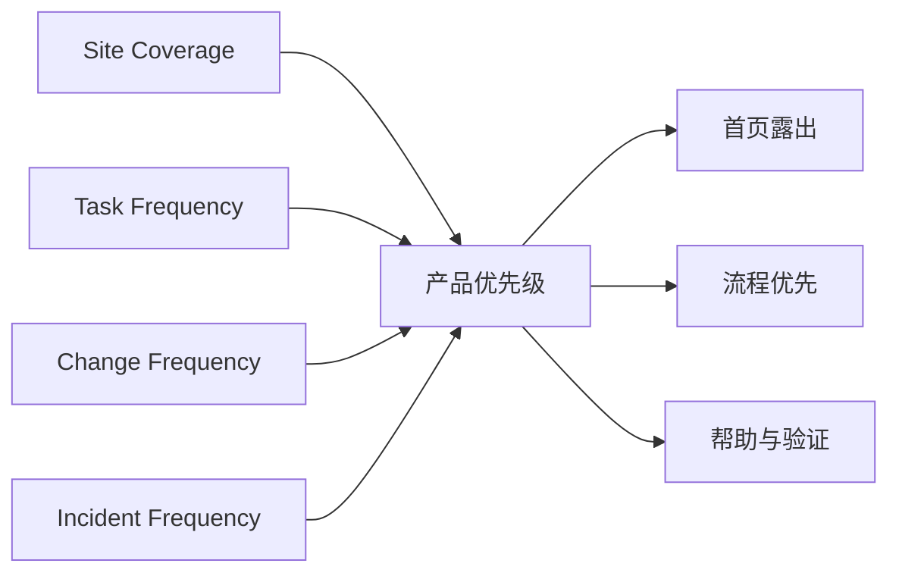

# 04 哪些设置高频，产品应该优先什么？

[上一页：配置流程](./03-configuration-flow.md) · [Handbook 导航](../product-handbook.md) · [下一页：安全与验证](./05-safety-and-validation.md)

> **这一页只回答一个问题：怎样判断高频，并决定首页和路线图优先级？**

## 一句话答案

高频不能只看修改次数。必须同时看站点覆盖、任务频率、修改频率和问题频率；当前 Tier A–D 是待数据验证的产品假设。

## 四类频率



| 频率 | 回答的问题 | 示例 |
|---|---|---|
| Site Coverage | 多少站点需要确认？ | Country 覆盖高 |
| Task Frequency | 用户多久执行一次相关任务？ | 支持人员常查看 Work Mode |
| Change Frequency | 参数多久真正修改一次？ | TOU 时段可能季节性调整 |
| Incident Frequency | 多常成为问题根因？ | Meter / CT 可能导致防逆流异常 |

`Country Regulation` 很少修改，但每个新站都需要确认；`Work Status` 经常查看，但不应该设计成可写设置。

## Tier A：高覆盖核心

| 设置组 | 覆盖假设 | 频率类型 | 为什么优先 |
|---|---|---|---|
| Work Status | 高 | 查看高、修改无 | 所有配置和验证的状态入口 |
| Country & Regulation | 高 | 确认高、修改低 | 投运必经且错误代价高 |
| Work Mode | 高 | 查看高、修改中 | 决定主要能源行为 |
| Battery Power & SOC | 高 | 查看高、修改中 | 直接影响充放电体验 |
| Export Limitation | 中到高 | 查看高、修改中 | 并网要求与现场问题相关 |
| Power Sensor / Meter / CT | 中到高 | 检查高、修改低 | 多个闭环控制的前置条件 |

## Tier B：模式内高频

| 设置组 | 触发条件 | 产品策略 |
|---|---|---|
| TOU Time Period | 选择 TOU | 放在 TOU 主页面，不放 Advanced |
| Charge From Grid | 允许从网充电 | 与 TOU、Backup 联动 |
| Backup Reserve SOC | 选择 Backup / Off-Grid | 使用“保留电量”语言 |
| Peak Shaving Target | 选择 Peak Shaving | 与 Measurement 一起展示 |
| Phase level | 分相控制或法规要求 | 由能力推荐，允许确认 |

## Tier C：条件场景

- Off-Grid
- AC-Couple
- Parallel
- Generator / Smart Load

这些设置站点覆盖较低，但在适用场景中影响高。产品应按能力显示，不应永久埋在 Advanced，也不应对所有人展示。

## Tier D：专家与恢复

- Export Failure Default Power / Time
- 原始寄存器和协议信息
- 版本调试和低层恢复工具

默认下沉到 Advanced 或 Expert Tools，并提供风险和适用性说明。

## 首页露出建议

```text
Energy Summary
├─ 当前 Work Mode 与运行状态
├─ Export / Battery / Reserve 关键目标
├─ Meter / CT 健康状态
├─ 最近配置与验证结果
├─ 高频任务：模式、电池、TOU、防逆流
└─ 当前设备支持的场景入口
```

首页不展示完整参数树，也不按来源模块数量安排位置。

## 如何用真实数据验证

按稳定 `setting_key` 记录：

- `setting_viewed`
- `setting_changed`
- `setting_saved`
- `validation_failed`
- `setting_readback_mismatch`
- `setting_reverted`
- `setting_searched`
- `help_opened`
- `configuration_completed`
- `verification_passed`

数据必须按用户角色、机型、地区、模式和任务分群。原始点击量不能直接代表用户价值。

## 优先级判断

```text
优先级
= 覆盖率
× 任务频率
× 用户影响
× 出错成本
× 当前体验缺口
```

一个低修改频率但高出错成本的参数，仍可能比高点击低影响的参数更优先。

## 本页形成的产品决策

- 先按 Tier A / B 设计核心体验，同时上线埋点。
- 分开统计查看、修改和问题频率。
- 首页优先展示目标、状态和健康，不展示全部字段。
- Tier C 按能力出现；Tier D 下沉。
- 4–8 周真实数据后重新排序，不固化首轮假设。

## 下一步

优先级确定后，下一页只解决：[怎样安全写入并证明配置已经生效？](./05-safety-and-validation.md)

## 证据边界

当前画板可以证明参数存在，不能证明真实使用频率。完整来源边界见 [来源映射](../01-source-map.md#来源使用原则)。
