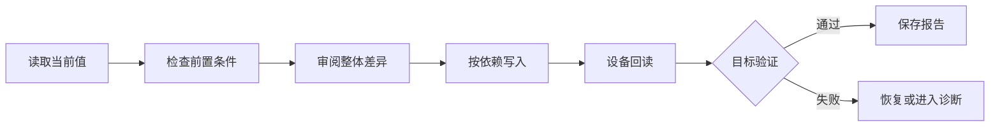

# 05 怎样安全写入并证明配置已经生效？

[上一页：高频与优先级](./04-frequency-and-priority.md) · [Handbook 导航](../product-handbook.md) · [下一页：设置事实模型](./06-setting-contract.md)

> **这一页只回答一个问题：怎样避免误操作，并把“写入成功”升级为“配置成功”？**

## 一句话答案

每次变更都要经过风险分级、前置检查、整体差异、依赖排序、设备回读和目标验证；任何一步失败都要知道已生效范围和恢复方式。

## 安全闭环

## 风险分级

| 级别 | 类型 | 示例 | 最低保护 |
|---|---|---|---|
| E0 | 只读 | Work Status、能力、测量健康 | 时间戳、数据来源 |
| E1 | 普通调整 | TOU 时段、普通 SOC 目标 | 范围、冲突检查、回读 |
| E2 | 运行影响 | Work Mode、功率边界、从网充电 | 差异预览、确认、回滚、验证 |
| E3 | 合规 / 拓扑 | Country、Off-Grid、Parallel | 强权限、二次确认、完整审计 |
| E4 | 专家底层 | Register Setting | 独立工具、临时专家权限、白名单 |

风险越高，权限、解释、确认、审计和恢复要求越强。

## 写入前必须知道什么

- 连接的是哪台设备，身份是否可信。
- 当前值来自设备还是页面缓存。
- 当前固件、协议、地区和拓扑是否适用。
- 哪些参数会被修改，哪些参数停止生效。
- 是否会造成重启、失联、并网中断或能源行为变化。
- 失败时怎样恢复原值。

## 安全写入顺序

候选顺序为：

1. 读取并固定设备上下文和当前基线。
2. 验证 Measurement 与 Topology 前置条件。
3. 写入模式的非激活参数。
4. 写入功率、SOC、出口和时段边界。
5. 最后激活 Work Mode 或 Enable。
6. 回读全部受影响参数。
7. 执行模式对应的能源行为验证。

具体寄存器顺序仍需固件与协议负责人确认。

## 后置验证

| 配置目标 | 最低验证 |
|---|---|
| TOU | 当前时段识别正确，计划状态与充放电方向符合预期 |
| Backup | Reserve SOC 生效，可用容量与离网能力一致 |
| Peak Shaving | 测量有效，功率进入正确控制状态 |
| Export Limitation | Meter / CT 在线且方向正确，实际馈电在目标范围 |
| Battery Limits | 回读值一致，设备没有被其他约束阻止 |
| Charge From Grid | 允许条件、功率上限和停止 SOC 均生效 |

## 四种结果状态

| 状态 | 含义 | 用户下一步 |
|---|---|---|
| Applied | 命令已发送 | 等待回读，不能宣布成功 |
| Read back | 设备实际值与计划一致 | 进入行为验证 |
| Verified | 能源目标验证通过 | 保存配置报告 |
| Failed / Partial | 写入、回读或验证失败 | 显示已生效范围并恢复或诊断 |

前端 Toast 只能显示当前阶段，不能把 `Applied` 命名为“配置成功”。

## Configuration Package 的安全字段

| 字段 | 用途 |
|---|---|
| Current values | 形成恢复基线 |
| Proposed changes | 审阅整体差异 |
| Dependencies | 防止错误顺序 |
| Risk & side effects | 让用户理解影响 |
| Rollback values | 处理失败和取消 |
| Verification plan | 定义真正完成条件 |
| Audit | 记录谁、何时、为什么、结果怎样 |

## 本页形成的产品决策

- E2 以上动作必须先展示整体差异和恢复方式。
- 写入、回读、验证是三个不同阶段。
- 部分失败必须显示哪些值已经改变。
- 无法可靠识别设备或协议时，禁止高风险写入。
- 无法形成验证计划的功能不能进入 Quick Setup。

## 下一步

安全闭环依赖稳定的数据定义。下一页只解决：[怎样保持一份设置事实，避免页面重复？](./06-setting-contract.md)

## 证据

- [直连设置中的 Reset 与 Register Setting 风险](../modules/02-direct-settings-platform.md#advanced-setting)
- [批注与结构化模型](../modules/05-layout-annotations-and-legacy-artifacts.md#建议的结构化模型)
