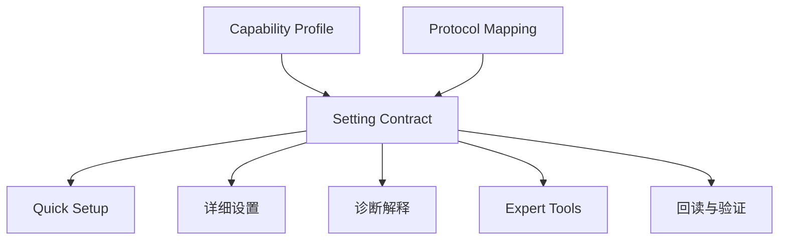

# 06 怎样保持一份设置事实，避免页面重复？

[上一页：安全与验证](./05-safety-and-validation.md) · [Handbook 导航](../product-handbook.md)

> **这一页只回答一个问题：Quick Setup、详细设置和诊断怎样共享同一个参数，而不是维护三份定义？**

## 一句话答案

每个参数建立唯一 `setting_key` 和 Setting Contract；不同页面只决定何时展示、展示多少和怎样编排，不重新定义语义与协议。

## 一份事实，多处使用



## 为什么需要 Setting Contract

当前来源中，同一设置可能出现在：

- Quick Site Setup
- Quick Setting(New)
- 独立 EMS
- 旧 quick Setting
- 旧直连模式

如果每个页面各自维护显示名、范围、默认值和寄存器，版本变化后必然漂移。

## Setting Contract 最低字段

| 字段 | 作用 |
|---|---|
| `setting_key` | 跨页面稳定标识 |
| `display_name` | 正式用户文案 |
| `domain_group` | Measurement / Strategy / Export / Battery 等 |
| `purpose` | 用户为什么配置 |
| `applicability` | 机型、固件、协议、地区和拓扑 |
| `data_type`、`unit`、`range`、`step` | 输入约束 |
| `default_source` | 默认值来源和版本 |
| `dependencies` | 前置、联动、冲突和优先级 |
| `risk_level` | E0–E4 |
| `register_mapping` | 经确认的协议映射 |
| `readback` | 设备实际值读取方式 |
| `verification` | 能源行为验证方式 |
| `owner` | 产品与技术负责人 |

## 页面只负责什么

| 页面 | 负责 | 不负责 |
|---|---|---|
| Quick Setup | 顺序、必需项、摘要、完成条件 | 重复设置定义 |
| 详细设置 | 完整参数和高级选项 | 创建新的同义 setting_key |
| 诊断 | 用设置解释症状、生成最小修正集 | 绕过风险和适用性规则 |
| Expert Tools | 查看底层映射和原始证据 | 成为普通用户事实源 |

## 领域归属示例

| 设置 / 上下文 | 唯一归属 | 其他页面怎样使用 |
|---|---|---|
| Work Mode | Energy Strategy | Quick Setup 选择，诊断解释 |
| TOU Period | Strategy / Schedule | Quick Setup 配置，详细页维护 |
| Export Limitation | Grid & Export | Quick Setup 配置基础项 |
| Power Sensor | Measurement | Export 和 Peak Shaving 引用 |
| Battery Limits | Battery & Reserve | 多种模式共享 |
| Country Regulation | Compliance | 能管流程引用或跳转 |
| Off-Grid Topology | Installation | 能管流程读取能力 |

## 生命周期规则

```text
draft → validated → active → deprecated_candidate → deprecated
```

- `删除` 批注只进入 `deprecated_candidate`。
- 真正下线必须有继任 `setting_key`、确认人、生效版本和迁移验证。
- 重命名只修改 `display_name`，不修改稳定键。
- 机型“不显示”应成为 Capability 规则，不写进名称。
- `开关按钮` 只描述交互，不证明协议数据类型。

## Definition of Done

- [ ] 有稳定 `setting_key` 和唯一领域归属
- [ ] 机型、固件、协议、地区和拓扑范围已确认
- [ ] 单位、范围、枚举、步进和默认值已确认
- [ ] 依赖、冲突和优先级有明确规则
- [ ] 风险、权限、失败和恢复已定义
- [ ] 写入后可以回读和验证
- [ ] Quick Setup 与详细页面引用同一 Contract
- [ ] 埋点使用 `setting_key`，不使用页面文案作为身份

## 本页形成的产品决策

- 设置事实与页面导航分离。
- Quick Site Setup 不再复制 EMS 数据结构。
- 旧版页面只做迁移审计。
- Capability Profile 管理条件显示。
- Protocol Mapping 经过确认后进入 Contract，不从名称自动推断。

## Handbook 完成后的下一步

1. 为 Tier A 参数建立首批 Setting Contract。
2. 对 Quick Setup、Quick Setting(New) 和 EMS 做重复映射。
3. 上线频率与验证埋点。
4. 用真实任务验证六组导航和配置流程。

返回 [Handbook 导航](../product-handbook.md)，或进入 [当前功能证据](../modules/02-direct-settings-platform.md)。

## 证据

- [旧 quick Setting 迁移风险](../modules/03-reference-quick-setting.md#迁移风险)
- [旧直连模式迁移矩阵](../modules/04-reference-direct-mode.md#向-m02-的迁移矩阵)
- [建议的结构化模型](../modules/05-layout-annotations-and-legacy-artifacts.md#建议的结构化模型)
